# Nipuna CRM — API

The Flask backend: architecture, conventions, build order, every endpoint, and function-level execution flows.

| Part | Covers |
|---|---|
| [Part A — Build plan and endpoints](#part-a--build-plan-and-endpoints) | Architecture, conventions, build order and every endpoint with "As built" notes |
| [Part B — Execution flows](#part-b--execution-flows) | Function-by-function flowcharts of the request pipeline and the health, auth, users, roles, branches and staff endpoints |

---

## Part A — Build plan and endpoints

Flask backend over the `nipunacrm` PostgreSQL database (schema in `db/`, see [DATABASE.md](DATABASE.md)).
This plan covers the code structure, the conventions every endpoint follows, and the order in which to build the APIs: auth first, then master data, then the 15 sidebar sections in dependency order.

---

### 1. Architecture

#### Layers

A request flows top to bottom. Each layer only talks to the one directly below it.

| Layer | Folder | Responsibility | Must not |
|---|---|---|---|
| Routes | `backend/routes/` | Blueprints: URL + HTTP method, auth / role decorators (`routes/decorators.py`), call the controller | Contain logic or queries |
| Controllers | `backend/controllers/` | Read and validate the request (`Validator` in `controllers/common.py`), call the service, return JSON via `model.to_dict()` | Touch the database |
| Services | `backend/services/` | Business rules, permission and branch-scope checks, audit log, creating tasks / notifications. Also shared: `errors.py`, `security.py` (passwords / tokens), `context.py` (current user) | Build HTTP responses |
| Repositories | `backend/repositories/` | Database queries: filters, joins, pagination, reading views. Shared: `common.py` (`paginate`, `set_db_user`) | Contain business rules |
| Models | `backend/models/` | SQLAlchemy classes mapped to the existing tables and views, each with `to_dict()` for responses | Create or alter tables |
| Config | `backend/config/` | Settings per environment, the shared `db` object, logging, JSON encoding | Import from any other layer |

No separate `core/` or `schemas/` folders: shared helpers live in the layer that uses them.

**When to use a repository:** every module that lists, filters or aggregates data gets one (leads, pipeline, payments, collections, students, tasks, reports, dashboard). Simple lookups and single-row reads can use the model directly from the service. If a service method grows a query longer than a few lines, move it to a repository.

#### Folder structure

```
nipuna-crm/
├── backend/
│   ├── app.py                 # Entry point: create_app() + `python app.py` / `flask --app app run`
│   ├── config/
│   │   ├── __init__.py        # get_config(env) → Dev / Test / Prod
│   │   ├── settings.py        # Config classes read from .env (DATABASE_URL, SECRET_KEY, ...)
│   │   ├── database.py        # db = SQLAlchemy()  ← models and repositories import db from here
│   │   ├── json_provider.py   # ISO dates, money as strings
│   │   └── logging.py
│   ├── models/                # one file per domain (access.py, masters.py, system.py, leads.py, ...), with to_dict()
│   ├── repositories/
│   │   └── common.py          # paginate(), set_db_user()
│   ├── services/
│   │   ├── errors.py          # AppError, ValidationError, NotFound, BusinessRule, ...
│   │   ├── security.py        # password hashing, session tokens
│   │   └── context.py         # CurrentUser for the request (roles, branches, fresh auth)
│   ├── controllers/
│   │   └── common.py          # ok() / created() / paginated(), Validator, get_page_params(), exception → error response
│   ├── routes/
│   │   ├── __init__.py        # register_blueprints(app) — the only list of blueprints
│   │   └── decorators.py      # @login_required, @require_roles, @fresh_auth
│   ├── cli/                   # flask create-admin, flask jobs run
│   ├── tests/
│   ├── .env / .env.example
│   └── requirements.txt
├── db/                        # SQL migrations (source of truth for the schema)
├── frontend/                  # React SPA connected to this API (see docs/DEVELOPMENT.md, Part B)
├── prototype/                 # Lovable frontend prototype v1.1 (reference; `npm install && npx vite dev`)
├── venv/
└── docs/                      # PRODUCT_GUIDE.md, DATABASE.md, API.md, DEVELOPMENT.md
```

**`app.py` is independent:** it is the only place that builds the application — it loads config, initialises `db`, registers error handlers, blueprints (via `routes.register_blueprints`) and CLI commands. **No other module imports from `app.py`**: models and repositories get `db` from `config.database`, and routes are plain blueprints. This avoids circular imports and lets tests call `create_app("test")` directly.

`app.py` also holds the per-request transaction hook (commit on success, roll back on error) and the error handler that turns every exception into the standard error response.

Commands are run from `backend/`: `flask --app app run`, `flask --app app create-admin`, `pytest`.

Every module uses the same file names across layers, e.g. `routes/leads.py → controllers/leads.py → services/leads.py → repositories/leads.py → models/leads.py`.

#### Key decisions

| Decision | Choice | Why |
|---|---|---|
| Schema ownership | SQL files in `db/` stay the source of truth. Models map to existing tables; never run `db.create_all()` or Alembic autogenerate | The schema relies on triggers, views, enums and constraints that autogenerate can't express |
| Auth tokens | Opaque session token (random 256-bit), sent as `Authorization: Bearer <token>`; only its SHA-256 hash is stored in `user_sessions` | The prototype requires a 30-min idle timeout, a 12-hour max session, revocation and fresh auth for sensitive actions — all need server-side sessions, which JWTs don't give |
| Password hashing | `werkzeug.security` (`generate_password_hash` / `check_password_hash`, scrypt) | Already installed with Flask |
| Validation | Small `Validator` in `controllers/common.py` (string, email, integer, boolean, datetime, list); responses via `model.to_dict()` | No extra library or schema layer; keeps each endpoint's rules visible in its controller |
| Tests | pytest against a `nipunacrm_test` database built from `db/*.sql`, each test in a rolled-back transaction | Exercises the real triggers |

---

### 2. Conventions (all endpoints)

**URLs:** prefix `/api/v1`, plural nouns (`/leads`, `/leads/{id}/activities`). Actions that aren't plain updates are sub-resources: `POST /payments/{id}/verify`, `POST /special-closing-requests/{id}/approve`.

**Success response**
```json
{ "data": { ... } }
{ "data": [ ... ], "meta": { "page": 1, "per_page": 25, "total": 132 } }
```

**Error response**
```json
{ "error": { "code": "VALIDATION_ERROR", "message": "Phone is required", "details": { "phone": ["Required"] } } }
```

| Situation | Status | `code` |
|---|---|---|
| Invalid input | 400 | `VALIDATION_ERROR` |
| No / expired / idle session | 401 | `UNAUTHENTICATED` |
| Sensitive action without recent login | 401 | `FRESH_AUTH_REQUIRED` |
| Role or branch not allowed | 403 | `FORBIDDEN` |
| Not found or outside the user's branches | 404 | `NOT_FOUND` |
| Unique violation (Postgres 23505) | 409 | `CONFLICT` |
| Business rule from a trigger (`RAISE EXCEPTION`, P0001) or check constraint (23514) | 422 | `BUSINESS_RULE` — message passed through from the database |
| Foreign key violation (23503) | 422 | `INVALID_REFERENCE` |
| Exclusion (23P01) or not-null (23502) violation | 422 | `BUSINESS_RULE` |
| Invalid text representation (22P02) | 400 | `VALIDATION_ERROR` |
| Temporary password not yet changed | 403 | `PASSWORD_CHANGE_REQUIRED` |
| Too many failed logins (account locked) | 429 | `TOO_MANY_ATTEMPTS` |

The database triggers already return readable messages ("Prerequisite missing: first qualifying allocated payment must be Verified by Accounts"). `controllers/common.py` (`error_response_for`) maps them to the table above, so services don't duplicate every rule — they only pre-check where a friendlier message or an early exit helps.

**Lists:** `?page=1&per_page=25` (max 100), `?sort=-created_at`, filters as query params (`?branch_id=1&stage=Counselling&q=ananya`).

**Data formats:**
- Money as strings with 2 decimals (`"27000.00"`), `Decimal` in Python — never floats.
- Timestamps in ISO 8601 with offset; business dates in IST (`business_tz()`).
- Enum values exactly as stored (`"Payment Pending Verification"`).
- IDs: numeric `*_id` for references, plus the human code (`lead_code`, `admission_code`, `receipt_number`) in every response.

**Every request (handled once, in `routes/decorators.py`, `services/auth.py` and `app.py`):**
1. Resolve the bearer token → `active_sessions` row → user and active role scopes (unrevoked, unexpired `user_role_scopes`; `repositories/users.py`). Throttle `last_seen_at` updates to once a minute.
2. Open one transaction per request and run `SET LOCAL app.current_user_id = '<id>'`, so triggers credit stage changes, task completions and so on to the user.
3. Branch scoping: list endpoints filter to the user's branches unless they hold a company-wide role; single-record reads return 404 outside scope.
4. Commit on success, roll back on any error.

**Audit:** services write `audit_log` for creates / updates of sensitive records (approvals, payments, fee changes, refunds, role scopes, settings) with old and new values.

---

### 3. Build order

#### Overview

| Step | Module | Sidebar section | Why this position |
|---|---|---|---|
| 0 | Foundation | — | App skeleton, DB, errors, responses, tests |
| 1 | **Auth & access** | — (login screen, Admin → Users & Access) | Every other endpoint needs the current user and role scopes |
| 2 | Master data | #15 Course Master, More → Offer Master | Leads need courses, lookups and branches; fees need offers and plans |
| 3 | Internal core services | — | Audit, task and notification creation, used by later modules |
| 4 | Leads | #2 Leads (+ Counsellor workspace) | Start of the sales flow |
| 5 | Pipeline | #3 Pipeline | A view over leads |
| 6 | Demos | #4 Demos | Needs leads |
| 7 | Fee discussions & special closing | inside lead detail ("Fees / Offers") | Needs leads, offers, plans; needed before payments |
| 7b | Invoices | Invoice Register (from Payments / Fee Discussion) | Issued from an approved fee version; payments and dues hang off invoices |
| 8 | Payments | #7 Payments | Admission requires a verified payment |
| 9 | Admissions & academics | #5 Admissions | Needs accepted fee plan + verified payment |
| 10 | Students | #6 Students | Aggregates admissions, payments, documents |
| 11 | Collections | #8 Collections | Needs admissions + installments |
| 12 | Refunds & support cases | #9 Refunds | Needs admissions + payments |
| 13 | Tasks | #10 Tasks | Links to all earlier records |
| 14 | Communications & notifications | #11 Communications, More → Notifications | Links to persons / leads; notification UI |
| 15 | Placement & Alumni | #13 Placement & Alumni | Needs students + completed admissions |
| 16 | Reports & targets | #12 Reports, More → Target Master | Reads everything |
| 17 | Dashboard | #1 Dashboard (+ Branch Manager / Founder views) | Aggregates everything, so built last among the core |
| 18 | Admin / Settings | More → Admin / Settings | Integration status, incidents, sessions, deletion approvals |
| 19 | AI Copilot | #14 AI Copilot, More → Ask Nipuna | Needs real data and an external LLM |
| 20 | Background jobs | — | Escalations, reminders, scheduled reports |
| 21 | **V4 — deals, multi-course invoices, receipts** | Leads, Deal pipeline, Invoices, Payments & receipts, Admissions | UI V4 handoff (see [DEVELOPMENT.md · Part D (V4 plan)](DEVELOPMENT.md#part-d--v4-handoff-plan-and-review)); db 019–022 |

Dashboard is sidebar item #1 but is built late: it only displays numbers produced by the other modules.

#### Milestones

| Milestone | Steps | Outcome |
|---|---|---|
| M1 — Platform | 0, 1, 2, 3 | Staff can log in; masters are manageable |
| M2 — Sales | 4, 4b, 5, 6, 7 | Enquiry → lead → demo → approved fee |
| M3 — Sales-to-cash | 7b, 8, 9, 11, 12 | Invoice → payment → admission → collections → refunds |
| M4 — Student & operations | 10, 13, 14 | Student 360, tasks, inbox, notifications |
| M5 — Management | 15, 16, 17, 18 | Placement, reports, targets, dashboards, admin |
| M6 — Intelligence & automation | 19, 20 | AI features, scheduled jobs |
| M7 — UI V4 | 21 | Qualify → convert → delivery plan → multi-course invoice → claim → verified receipt → admission per course |

---

### 4. Module details

Roles below use the codes in `roles`: `FOUNDER_CEO`, `SUPER_ADMIN`, `BRANCH_MANAGER`, `SALES`, `FRONT_OFFICE`, `ACCOUNTS`, `ACADEMIC_COORDINATOR`, `TRAINER`, `PLACEMENT`, `HR`, `STUDENT`. "Admins" means Founder / CEO or Super Admin. "Counsellors" means Sales or Front Office.

#### Step 0 — Foundation ✅

- Create `backend/` with the folder structure above; move `requirements.txt` and `.env.example` into it.
- `backend/app.py` (`create_app()`), `config/` (settings per environment, `database.py`, logging), `.env` loading.
- `controllers/common.py` (responses, validation, page params, error mapping), `services/errors.py`, `repositories/common.py`, `routes/__init__.py`.
- `GET /api/v1/health` → app + database status.
- pytest setup: build `nipunacrm_test` from `db/*.sql`, per-test rollback fixture, test client.
- Add to requirements: `pytest` (done). No `flask-cors`: the frontend is a separate SPA (`frontend/`) served on the same origin — the Vite dev server proxies `/api` in development and a reverse proxy does the same in production (see [DEVELOPMENT.md · Part B (frontend)](DEVELOPMENT.md#part-b--frontend)).
- Run tests from `backend/`: `pytest` (rebuilds `nipunacrm_test` from `db/*.sql` each run). `flask --app app create-test-db` rebuilds it manually.

#### Step 1 — Auth & access ✅

Tables: `users`, `user_role_scopes`, `roles`, `branches`, `user_sessions`, `audit_log`.

| Method | Path | Who | Notes |
|---|---|---|---|
| POST | `/auth/login` | Public | Email + password → token, user, scopes, allowed branches. Creates a `user_sessions` row. Generic error message; log failures |
| POST | `/auth/logout` | Logged in | Revokes the current session |
| GET | `/auth/me` | Logged in | User, active scopes, allowed branches, home route (Counsellor workspace / Branch Manager dashboard / Dashboard, as in the prototype) |
| POST | `/auth/reauthenticate` | Logged in | Password → sets `reauthenticated_at` (fresh auth, 15 min) |
| POST | `/auth/change-password` | Logged in | Needs current password; revokes the user's other sessions |
| GET | `/auth/sessions` | Logged in | Own active sessions |
| DELETE | `/auth/sessions/{session_id}` | Logged in | Sign out another device |
| GET | `/users` | Admins | Filter by role, branch, active |
| POST | `/users` | Admins, fresh auth | Create user + initial scopes; returns a one-time temporary password |
| GET / PATCH | `/users/{id}` | Admins | Profile fields, `is_active` |
| POST | `/users/{id}/reset-password` | Admins, fresh auth | New temporary password; revokes the user's sessions |
| GET | `/users/{id}/scopes` | Admins | Including expired / revoked |
| POST | `/users/{id}/scopes` | Admins, fresh auth | Role + branch (+ `expires_at` for temporary access) |
| DELETE | `/users/{id}/scopes/{scope_id}` | Admins, fresh auth | Revoke (sets `revoked_at`; never deletes) |
| GET | `/roles`, `/branches` | Logged in | For dropdowns |
| GET | `/staff?branch_id=&role=SALES,FRONT_OFFICE` | Logged in | Staff directory for owner / trainer / task-owner pickers: active users with active scopes at the caller's branches (plus company-wide scopes), one entry per user with their matching roles. Other branch → 404. Added with the frontend |

Also:
- `flask create-admin` CLI command to create the first Founder / Super Admin (there are no users yet).
- Decorators: `@login_required`, `@require_roles("SUPER_ADMIN", "FOUNDER_CEO")`, `@fresh_auth`, and branch checks via `CurrentUser.has_role(*roles, branch_id=)` / `can_access_branch()` (`services/context.py`).
- Recovery account (`is_recovery_account`): allowed to log in, every action audited.

**Done when:** login, logout, me, idle timeout (31 min → 401), max session (12 h), revoked scope loses access immediately, fresh-auth enforcement — all covered by tests.

**As built** (migration `db/011_auth.sql` added `must_change_password`, `password_changed_at`, `failed_login_attempts`, `locked_until` and three settings):
- Admin-created users and password resets get a one-time temporary password; until it's changed, only `/auth/me`, `/auth/logout` and `/auth/change-password` work (403 `PASSWORD_CHANGE_REQUIRED`).
- 5 failed logins lock the account for 15 minutes (429 `TOO_MANY_ATTEMPTS`); both values and the 10-character minimum password length are in `app_settings`.
- Login counts as fresh auth for 15 minutes.
- Only a Founder / CEO can grant Founder / CEO access or create a recovery account; admins can't change their own access, deactivate or reset themselves.
- Granting a role whose previous grant expired closes the expired one automatically.
- `services/audit.py` (planned for step 3) was built here because auth needs it.

#### Step 2 — Master data ✅

Tables: lookup tables, `branches`, `branch_shifts`, `holidays`, `courses`, `course_branches`, `combo_courses`, `payment_plans`, `payment_plan_installments`, `offers` (+ scope / complimentary tables), `concession_limits`, `app_settings`, `document_types`, `task_types`, `support_case_types`.

| Method | Path | Who | Notes |
|---|---|---|---|
| GET | `/lookups` | Logged in | All dropdown lists in one call (sources, channels, entry methods, payment modes, lost reasons, task / document / support case types, enums) |
| POST / PATCH | `/lookups/{type}` , `/lookups/{type}/{id}` | Admins | Add / rename / deactivate (never delete) |
| GET / PATCH | `/branches/{id}` | GET: logged in (no branch-scope check — see DEVELOPMENT.md, Part E backlog); PATCH: admins | Contact details |
| GET / PUT | `/branches/{id}/shifts` | GET: logged in; PUT: admins | Staffed hours (drive all SLA deadlines) |
| GET / POST / DELETE | `/holidays` | Admins | |
| GET | `/courses` | Logged in | Filters: standalone / combo, category, status, branch |
| POST / PATCH | `/courses`, `/courses/{id}` | Admins | Code, title, category, standard fee, status |
| PUT | `/courses/{id}/branches` | Admins | Branches offering the course |
| PUT | `/courses/{id}/components` | Admins | Combo components (incl. the "+1" bonus course) |
| GET / POST / PATCH | `/payment-plans` | Admins | Installments with due-day windows |
| GET | `/offers` | Admins, Branch Manager | Versions with status |
| POST | `/offers` | Admins | New draft (or new version of an existing code) |
| PATCH | `/offers/{id}` | Admins | Draft only |
| POST | `/offers/{id}/activate`, `/offers/{id}/deactivate` | Admins, fresh auth | Activation needs approver + dates |
| PUT | `/offers/{id}/scope`, `/offers/{id}/complimentary-courses` | Admins | Branches, courses, complimentary thresholds + access period |
| GET / PUT | `/concession-limits` | Admins, fresh auth | Per role |
| GET / PATCH | `/settings` | Admins, fresh auth | `app_settings` |

**As built (step 2):**
- Also `GET /lookups/{type}` (admins, includes inactive values). Lookup codes are fixed once created; values are deactivated, never deleted.
- Offers: `POST /offers` rejects an existing code — use `POST /offers/{id}/new-version` (copies the version into the next Draft). `PATCH` can move Draft ↔ Configured; activating a version deactivates the other active version of the same code.
- Payment plan installments can't be changed once a fee discussion or admission uses the plan (create a new plan).
- Settings keep their type (a number stays a number); only existing keys can be changed.
- Past holidays can't be deleted (they explain past deadlines).

#### Step 3 — Internal core services (no public API yet) ✅

Built now so later modules can call them; their screens come in steps 13–14.
- `audit_service.record(action, entity, old, new, reason)`.
- `task_service.create_system_task(type, title, branch, due, linked_record, dedupe_key)` — idempotent via `dedupe_key`.
- `notification_service.notify(rule_code, event_key, entity, recipients)` — resolves recipients from the rule's role + branch, deduplicated.
- `sla_service.staffed_deadline(branch, start, minutes)` → wraps `add_staffed_minutes()`.

**As built (step 3):** `services/tasks.py` (`create_system_task`, `complete_system_task`), `services/notifications.py` (`notify`), `services/sla.py` (`staffed_deadline`, `add_working_days`, `working_day_end`); `services/audit.py` came with step 1.

#### Step 4 — Leads (sidebar #2) ✅

Tables: `persons`, `enquiries`, `leads`, `lead_activities`.

| Method | Path | Who | Notes |
|---|---|---|---|
| GET | `/persons/search?phone=&email=&name=` | Counsellors, BM | Duplicate check before creating (never auto-merge) |
| POST / GET / PATCH | `/persons`, `/persons/{id}` | Counsellors, BM | |
| GET | `/persons?q=&branch_id=&page=` | Lead roles, branch-scoped | Persons section: registered at, or with a lead at, the user's branches (403 for another branch), newest first. `q` matches the name, email or person code, or (4+ digits) the mobile / alternate number. Rows add `leads_count`, `active_leads` and `open_cards` (added with DB 017) |
| GET | `/persons/{id}/overview` | Lead roles, branch-scoped | Person 360: `person`, `pipeline_cards` (open first), `leads` (all, newest first), `admissions` (original or service branch in scope) |
| POST | `/enquiries` | Counsellors, BM | Records the enquiry; returns possible person / lead matches. Matches go to `Duplicate Review` |
| GET | `/enquiries?intake_status=Duplicate Review` | BM, Counsellors | Duplicate review queue |
| POST | `/enquiries/{id}/link` | BM, Counsellors | Link to an existing person / lead (manual decision) |
| POST | `/leads` | Counsellors, BM | Person + enquiry + lead in one transaction |
| GET | `/leads` | Counsellors (own + branch), BM, Admins | Filters: branch, stage, owner, source, intake, priority, course, search; queue tabs: New, Untouched, Due Today, Overdue, Hot, Demos, Fee Discussion, Payment Pending Verification, Collections, Cold / Reactivation, Future Joining |
| GET | `/leads/workspace` | Counsellors | Today's prioritised queue for the logged-in counsellor |
| GET / PATCH | `/leads/{id}` | Scoped | Detail header (person, stage, priority + score, owner, sales summary) |
| POST | `/leads/{id}/assign` | BM | Reassign owner |
| POST | `/leads/bulk-assign` | BM | Many leads → one owner |
| POST | `/leads/{id}/stage` | Owner, BM | Stage change; DB blocks backward moves after Payment Pending Verification |
| POST | `/leads/{id}/follow-up` | Owner, BM | Set next follow-up |
| POST | `/leads/{id}/lost` | Owner, BM | Reason, optional competitor, notes, reactivation date |
| POST | `/leads/{id}/reactivate` | BM | |
| GET / POST | `/leads/{id}/activities` | Scoped | Timeline; log call / WhatsApp / note |
| GET | `/leads/{id}/enquiries` | Scoped | "Enquiry" tab |

**As built (step 4):**
- Also `POST /enquiries/{id}/convert` (enquiry → new lead for an existing or new person) and `GET /enquiries/{id}`.
- Phone numbers are normalised to `+91XXXXXXXXXX`. Person search works across all branches (so a second-branch enquiry is found); person records are otherwise visible only where the person is registered or has a lead.
- Who can do what: counsellors see all leads at their branches; stage / follow-up / lost / edit need the owner, a branch manager or an admin (any branch counsellor while unassigned); assign, bulk assign and reactivate need a branch manager or admin; any lead role at the branch can log activities.
- A counsellor who creates a lead owns it. An unassigned lead creates a system task for the branch manager (due in 60 staffed minutes — an assumption, not from the prototype), completed automatically on assignment.
- Stage `Admitted` can't be set by hand (the admission sets it) and `Lost - closed` goes through `/lost`. Moving to Payment Pending Verification needs a course.
- Queue tabs (`?queue=`): new, untouched, due_today, overdue, hot, demos, fee_discussion, payment_pending, cold, future_joining. "Collections" arrives with step 11.

#### Step 4b — Leads: prototype v1.1 additions ✅

Schema is ready (`db/012_prototype_v1_1.sql`); these extend the step 4 endpoints.

| Method | Path | Who | Notes |
|---|---|---|---|
| POST / PATCH | `/leads`, `/leads/{id}` | as step 4 | Accept `campaign` (campaign / referral) and `remarks`; person accepts `whatsapp_number` (empty = same as mobile) |
| POST | `/leads` with `person_id` | Counsellors, BM | "Add Another Course": new opportunity for the same person; branch must be in the caller's scope, owner valid for that branch |
| POST | `/leads/{id}/follow-up-log` | Owner, BM, Front Office | Purpose (Counselling call / Demo confirmation / Post-demo / Fee / Collection / Document follow-up) + response (Interested / Call back later / Not reachable / Needs time / Not interested) + notes + next follow-up (required). Writes a `Call` activity (`purpose`, `outcome` = response), moves the next follow-up, creates a Call task; the original deadline is kept |
| GET / POST / DELETE | `/saved-views?module=leads`, `/saved-views/{id}` | Lead roles | Shared views (seeded) + the user's own; `filters` use the `GET /leads` query params |
| POST | `/lead-imports` | Counsellors, BM | Upload CSV (full_name, mobile, email, course, branch, source). Each row validated: phone format, email, course in Course Master, branch exists **and is in the caller's scope**; matches → `Duplicate Review` (never merged); invalid rows get `issues` |
| GET | `/lead-imports/{id}` | Uploader, BM | Field mapping + rows with validation result |
| POST | `/lead-imports/{id}/import` | Uploader, BM | Creates enquiries + leads for Ready and Duplicate Review rows (entry method `CSV import`); skips Invalid; import alone doesn't satisfy the lead SLA |

Intake statuses now also include `Invalid-Spam` and `Test` (staff-settable).

**As built (step 4b):**
- WhatsApp number: empty string or null = same as mobile; responses show the effective number.
- Follow-up log writes a `Call` activity (direction Outbound) and a Call task whose *original* deadline is the lead's previous follow-up (or now) and whose *revised* deadline is the new one — the prototype's "original deadline kept".
- Saved views: anyone with a lead role keeps private views; shared views are created by admins / branch managers and deleted by admins only.
- CSV import accepts multipart `file` or JSON `{file_name, content}`; max 1,000 rows; course matched by code or title, branch by code / name / city / prefix, source by code or label (case-insensitive); also flags "Course not offered at branch" and a phone repeated inside the file (→ Duplicate Review). Channel for imported enquiries = Web form (as the prototype). Duplicate Review rows become new people whose lead stays in Duplicate Review (never merged); access = uploader, admins, or a BM of a row's branch.
- `normalise_phone` moved to `services/persons.py` (services no longer import controllers).

#### Step 5 — Pipeline (sidebar #3) ✅ — V4 chips, columns, values and next actions in step 21

| Method | Path | Notes |
|---|---|---|
| GET | `/pipeline?branch_id=&owner_id=` | Stages in order with counts and lead cards (Kanban) or rows (Table) |
| POST | `/leads/{id}/stage` | Reused from Leads; returns missing required fields when moving to Payment Pending Verification / Admitted. Since 017 it moves the person's card |

**As built (step 5):** `GET /pipeline?view=kanban|table&branch_id=&owner_id=me|unassigned|{id}&course_id=&source_id=&priority=&q=&per_stage=` (lead roles). Kanban returns all 8 stages with counts and up to `per_stage` cards (default 20, max 100) ordered by next follow-up; Table is paginated in stage order. Moving to Admitted by hand returns 422 with `missing_fields: ["admission"]`.

**As built (person pipeline, DB 017):** the pipeline lists **persons**, not leads. Each card is one `pipeline_entries` row per person per branch, and all of the person's open courses at that branch sit on it at one shared stage.

| Method | Path | Roles | Notes |
|---|---|---|---|
| GET | `/pipeline?view=kanban\|table&branch_id=&owner_id=me\|unassigned\|{id}&course_id=&source_id=&priority=&q=&per_stage=` | Lead roles | Open cards only. Kanban has 5 columns (Counselling → Payment Pending Verification), each with `count` and `cards`. Table is paginated in stage order. A card row has `entry_code`, `person`, `branch`, `owner`, `next_follow_up_at`, `ai_priority`, `courses` (open leads: `lead_code`, `course`, `stage`). `course_id` / `source_id` / `q` also match the card's open courses |
| GET | `/pipeline-entries/{id}` | Lead roles, branch-scoped | Card detail, plus every lead ever on it and the lost details |
| POST | `/pipeline-entries/{id}/stage` | Card owner, BM / admin, or any branch counsellor while unassigned | `stage` is one of the 5 columns or `Lost - closed` (needs `lost_reason_id`; optional `lost_competitor`, `lost_notes`, `reactivation_date`). Optional `note` is logged on every open course. Moves every open course. Payment Pending Verification needs a course on each (422 `details.leads`). Closed card → 422 |
| PATCH | `/pipeline-entries/{id}` | as above; owner change needs BM / admin | `assigned_to`, `next_follow_up_at` (must be in the future). Both are copied to the card's open courses, so the workspace queues and tasks keep working |

- `GET /leads` now takes `lead_status=Active|Inactive|All`. It defaults to **Active** (New Enquiry), or to All when `stage` or `queue` is given. Rows carry `lead_status` and `pipeline_entry_id`.
- `POST /leads/{id}/stage` moves the lead's whole card. Moving to Payment Pending Verification also needs a course on the card's other open courses. Moving back to New Enquiry is refused (422), except from Lost via reactivate.
- A new lead for a person with an open card at that branch joins the card at once, at the card's stage.
- Assumptions: closed cards (Admitted / Lost) leave the board, with no closed columns. The workspace still lists the counsellor's open leads (not cards). Lead-level assign / follow-up don't update the card; use the card endpoints.

#### Step 6 — Demos (sidebar #4) ✅

Tables: `demos`.

| Method | Path | Who | Notes |
|---|---|---|---|
| GET | `/demos?from=&to=&branch_id=&trainer_id=&status=` | Scoped | Demo schedule with attended count per lead ("1 of 2") |
| POST | `/leads/{id}/demos` | Counsellors, BM | `DM-GNT-0001`; course optional (`course_id`, else the lead's course, else none); trainer from the lead's branch; Standard ≤ 45 min, Practical ≤ 60; a 3rd demo after 2 attended needs `extra_demo_approved_by`. Moves the lead to Demo Scheduled unless it's in a protected stage. Reminders are created by the DB (24h / 1h skipped if already past) |
| PATCH | `/demos/{id}` | Counsellors, BM | Trainer, mode, link |
| POST | `/demos/{id}/confirm` | Counsellors, BM | |
| POST | `/demos/{id}/reschedule` | Counsellors, BM | New time + reason (required: Student requested / Trainer unavailable / Batch timing change / Other); old demo → Rescheduled (its pending reminders Superseded), new demo with `rescheduled_from_demo_id` |
| POST | `/demos/{id}/cancel` | Counsellors, BM | Reason required (Student not available / Duplicate booking / Course changed / Other); pending reminders Cleared |
| POST | `/demos/{id}/outcome` | Trainer, Counsellors | Attended / No Show + student feedback, trainer feedback, outcome, recommended course, next action, commercial owner, exact next follow-up (required). Lead → Demo Attended unless protected (Payment Pending Verification / Admitted / Lost never move). Sets the 2-staffed-hour commercial follow-up and creates the Call task |
| GET | `/demos/{id}/reminders` | Scoped | Reminder states (Pending / Sent / Skipped / Superseded / Cleared / Not needed / Failed) |
| POST | `/demos/{id}/approve-extra` | Academic Coordinator, BM | |

**As built (step 6):**
- Also `GET /demos/{id}`. Read access: lead roles + Trainer + Academic Coordinator; booking / changes: counsellors, BM, admins; outcome: also trainers of the branch.
- Protected stages (never moved by a demo) = Payment Pending Verification, Admitted, Lost (prototype `protectedStages`); booking moves any other stage to Demo Scheduled, attendance to Demo Attended.
- Default duration 45 (Standard) / 60 (Practical). Extra demo: a counsellor passes `extra_demo_approved_by` (DB checks the approver's role) or an AC / BM booking it approves it themselves; `approve-extra` stamps approval on an already-booked demo (e.g. one that became the 3rd after two were attended).
- An outcome can't be recorded before the demo's start time. The Call task links to the lead, owned by the commercial owner (default lead owner), original due = the 2-staffed-hour target, revised = the agreed next follow-up (as the prototype).
- Reschedule returns the *new* demo (201). Reschedule / cancel / outcome also write lead timeline notes with `demo_id`.

#### Step 7 — Fee discussions & special closing (lead detail "Fees / Offers") ✅

Tables: `fee_discussions`, `fee_discussion_versions`, `special_closing_requests`.

| Method | Path | Who | Notes |
|---|---|---|---|
| GET / POST | `/leads/{id}/fee-discussions` | Counsellors, BM | |
| GET | `/fee-discussions/{id}` | Scoped | Current version, history, milestone, applicable offers (minus offers the person already used), `used_offers` (offer code + admission that used it) |
| POST | `/fee-discussions/{id}/versions` | Counsellors | New version (amounts frozen once saved): offer, extra concession, validity, notes. **V4 (db 021):** no schedule — the 1–3 instalments are set on the invoice; `payment_plan_id` is informational (default FULL). Blocked while the course is on an Issued invoice. Needs a converted deal (db 019) |
| POST | `/fee-discussions/{id}/share` | Counsellors | Milestone Fee Shared |
| ~~POST~~ | ~~`/fee-discussions/{id}/accept-plan`~~ | — | **Removed in V4 (db 020):** the delivery plan is per course deal — `/leads/{id}/delivery-plan` (step 21) |
| ~~POST~~ | ~~`/fee-discussion-versions/{id}/invoice`~~ | — | **Removed in V4 (db 021):** `POST /invoices` with `lead_ids` (step 21) |
| GET | `/special-closing-requests?queue=can_approve\|higher_approval` | BM, Admins | Approval queues with decision-due countdown |
| POST | `/fee-discussion-versions/{id}/special-closing-requests` | Counsellors | Requested extra + reason; notifies approver (`SCR_PENDING`) |
| POST | `/special-closing-requests/{id}/approve` | BM, Admins, fresh auth | Below floor: Admin + `independent_approved_by` |
| POST | `/special-closing-requests/{id}/counteroffer` | BM, Admins | Counter amount |
| POST | `/special-closing-requests/{id}/reject` | BM, Admins | Reason required |
| POST | `/fee-discussion-versions/{id}/approve` | Counsellors, BM, Admins | Counsellors can approve standard-price versions (offers allowed); needs an approved SCR if there's an extra concession or it's below floor |

**Offer once per person (migration 015):** an offer (any version of the same `offer_code`) can be used once per person. Saving a version with an already-used offer and issuing an invoice for one return 422 `BUSINESS_RULE` naming the admission that used it; the database refuses the admission itself as a last line (covers parallel discussions and complimentary courses). Cancelled admissions release the offer.

**As built (step 7):**
- Also `GET /special-closing-requests/{id}`. One open discussion per lead + course (409 names the existing one). Starting a discussion moves an early-stage lead to Fee Discussion / Payment Awaited.
- Versions: standard fee from Course Master; offer must be Active today and in scope (percent → rounded, amount capped at the fee; complimentary-course offers give no discount); default plan FULL. A new version supersedes the earlier open / approved ones and puts the milestone back to In Discussion; blocked once the plan is accepted.
- **Approval (deviation):** a version with no extra concession and not below floor (the published price) can be approved by the counsellor; one that needs special closing is approved automatically when its SCR is approved (the DB still refuses an Approved version without a matching approved SCR). The standalone approve endpoint therefore accepts counsellors, BM and admins.
- Counteroffer marks the version Counteroffered; the counsellor accepts by creating a new version with the counter amount and a new SCR. Queues `can_approve` / `higher_approval` are computed from the caller's highest concession limit at the branch (below-floor requests need an admin); self-requested SCRs are never "can approve".
- SCR approve needs fresh auth; SCRs notify `SCR_PENDING` and create an Approval task (both closed on decision).

#### Step 7b — Invoices (Invoice Register) ✅ — reworked in step 21 (multi-course lines)

Tables: `invoices`, `installments`; view `invoice_balances`, `installment_dues`. Scoped by **collecting branch**.

| Method | Path | Who | Notes |
|---|---|---|---|
| POST | `/fee-discussion-versions/{id}/invoice` | Counsellors, Accounts | Approved version only. Body: `day0_date`, `terms`. Amount, plan, parties, terms and (since DB 018) the instalment dates and amounts come from the version; `agreed_due_days` is no longer used. `INV-GNT-2627-0001`; builds the instalment schedule; milestone Invoice Issued. Re-issuing before any payment supersedes the previous invoice |
| GET | `/invoices` | Lead roles, Accounts, Admins | Register with totals: billed, verified paid, pending verification (excluded), outstanding; per row next due, completion (Unpaid / Part Paid / Paid), due position |
| GET | `/invoices/{id}` | Scoped | Details, approved terms, plan, state; instalment schedule (verified money applied oldest-first); linked payment history; correction requests |
| GET | `/invoices/{id}/admission-readiness` | Scoped | Both admission prerequisites and what's missing (drives Create Admission). Since DB 018 the `verified_payment` check means verified payments ≥ the admission token (₹1,000), and carries `token` and `verified_total` |
| GET | `/invoices/{id}/print` | Scoped | Printable invoice (PDF later); `GET /payments/{id}/receipt` for receipts — unverified receipts print as "acknowledgement of proof only" |
| POST | `/invoices/{id}/cancel` | Accounts, Admins | Reason required; only without payments |
| PUT | `/invoices/{id}/installments/{no}/due-date` | Counsellors, Accounts | Any agreed date (the plan window was removed in DB 018) |

**As built (step 7b):** list meta carries `totals` (billed, verified paid, pending verification, outstanding over Issued invoices). `GET /invoices/{id}` includes the schedule from `installment_dues`, payments and correction requests. Print returns a JSON printable view (PDF later). Cancel: Accounts at the collecting branch or admins. Due-date change is audited. `day0_date` defaults to today.

#### Step 8 — Payments (sidebar #7) ✅ — reworked in step 21 (allocations, tenders, TXN / receipt numbers)

Tables: `payments`, `payment_correction_requests`, `payment_modes`; views `unallocated_advances`, `invoice_balances`.

| Method | Path | Who | Notes |
|---|---|---|---|
| GET | `/payments` | Accounts, BM, Admins (Counsellors: own branch, read-only) | Ledger: receipt / reversal, invoice, person, branch, amount, method, recorded, verification; totals verified net and pending (excluded) |
| POST | `/payments` | Counsellors, Front Office, Accounts | Against an `invoice_id` (or none = unallocated advance). Can't exceed the invoice outstanding — the excess goes in as an advance. Cheque needs `exception_approved_by`. Optional proof file. Notifies Accounts (`PAYMENT_PENDING_VERIFICATION`), creates the verification task, adds contact hold |
| GET | `/payments/{id}` | Scoped | Receipt detail |
| POST | `/payments/{id}/verify` · `/fail` | Accounts, Admins, fresh auth | Only positive, pending receipts; once. Completes the verification task |
| POST | `/payments/{id}/allocate` | Accounts | Advance → invoice (once) |
| GET | `/payments/unallocated` | Accounts, BM | |
| POST | `/payments/{id}/correction-requests` | Accounts, Admins | Reason required. Only a Verified, un-reversed receipt (pending → mark Failed instead). Ledger unchanged; creates an approval task for Founder / CEO or Super Admin |
| GET | `/correction-requests?status=Pending Approval` | Accounts, Admins | Queue (also on the invoice page) |
| POST | `/correction-requests/{id}/approve` · `/reject` | Founder / CEO, Super Admin, fresh auth | Distinct from the requester. Approval appends the linked reversal `REV-GNT-2627-00001` (verified by the approver); the original receipt stays |

**As built (step 8):**
- `POST /payments` returns `{payment, advance}`: anything beyond the invoice's remaining cap is recorded as a second, unallocated receipt (`split_excess: false` refuses instead). An advance needs `person_id` or `lead_id` (+ collecting branch, defaulting to the lead's). Multipart form with a `proof` file is accepted (local `uploads/`).
- Cheque `exception_approved_by` must be a BM / admin at the branch and not the collector. Recording against an invoice moves the lead to Payment Pending Verification (unless protected).
- Each receipt notifies Accounts and creates a Payment Verification task due in 30 staffed minutes (the rule's escalation time) — completed on verify / fail.
- Verify / fail / correction approve / reject need fresh auth; rejecting a correction needs `decision_note`. Correction approval tasks go to team role Founder / CEO.

#### Step 9 — Admissions & academics (sidebar #5) ✅ — admissions per invoiced course, created on verification (step 21)

Tables: `admissions`, `installments`, `admission_transfers`, `admission_fee_changes`, `batches`, `batch_allocations`, `curriculum_versions`, `admission_curricula`; view `batch_allocation_queue`.

| Method | Path | Who | Notes |
|---|---|---|---|
| POST | `/admissions` | Counsellors, Front Office, BM | From an `invoice_id` (+ optional service branch, admission date). DB enforces both prerequisites (accepted plan on the invoice's version; first qualifying payment on the invoice Verified), records the first qualifying payment, links the invoice's payments, moves the lead to Admitted |
| POST | `/admissions/{id}/complimentary` | Counsellors, BM | Complimentary course from an active offer. One per offer per paid admission, and never a course the person already has (migration 016; 422 `BUSINESS_RULE` naming the admission; cancelled admissions don't count) |
| GET | `/admissions` | Scoped | Filters: branch (original / service), enrolment, curriculum, handover, LMS, seat type |
| GET / PATCH | `/admissions/{id}` | Scoped | Handover, LMS status, owners |
| POST | `/admissions/{id}/cancel` | BM | Operational cancellation (refund is separate) |
| POST | `/admissions/{id}/transfers` | BM | Service-branch transfer |
| POST | `/admissions/{id}/fee-changes` | Counsellors, BM | |
| POST | `/admission-fee-changes/{id}/approve` · `/reject` | Admins, fresh auth | An admin may approve their own request (db 023) |
| POST | `/admission-fee-changes/{id}/apply` | Accounts, Admins, fresh auth | Admins since db 024 |
| GET / POST / PATCH | `/batches`, `/batches/{id}` | Academic Coordinator, BM | Curriculum version, trainer, mode, dates, timing, days, room / link, minimum students, capacity; occupancy and Full status. Batch workspace also lists admissions awaiting allocation |
| GET | `/batch-allocation-queue` | Academic Coordinator, BM | Allocate-by / escalate-at |
| GET | `/batches/{id}/allocation-check?admission_id=` | Academic Coordinator, BM | Pre-check with the blocking reason and recovery owner (wrong branch → Branch Manager; curriculum → Academic Coordinator; full → Academic Coordinator) |
| POST | `/admissions/{id}/allocations` | Academic Coordinator, BM | Same service branch, curriculum Mapped (matching the batch's version), enrolment not Paused / Completed / Cancelled, capacity; one active per course |
| POST | `/batch-allocations/{id}/close` | Academic Coordinator | Moved / Withdrawn / Completed |
| POST | `/batch-allocations/{id}/joining-date` | Academic Coordinator, Trainer | First confirmed regular class |
| GET / POST | `/curriculum-versions` | Academic Coordinator, Admins | Publish |
| POST | `/admissions/{id}/curricula` | Academic Coordinator | Map, then mark Mapped |
| POST | `/admissions/{id}/complete` | Academic Coordinator | Authorised completion → alumni + support window |

**As built (step 9):**
- Admission detail includes allocations, curricula and fee changes; readers = all staff roles at the original or service branch. PATCH: handover, LMS status, delivery mode, planned start, owners (owners must be staff at the branch).
- Cancel (BM of the service branch) withdraws active allocations; transfer closes them as Moved (new branch = new batch).
- Fee change: request creates an Approval task (Founder / CEO); approval (also recorded on rejection, as the DB requires) creates an "apply" task for Accounts; only Accounts at the service branch can apply.
- Also `POST /curriculum-versions/{id}/publish` (retires the previous published version). A batch without a curriculum version picks up the course's published one.
- Completion only from In Progress; closes active allocations as Completed.

#### Step 10 — Students (sidebar #6) ✅

Tables: `persons`, `admissions`, `documents`, `certificates`, `support_cases`; views `admission_balances`, `document_checklist`.

| Method | Path | Notes |
|---|---|---|
| GET | `/students` | People with admissions: branch, admissions, active courses, paid, outstanding, LMS |
| GET | `/students/{person_id}` | Student 360 header |
| GET | `/students/{person_id}/admissions` · `/finance` · `/academic` · `/documents` · `/timeline` · `/cases` · `/placement` · `/audit` | One endpoint per 360 tab |
| POST | `/persons/{id}/documents` | Upload (multipart; local `uploads/` in dev, object storage later) |
| POST | `/documents/{id}/review` | Verify / reject with reason |
| POST | `/admissions/{id}/certificates` · `/certificates/{id}/issue` · `/certificates/{id}/revoke` | |
| GET / POST / PATCH | `/support-cases` | Create Support Case from Student 360 |

**As built (step 10):**
- A "student" is a person with an admission at one of the user's branches (original or service). Tabs are `GET /students/{id}/{tab}`; timeline merges lead activities, payments, admissions and documents.
- Documents: multipart (`file`, `document_type_id`, optional `admission_id`), pdf / image / doc up to 10 MB; upload creates a Document Review task (team Academic Coordinator). Reviewers: admins, BM, Academic Coordinator, Front Office — never the uploader.
- Certificates: also `PATCH /certificates/{id}` (eligibility); issue needs status Eligible (AC / admin); revoke admins + fresh auth.

#### Step 11 — Collections (sidebar #8) ✅

Views `installment_dues` (invoice level — includes pre-admission invoices; superseded / cancelled excluded), `invoice_balances`; table `payment_promises`. Scoped by collecting branch.

| Method | Path | Notes |
|---|---|---|
| GET | `/collections/dues?position=Due Today\|Overdue&age_band=&plan=&branch_id=` | One coordinated plan per admission; contact hold shown |
| GET | `/collections/ageing` | Totals per age band (1–3 … 91+) |
| GET | `/collections/payment-gaps?branch_id=` | (DB 018) Persons whose next unpaid instalment is due more than `payment_gap_alert_days` (30) after their last verified payment, longest gap first: invoice, person, owner, course, last payment, next due, `gap_days`, outstanding. Finance roles |
| GET / POST | `/admissions/{id}/promises` | Promise to pay |
| POST | `/payment-promises/{id}/kept` · `/broken` · `/cancel` | Broken promises feed escalation (step 20) |

**As built (step 11):** dues are paged per invoice ("one coordinated plan": balance, next due, max days overdue, contact hold, instalments); filters `position`, `age_band`, `plan_code`, `branch_id`, `person_id`, `contact_hold`. Ageing lists all seven bands (overdue only). One pending promise per admission, for today or later and not above the outstanding balance.

#### Step 12 — Refunds & support cases (sidebar #9) ✅

Tables: `refund_cases`, `refund_case_receipts`.

| Method | Path | Who | Notes |
|---|---|---|---|
| GET / POST | `/refund-cases` | BM, Admins, Accounts | Registration always allowed, even with evidence pending |
| GET / PATCH | `/refund-cases/{id}` | Scoped | Assessment date / notes, evidence status, linked receipts |
| POST | `/refund-cases/{id}/decide` | Admins, fresh auth | Refund / waiver / reject |
| POST | `/refund-cases/{id}/payout` | Accounts, Admins | Processing → Completed / Failed |
| POST | `/refund-cases/{id}/reconcile` | Accounts, Admins | Required before Completed |
| POST | `/refund-cases/{id}/withdraw` | BM | |

**As built (step 12):** registration by BM / Accounts / admins creates a decision task (Founder / CEO) due at the DB's 7-working-day target; a Refund Approved decision creates a payout task for Accounts. Payout flow: `Processing` (amount defaults to the approved amount, reference) → `reconcile` → `Completed`; `Failed` needs a reason. Assessment moves Registered → Under Assessment. Withdraw is refused once payout is processing / completed.

#### Step 13 — Tasks (sidebar #10) ✅

| Method | Path | Notes |
|---|---|---|
| GET | `/tasks?view=my\|team&status=&overdue=&unassigned=&type=` | From `task_board` |
| POST | `/tasks` | Manual task linked to one record |
| PATCH | `/tasks/{id}` | Title, description, owner (reassignment never changes lead owner / admission) |
| POST | `/tasks/{id}/start` · `/block` · `/complete` · `/cancel` | Block and cancel need a reason |
| POST | `/tasks/{id}/revise-deadline` | New due + reason; original stays |

**As built (step 13):** `view=team` = everything at branches the user manages, plus their own tasks and unassigned tasks for one of their roles; extra filters `due_today`, `open`, `type` (task type code), `branch_id`, `owner_user_id`, and link filters (`lead_id`, `admission_id`, `payment_id`, … — any `Task.LINK_FIELDS`, added for the Lead 360 / Student 360 task tabs). Manual tasks link at most one record via `link: {lead_id: …}` (existence checked). Starting an unassigned task takes it. Allowed actors: owner, creator, the task's team (while unassigned) or a branch manager.

#### Step 14 — Communications & notifications (sidebar #11, More → Notifications) ✅

| Method | Path | Notes |
|---|---|---|
| GET | `/communications?queue=Awaiting Reply\|Failed Communications\|Manual Activity\|Match Review\|Missed Calls` | From `communication_inbox`, with SLA state |
| POST | `/communications` | Record manual activity (no live integrations yet) |
| POST | `/communications/{id}/reply` | Logs the reply, sets `responded_at` |
| POST | `/communications/{id}/retry` | New row with `retry_of_id` |
| POST | `/communications/{id}/match` | Match to person / lead (manual) |
| GET / POST / PATCH | `/branch-channels` | Admins |
| GET | `/notifications?tab=Action Required\|Escalations\|Unread\|System Issues\|Completed` | Own notifications |
| POST | `/notifications/{id}/read` · `/acknowledge` · `/complete` | Separate states |
| GET / PATCH | `/notification-rules` | Admins |

**As built (step 14):**
- Recording: with a lead / person it's Matched and logged on the lead timeline; otherwise a phone / email match puts it in Match Review (never auto-matched). Inbound messages need a response by default, due in **60 staffed minutes** (assumption; setting `communication_response_staffed_minutes`).
- Reply logs an outbound message and stamps `responded_at`; retry only for Failed.
- Notifications: list meta includes `unread`; complete only for action-required notifications. Rules: admins can change thresholds, flags, recipient / escalation role (by code).

#### Step 15 — Placement & Alumni (sidebar #13) ✅

| Method | Path | Notes |
|---|---|---|
| GET / POST / PATCH | `/companies`, `/job-openings` | Job Opening Master |
| GET / PUT | `/persons/{id}/placement-profile` | Readiness, CV, preferences |
| POST | `/placement-profiles/{id}/consent` | Explicit referral consent (or withdrawal) |
| POST | `/job-applications` | Needs consent + open job |
| POST | `/job-applications/{id}/stage` · `/events` | Pipeline and interview events (no-show) |
| GET | `/alumni` | From the `alumni` view |
| POST | `/admissions/{id}/support-extensions` | Admins, fresh auth |

**As built (step 15):** roles = admins, Placement Team, BM (alumni also AC). Also `GET /job-applications`. Opening a job (or `verified: true`) stamps `last_verified_at`. A new CV path bumps `cv_version` and sets review to Review Pending. Events: Interview Scheduled (needs `interview_at`) / No-show / Note / Evidence — a no-show never closes the application. Support extensions: admins + fresh auth, must be later than the current end.

#### Step 16 — Reports & targets (sidebar #12, More → Target Master) ✅

Common filters on every report: period preset (Today, Yesterday, This Week, Last Week, This Month, Last Month, Custom — week Monday–Sunday, IST), branch, course, staff, source, stage, classification, age band, original / current service / collecting branch.

| Method | Path | Notes |
|---|---|---|
| GET | `/reports/management` | Verified collections, dues recovery, new paid admissions, gross / refunds / net — per branch and company |
| GET | `/reports/funnel` | Exact pipeline funnel |
| GET | `/reports/performance?by=course\|source\|staff` | Enquiries, admissions, conversion |
| GET | `/reports/sla` | SLA and staff follow-up completion |
| GET | `/reports/{name}/export?format=excel\|csv\|pdf` | Writes a `report_runs` row (cutoff, completeness) |
| GET / POST / PATCH | `/scheduled-reports` | Daily / weekly / monthly |
| GET / POST | `/targets` | Target Master versions + lines |
| POST | `/targets/{id}/approve` | Admins, fresh auth; supersedes overlapping |
| GET | `/targets/achievement` | From `target_achievement` |

**As built (step 16):**
- Readers: admins, BM, Accounts. Every report returns `cutoff_at` and `completeness` (Partial while the period is still open before the daily cutoff, setting `report_cutoff_time`).
- Definitions (to confirm): verified collections = verified payments − reversals by payment date and collecting branch; dues recovery = verified collections on admissions first paid before the period; refunds = completed payouts; funnel = leads created in the period counted cumulatively up to the furthest stage reached (Lost separately); SLA = tasks due in the period by owner (on time / late / overdue) + response SLA states.
- Export: **CSV only** so far (Excel / PDF return 422); each export writes `report_runs` and returns `X-Report-Run-Id`.
- Targets: also `GET /targets/{id}`; lines are `[{branch_id|null, verified_collections_target, paid_admissions_target}]`; create by admins, approve admins + fresh auth.

#### Step 17 — Dashboard (sidebar #1) ✅

| Method | Path | Notes |
|---|---|---|
| GET | `/dashboard` | Role-aware. Founder / Admin: company + branch comparison. Branch Manager: KPI tiles (genuine enquiries, SLA at risk, overdue follow-ups, demos S/A/N, paid admissions, verified collections, dues, long-gap plans `{count, outstanding}` (DB 018), staff coverage), funnel, approval queues (can approve / higher approval / awaiting execution), target achievement, top staff |
| GET | `/dashboard/counsellor` | Counsellor workspace summary |

**As built (step 17):** `?period=` (default This Month) and `branch_id`. Views: `company` (admins), `branch_manager`, `staff`. Staff coverage = active counsellors + unassigned open leads (assumption). Approval queues: SCRs I can / can't approve, fee changes awaiting apply, refunds awaiting payout, corrections pending. Counsellor summary: queue counts, today's demos, tasks due / overdue, my payments pending verification, my pending SCRs.

#### Step 18 — Admin / Settings (More → Admin / Settings) ✅

| Method | Path | Notes |
|---|---|---|
| GET / PATCH | `/integrations` | Integration status |
| GET / POST / PATCH | `/incidents` | Incident register |
| GET | `/audit-log?entity_type=&entity_id=&actor_id=` | Read-only |
| GET / POST | `/deletion-requests`, `/deletion-requests/{id}/approve` · `/reject` · `/execute` | Independent approver |
| GET | `/admin/sessions` · `DELETE /admin/sessions/{id}` | Force sign-out |

**As built (step 18):** all admin-only. Deletion requests support only `document`, `saved_view` and `branch_channel` (everything else is corrected, not deleted); approve and execute need fresh auth and a different admin from the requester; deleting a document cancels / unlinks its tasks and removes the file. Force sign-out needs fresh auth.

#### Step 19 — AI Copilot (sidebar #14, More → Ask Nipuna) ✅

Uses the Claude API (key in `.env`). Every output is advisory, stored, and marked Human Review Required.

| Method | Path | Notes |
|---|---|---|
| POST | `/leads/{id}/ai/brief` | Before-call brief + why-hot explanation + suggested WhatsApp (English / Telugu) → `ai_insights` |
| GET | `/leads/{id}/ai/insights` | |
| POST | `/ai/next-best-action` | For the counsellor's queue |
| POST | `/ai/ask` | Ask Nipuna: question + scope → answer with recorded facts, possible explanation, missing evidence, sources, freshness → `ai_queries` |
| POST | `/ai/feedback` | Helpful / Incorrect / Not Useful / Missing Context |
| GET | `/ai/management-brief` | For dashboards |

**As built (step 19):**
- `services/ai.py` calls Claude (`anthropic` SDK, model `AI_MODEL`, default `claude-opus-5`) with schema-validated JSON output, effort `medium` and server-side refusal fallbacks (`fallbacks: "default"`). The prompt contains only CRM facts from the user's scope. Without `ANTHROPIC_API_KEY`, on refusal or on any error, a rule-based writer is used (`model: "rules-fallback"`). Tests never call the real API.
- The brief stores two insights (Before-Call Brief with the suggested WhatsApp message, Priority Explanation); language defaults to the person's preferred language. Ask Nipuna answers over the management report + funnel for the chosen period / branch and stores sources, freshness and a supporting table. One feedback per user per insight / query.

#### Step 20 — Background jobs ✅

A worker process (`flask jobs run`, scheduled by cron or APScheduler):
- Escalate notifications from `notifications_due_for_escalation` (warn / escalate thresholds).
- Demo reminders: confirmation, 24h student, 1h student + trainer.
- Collections reminders and escalation: Day −3, due date, +3, +4 owner, +7 manager, weekly to Day 30; broken-promise escalation.
- Batch allocation escalation (24h before start).
- Scheduled reports (`scheduled_reports` → `report_runs`).
- Clean-up: expired sessions, expired role scopes, expired fee versions and offers.

**As built (step 20):** `flask --app app jobs list` / `jobs run [name …]` (each job commits separately; exit 1 if any fails). Jobs: `escalations`, `demo-reminders`, `collections`, `dues-due-soon` (DB 018: owner, Accounts and BM notified of unpaid instalments due within `installment_due_soon_days`), `broken-promises`, `batch-allocation`, `scheduled-reports`, `cleanup`; all idempotent (dedupe keys). With no live WhatsApp / email yet, a due demo reminder becomes a task for the lead owner (reminder marked Sent with a note) and scheduled reports are generated into `report_runs` as Not Sent. Collections skip contact-hold dues; Day +7 onwards goes to the branch manager. Scope clean-up (expired role scopes) needs nothing — expiry is derived.

---

#### Step 21 — UI V4: deals, multi-course invoices, receipts ✅ (dev only)

Plan: [DEVELOPMENT.md · Part D (V4 plan)](DEVELOPMENT.md#part-d--v4-handoff-plan-and-review). Migrations 019–022 ([DATABASE.md](DATABASE.md)). Deviations kept on purpose: person card per branch (017), flexible 1–3 instalments (018), admission at ₹1,000 verified per course, fee discussions with special closing.

**Qualify and convert (db 019)**

| Method | Path | Who | Notes |
|---|---|---|---|
| GET | `/leads/{id}/qualification` | Lead roles | The six checks (`check`, `hint`, `reviewed`, `reviewed_by`, `reviewed_at`), `qualified_at`, `converted_at`, `can_convert` |
| PUT | `/leads/{id}/qualification/checks` | Owner, BM, counsellors (unassigned) | `{check, reviewed, notes?}`; frozen once qualified |
| POST | `/leads/{id}/qualify` | Same | Mark Qualified — 422 with `missing_checks` until all six are reviewed; never changes the stage |
| POST | `/leads/{id}/convert` | Same | `{course_ids[], branch_id?, assigned_to?, expected_close_date?}`. Qualified New Enquiry leads only; the lead's own course must be included. Each course → `converted` (the lead / an existing New Enquiry lead), `created` (new lead for the same person) or `existing` (already a deal — returned). Moves them to Counselling on the person's card; returns `{pipeline_entry, courses}`. No admission, receipt or LMS access |

Stage changes past New Enquiry, demo booking and starting a fee discussion now return 422 "Qualify and convert … to a deal" (`missing_fields: ["qualified_at" | "converted_at"]`) for unconverted leads. Reactivating a Lost lead to New Enquiry makes it an unconverted lead again.

**Pipeline (V4)**

| Method | Path | Notes |
|---|---|---|
| GET | `/pipeline?stage=` | Board: `chips` (the seven stages; Admitted / Closed lost are all-time per branch), `columns` (Counselling · Demo (scheduled + attended) · Fee discussion · Payment review; a closed chip shows only its column), `stats` (open opportunities, open value, admitted). Cards carry `value` (approved fee, else standard; admitted fee once admitted), `delivery_plan_status`, `expected_close_date`, and per course `price_basis`, `delivery_plan`, live `invoice`. `view=table` rows have the same fields |
| GET | `/pipeline/next-actions?branch_id=` | One action per open card, in V4 order: `review_payment`, `record_demo_outcome`, `confirm_delivery_plan`, `prepare_invoice`, `follow_up_balance`; with the course (`lead_id`) to open and the invoice |
| PATCH | `/pipeline-entries/{id}` | Also `expected_close_date` |

**Delivery plan per course (db 020)**

| Method | Path | Who | Notes |
|---|---|---|---|
| GET | `/leads/{id}/delivery-plan` | Lead roles, Academic Coordinator, Accounts | `{plan, invoice, can_edit}` — `plan`: `DP-00001`, status Draft / Accepted, service branch, mode, seat type, planned start, capacity review, student accepted, accepted by / at |
| PUT | `/leads/{id}/delivery-plan` | Lead roles, Academic Coordinator | Save the draft (converted, open, not invoiced) |
| POST | `/leads/{id}/delivery-plan/accept` | Same | Optional plan fields + `student_accepted: true` (required) |
| POST | `/leads/{id}/delivery-plan/reopen` | Same | `{reason}`; not once invoiced |

**Invoices (db 021)**

| Method | Path | Who | Notes |
|---|---|---|---|
| GET | `/invoices/options?lead_id=` | Finance roles | Create-invoice dialog: issuer preview (branch legal name, address, phone, email, accent), bill-to, every course deal of the same person at the same branch with `amount`, `fee_version`, `delivery_plan`, live `invoice`, `eligible` and `reasons` |
| POST | `/invoices` | Counsellors, Accounts, BM | `{lead_ids[], installments?: [{due_date, amount}] (1–3; default: the whole total today), day0_date?, terms?}`. Only eligible, compatible courses (same person and branch, approved version, accepted plan, not invoiced, open); 422 `details.leads` names what blocks each. Plan by instalment count. Snapshots the issuer |
| GET | `/invoices` | Finance roles | Rows have `courses[]` (line id / code / course / amount), `admitted_lines`; filters `lead_id` (any line), `outstanding=true`; search also matches course titles |
| GET | `/invoices/{id}` | Scoped | Adds `lines[]` (per course: charge, verified, pending, waived, outstanding, open to allocate, admission), `issuer`, `split` ("50/50"…), `receipts[]` (verified only), `admissions[]`, `promises[]` |
| GET | `/invoices/{id}/admission-readiness` | Scoped | Per line: invoice issued, accepted plan, ₹1,000 verified on the course, not yet admitted |
| GET | `/invoices/{id}/print` | Scoped | Branch document data: issuer snapshot, bill-to, lines, plan + split, totals (standard, discount, billed, verified, pending, waived, balance), instalment cards with position, verified receipts |
| GET / POST | `/invoices/{id}/promises` | Finance roles | Promises to pay are per invoice (admission routes still work and map to the admission's invoice) |
| POST | `/invoices/{id}/cancel` | Accounts, BM, Admins | Unpaid only; the courses can then be invoiced again |

**Payments and receipts (db 021–022)**

| Method | Path | Notes |
|---|---|---|
| POST | `/payments` | One tender at the top level (`amount`, `payment_mode_id`, `reference`, …) or `tenders[]` (a split checkout: one Pending Verification transaction each). `allocations[] = [{invoice_line_id, amount}]` split the money across the invoice's courses (default: oldest course first, up to what is left on each); no course can be paid beyond what is left. Returns `{payment, payments[], advance}`. Every payment gets `transaction_number` `TXN-GNT-00001`; `receipt_number` is null until verified. Multipart forms send `tenders` / `allocations` as JSON strings |
| POST | `/payments/{id}/verify` | `{evidence_reviewed: true, cash_checked}` — both confirmations (cash needs the independent check). Issues the receipt number and creates an admission for every course line whose verified money reaches ₹1,000 (or the whole line) — returned as `admissions_created` |
| POST | `/payments/{id}/allocate` | `{invoice_id, allocations?}`; a verified advance may complete admissions |
| GET | `/payments/{id}/receipt` | `document` = Payment receipt / Payment claim / Payment claim (failed verification); `is_receipt`; claims carry no receipt number; `allocations`, issuer block |
| GET | `/payments?q=` | Also matches transaction numbers; rows carry `transaction_number`, `document_kind`, `allocations` |

**Admissions (db 021)**

| Method | Path | Notes |
|---|---|---|
| GET | `/admissions/eligibility` | New Admission review: invoiced courses without an admission, with verified-on-course vs token, delivery plan, `eligible`, `waiting_for` |
| POST | `/admissions` | `{invoice_line_id}` (or `invoice_id` for a one-course invoice) — manual fallback; Accounts can also create. 409 if the course is already admitted |

**Branches:** `PATCH /branches/{id}` also takes `legal_name` and `invoice_accent` (hex colour).

**As built (step 21):**
- Auto-admission runs in the verify / allocate service after the payment is verified; a course the database refuses (e.g. an offer already used by the person) is skipped and a Branch Manager task "Admission blocked …" is created; it stays on the eligibility review.
- Recording money against an invoice moves the courses that received money to Payment Pending Verification (the card follows).
- Conversion: owner = `assigned_to`, else the lead's owner, else the converting counsellor; an existing card keeps its owner. A lead converted into another branch moves to that branch first (while still a New Enquiry lead).
- Collections dues rows carry `courses[]` and `admission_ids[]` instead of one `admission_id`; payment gaps carry `courses[]` (owner from the invoice's first course).
- The dashboard overview's open value uses the pipeline rule (approved fee, else standard fee).
- Tests: `tests/test_qualify_convert.py`, and the V4 cases in `test_payments.py` (sample acceptance case, multi-course split tenders), `test_fees_invoices.py`, `test_admissions.py`, `test_pipeline_demos.py`; e2e `e2e/v4-deals.spec.ts`.

### 5. Definition of done (every module)

- Model(s) mapped to the existing tables — column names and types match the SQL.
- `Validator` rules in the controller for each request body / query; `to_dict()` on each model returned.
- Repository for list / filter queries; service with business rules, branch scoping and audit.
- Controller + routes with the correct role decorators.
- pytest: happy path, permission denied, out-of-branch 404, and every business rule the endpoint can hit (including the DB trigger messages).
- A `.http` / Postman collection entry for each endpoint (`backend/api.http`, generated from the URL map).
- Endpoint table in this file updated if anything changed.

---

### 6. Environments

Three databases — `nipunacrm` (main), `nipunacrm-dev` (local development and e2e tests, rebuilt with `flask create-dev-db` + `flask seed-dev`) and `nipunacrm_test` (pytest). Setup, staging accounts and run commands: [DEVELOPMENT.md · Part A (local development)](DEVELOPMENT.md#part-a--local-development).

### 7. Open questions

Tracked with the API gaps found by the frontend in [DEVELOPMENT.md · Part E (backlog)](DEVELOPMENT.md#part-e--backlog) (§1 Decisions needed).

---

## Part B — Execution flows

Function-to-function and file-to-file flowcharts of the shared request pipeline and the step 1 endpoints (health, auth, users, roles, branches, staff).

> **Scope.** Only the endpoints listed below are drawn. Every later module (see [Part A (build plan)](#part-a--build-plan-and-endpoints)) follows the same route → controller → service → repository → model path, and the same auth (section 2), error and transaction (section 3) pipelines shown here.

- Base prefix for every path: **`/api/v1`** (`API_PREFIX`, [backend/config/settings.py:26](../backend/config/settings.py#L26))
- Diagrams are Mermaid. They render on GitHub and in VS Code with a Mermaid preview extension.
- In each diagram, a **box with a file name** holds the functions from that file. An arrow is a call or the next step. **Red** nodes are error responses and **green** nodes are successful responses. **Grey dashed** nodes are shared flows drawn in full in another section.

---

### Contents

1. [File map (layers)](#file-map)
2. [Shared: authentication pipeline (`@login_required`, `@require_roles`, `@fresh_auth`)](#auth-pipeline)
3. [Shared: response, error and transaction pipeline](#response-pipeline)
4. [Shared sub-flow: `services/users.py · _grant()`](#grant-subflow)
5. Endpoints

| # | Method | Path | Guards |
|---|---|---|---|
| 5.1 | GET | [`/health`](#health) | Public |
| 5.2 | POST | [`/auth/login`](#auth-login) | Public |
| 5.3 | POST | [`/auth/logout`](#auth-logout) | Logged in |
| 5.4 | GET | [`/auth/me`](#auth-me) | Logged in |
| 5.5 | POST | [`/auth/reauthenticate`](#auth-reauthenticate) | Logged in |
| 5.6 | POST | [`/auth/change-password`](#auth-change-password) | Logged in |
| 5.7 | GET | [`/auth/sessions`](#auth-sessions) | Logged in |
| 5.8 | DELETE | [`/auth/sessions/<session_id>`](#auth-revoke-session) | Logged in |
| 5.9 | GET | [`/users`](#users-list) | Admin |
| 5.10 | POST | [`/users`](#users-create) | Admin + fresh auth |
| 5.11 | GET | [`/users/<user_id>`](#users-get) | Admin |
| 5.12 | PATCH | [`/users/<user_id>`](#users-update) | Admin |
| 5.13 | POST | [`/users/<user_id>/reset-password`](#users-reset-password) | Admin + fresh auth |
| 5.14 | GET | [`/users/<user_id>/scopes`](#users-scopes-list) | Admin |
| 5.15 | POST | [`/users/<user_id>/scopes`](#users-scopes-grant) | Admin + fresh auth |
| 5.16 | DELETE | [`/users/<user_id>/scopes/<scope_id>`](#users-scopes-revoke) | Admin + fresh auth |
| 5.17 | GET | [`/roles`](#roles) | Logged in |
| 5.18 | GET | [`/branches`](#branches) | Logged in |
| 5.19 | GET | [`/branches/<branch_id>`](#branches-get) | Logged in |
| 5.20 | PATCH | [`/branches/<branch_id>`](#branches-update) | Admin |
| 5.21 | GET | [`/staff`](#staff) | Logged in |

"Admin" means the user holds `FOUNDER_CEO` or `SUPER_ADMIN` (`ADMIN_ROLES`, [backend/services/context.py:9](../backend/services/context.py#L9)). The other branch endpoints in [routes/masters.py](../backend/routes/masters.py) (`/branches/<id>/shifts`, `/holidays`) belong to step 2 and use the same pipeline.

---

<a id="file-map"></a>
### 1. File map (layers)

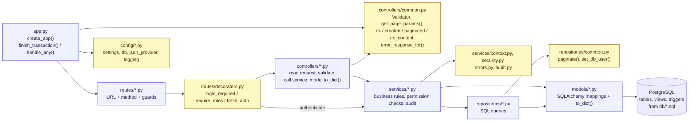
```mermaid
flowchart LR
    classDef layer fill:#eef2ff,stroke:#4f46e5,color:#1e1b4b
    classDef shared fill:#fef9c3,stroke:#a16207,color:#422006

    APP["app.py<br/>create_app()<br/>finish_transaction() / handle_any()"]:::layer
    ROUTES["routes/*.py<br/>URL + method + guards"]:::layer
    GUARDS["routes/decorators.py<br/>login_required / require_roles / fresh_auth"]:::shared
    CTRL["controllers/*.py<br/>read request, validate,<br/>call service, model.to_dict()"]:::layer
    CCOM["controllers/common.py<br/>Validator, get_page_params(),<br/>ok / created / paginated / no_content,<br/>error_response_for()"]:::shared
    SVC["services/*.py<br/>business rules, permission checks, audit"]:::layer
    SCOM["services/context.py, security.py,<br/>errors.py, audit.py"]:::shared
    REPO["repositories/*.py<br/>SQL queries"]:::layer
    RCOM["repositories/common.py<br/>paginate(), set_db_user()"]:::shared
    MODEL["models/*.py<br/>SQLAlchemy mappings + to_dict()"]:::layer
    CONF["config/*.py<br/>settings, db, json_provider, logging"]:::shared
    DB[("PostgreSQL<br/>tables, views, triggers<br/>from db/*.sql")]

    APP --> ROUTES --> GUARDS --> CTRL
    GUARDS -->|authenticate| SVC
    CTRL --> CCOM
    CTRL --> SVC
    SVC --> SCOM
    SVC --> REPO --> MODEL --> DB
    SVC --> MODEL
    REPO --> RCOM
    APP --> CCOM
    APP --> CONF
```

| Layer | Files |
|---|---|
| Entry | [backend/app.py](../backend/app.py), [backend/routes/\_\_init\_\_.py](../backend/routes/__init__.py) |
| Routes | [auth.py](../backend/routes/auth.py), [users.py](../backend/routes/users.py), [reference.py](../backend/routes/reference.py), [masters.py](../backend/routes/masters.py), [health.py](../backend/routes/health.py), [decorators.py](../backend/routes/decorators.py) |
| Controllers | [auth.py](../backend/controllers/auth.py), [users.py](../backend/controllers/users.py), [reference.py](../backend/controllers/reference.py), [masters.py](../backend/controllers/masters.py), [health.py](../backend/controllers/health.py), [common.py](../backend/controllers/common.py) |
| Services | [auth.py](../backend/services/auth.py), [users.py](../backend/services/users.py), [reference.py](../backend/services/reference.py), [branches.py](../backend/services/branches.py), [health.py](../backend/services/health.py), [audit.py](../backend/services/audit.py), [context.py](../backend/services/context.py), [security.py](../backend/services/security.py), [errors.py](../backend/services/errors.py) |
| Repositories | [users.py](../backend/repositories/users.py), [sessions.py](../backend/repositories/sessions.py), [settings.py](../backend/repositories/settings.py), [common.py](../backend/repositories/common.py) |
| Models | [access.py](../backend/models/access.py) (Role, User, UserRoleScope, UserSession, ActiveSession), [masters.py](../backend/models/masters.py) (Branch), [system.py](../backend/models/system.py) (AuditLog, AppSetting) |
| Config | [settings.py](../backend/config/settings.py), [database.py](../backend/config/database.py), [json_provider.py](../backend/config/json_provider.py), [logging.py](../backend/config/logging.py) |

At startup, `create_app()` ([backend/app.py:18](../backend/app.py#L18)) wires everything once: `get_config` → `configure_logging` → `app.json = JSONProvider(app)` → `db.init_app` → `register_transaction_hook` (after-request commit / rollback, [:34](../backend/app.py#L34)) → `register_error_handlers` ([:50](../backend/app.py#L50)) → `register_blueprints` (adds the `/api/v1` prefix, [routes/\_\_init\_\_.py:41](../backend/routes/__init__.py#L41)) → `register_cli`.

---

<a id="auth-pipeline"></a>
### 2. Shared: authentication pipeline

Every endpoint except `/health` and `/auth/login` runs this **before** its route function. The decorators always run in this order: `@login_required` → `@require_roles(...)` (admin routes only) → `@fresh_auth` (sensitive routes only) → the view.

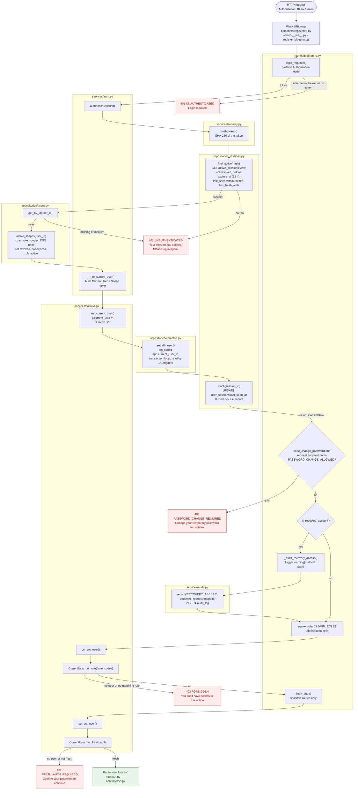
```mermaid
flowchart TD
    classDef err fill:#fdecea,stroke:#c62828,color:#b71c1c
    classDef done fill:#e8f5e9,stroke:#2e7d32,color:#1b5e20

    REQ(["HTTP request<br/>Authorization: Bearer token"])
    URL["Flask URL map<br/>blueprints registered by<br/>routes/__init__.py · register_blueprints()"]

    subgraph sgGuard["routes/decorators.py"]
        LR["login_required()<br/>partition Authorization header"]
        PCR{"must_change_password and<br/>request.endpoint not in<br/>PASSWORD_CHANGE_ALLOWED?"}
        REC{"is_recovery_account?"}
        ARA["_audit_recovery_access()<br/>logger.warning(method, path)"]
        RR["require_roles(*ADMIN_ROLES)<br/>admin routes only"]
        FA["fresh_auth()<br/>sensitive routes only"]
    end

    subgraph sgSvc["services/auth.py"]
        AUTH["authenticate(token)"]
        TCU["_to_current_user()<br/>build CurrentUser + Scope tuples"]
    end

    subgraph sgSec["services/security.py"]
        HT["hash_token()<br/>SHA-256 of the token"]
    end

    subgraph sgSess["repositories/sessions.py"]
        FIND["find_active(hash)<br/>GET active_sessions view:<br/>not revoked, before expires_at (12 h),<br/>last_seen within 30 min, has_fresh_auth"]
        TOUCH["touch(session_id)<br/>UPDATE user_sessions.last_seen_at<br/>at most once a minute"]
    end

    subgraph sgUsers["repositories/users.py"]
        GBI["get_by_id(user_id)"]
        ASC["active_scopes(user_id)<br/>user_role_scopes JOIN roles<br/>not revoked, not expired, role active"]
    end

    subgraph sgCtx["services/context.py"]
        SCU["set_current_user()<br/>g.current_user = CurrentUser"]
        CU1["current_user()"]
        HR["CurrentUser.has_role(*role_codes)"]
        CU2["current_user()"]
        HFA["CurrentUser.has_fresh_auth"]
    end

    subgraph sgDbc["repositories/common.py"]
        SDU["set_db_user()<br/>set_config app.current_user_id,<br/>transaction-local, read by DB triggers"]
    end

    subgraph sgAudit["services/audit.py"]
        AR["record('RECOVERY_ACCESS',<br/>'endpoint', request.endpoint)<br/>INSERT audit_log"]
    end

    VIEW["Route view function<br/>routes/*.py → controllers/*.py"]:::done

    E401A["401 UNAUTHENTICATED<br/>Login required"]:::err
    E401B["401 UNAUTHENTICATED<br/>Your session has expired.<br/>Please log in again."]:::err
    E403P["403 PASSWORD_CHANGE_REQUIRED<br/>Change your temporary password to continue"]:::err
    E403F["403 FORBIDDEN<br/>You don't have access to this action"]:::err
    E401F["401 FRESH_AUTH_REQUIRED<br/>Confirm your password to continue"]:::err

    REQ --> URL --> LR
    LR -->|scheme not bearer or no token| E401A
    LR -->|token| AUTH
    AUTH --> HT --> FIND
    FIND -->|no row| E401B
    FIND -->|session| GBI
    GBI -->|missing or inactive| E401B
    GBI -->|user| ASC --> TCU --> SCU --> SDU --> TOUCH
    TOUCH -->|return CurrentUser| PCR
    PCR -->|yes| E403P
    PCR -->|no| REC
    REC -->|yes| ARA --> AR --> RR
    REC -->|no| RR
    RR --> CU1 --> HR
    HR -->|no user or no matching role| E403F
    HR -->|ok| FA
    FA --> CU2 --> HFA
    HFA -->|no user or not fresh| E401F
    HFA -->|fresh| VIEW
```

- `PASSWORD_CHANGE_ALLOWED = {"auth.me", "auth.logout", "auth.change_password"}` ([routes/decorators.py:18](../backend/routes/decorators.py#L18)). A user with a temporary password can call only those three endpoints; everything else returns 403 `PASSWORD_CHANGE_REQUIRED`.
- **Idle / max session / fresh auth** are enforced in SQL, not Python. The max session length comes from `trg_user_sessions_expiry`, which sets `expires_at = created_at + session_max_hours` (default 12) on insert ([db/010_prototype_alignment.sql:138](../db/010_prototype_alignment.sql#L138)). The `active_sessions` view ([db/010_prototype_alignment.sql:142](../db/010_prototype_alignment.sql#L142)) drops rows that are revoked, past `expires_at` or idle longer than `session_idle_minutes` (default 30), and computes `has_fresh_auth` as `reauthenticated_at` within `fresh_auth_minutes` (default 15).
- **Recovery accounts:** every request is logged with `logger.warning` and writes a `RECOVERY_ACCESS` audit row **before** the role / fresh-auth checks. The audit row is part of the request transaction, so if the request then fails (status 400 or above) the row is rolled back by `finish_transaction()`; only the log line survives.

**Call trace**

| # | Location | Function | What it does |
|---|---|---|---|
| 1 | [routes/decorators.py:21](../backend/routes/decorators.py#L21) | `login_required` | Reads `Authorization`. Anything other than `Bearer <token>` (case-insensitive scheme) → 401 |
| 2 | [services/auth.py:33](../backend/services/auth.py#L33) | `authenticate` | Resolves the token to the current user |
| 3 | [services/security.py:38](../backend/services/security.py#L38) | `hash_token` | SHA-256. Only the hash is stored |
| 4 | [repositories/sessions.py:15](../backend/repositories/sessions.py#L15) | `find_active` | `db.session.get(ActiveSession, ...)` on the `active_sessions` view |
| 5 | [repositories/users.py:16](../backend/repositories/users.py#L16) | `get_by_id` | Missing or inactive user → 401 |
| 6 | [repositories/users.py:31](../backend/repositories/users.py#L31) | `active_scopes` | Role scopes that are live now (`_active_scope_condition`, [:9](../backend/repositories/users.py#L9)) |
| 7 | [services/auth.py:50](../backend/services/auth.py#L50) | `_to_current_user` | Builds the frozen `CurrentUser` dataclass ([services/context.py:32](../backend/services/context.py#L32)) |
| 8 | [services/context.py:72](../backend/services/context.py#L72) | `set_current_user` | Stores it on `flask.g` |
| 9 | [repositories/common.py:13](../backend/repositories/common.py#L13) | `set_db_user` | `set_config('app.current_user_id', ..., true)` for triggers |
| 10 | [repositories/sessions.py:29](../backend/repositories/sessions.py#L29) | `touch` | Updates `last_seen_at` (at most once a minute) |
| 11 | [routes/decorators.py:29](../backend/routes/decorators.py#L29) | `login_required` | Forced password change check |
| 12 | [routes/decorators.py:38](../backend/routes/decorators.py#L38) → [services/audit.py:17](../backend/services/audit.py#L17) | `_audit_recovery_access` → `record` | Recovery accounts: every request is audited |
| 13 | [routes/decorators.py:45](../backend/routes/decorators.py#L45) | `require_roles` | Any matching role at any branch, via [services/context.py:50](../backend/services/context.py#L50) `has_role`. Branch-level checks happen in services |
| 14 | [routes/decorators.py:61](../backend/routes/decorators.py#L61) | `fresh_auth` | Needs `has_fresh_auth` from the session view |

---

<a id="response-pipeline"></a>
### 3. Shared: response, error and transaction pipeline

Every endpoint **finishes** through this. One DB transaction covers the whole request.

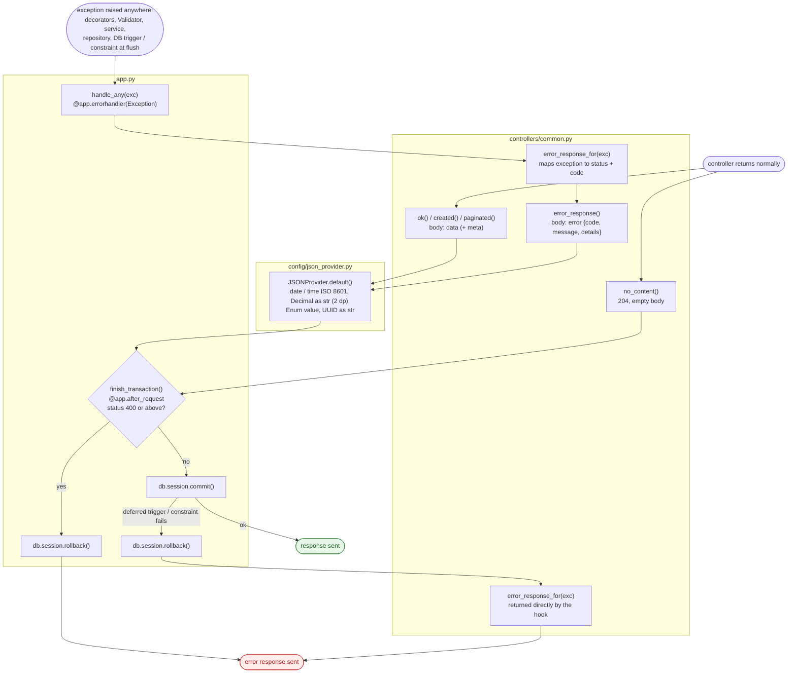
```mermaid
flowchart TD
    classDef err fill:#fdecea,stroke:#c62828,color:#b71c1c
    classDef done fill:#e8f5e9,stroke:#2e7d32,color:#1b5e20

    CTRL(["controller returns normally"])
    EXC(["exception raised anywhere:<br/>decorators, Validator, service,<br/>repository, DB trigger / constraint at flush"])

    subgraph sgResp["controllers/common.py"]
        OK["ok() / created() / paginated()<br/>body: data (+ meta)"]
        NC["no_content()<br/>204, empty body"]
        ERF["error_response_for(exc)<br/>maps exception to status + code"]
        ERR["error_response()<br/>body: error {code, message, details}"]
        ERF2["error_response_for(exc)<br/>returned directly by the hook"]
    end

    subgraph sgJson["config/json_provider.py"]
        JP["JSONProvider.default()<br/>date / time ISO 8601, Decimal as str (2 dp),<br/>Enum value, UUID as str"]
    end

    subgraph sgApp["app.py"]
        HA["handle_any(exc)<br/>@app.errorhandler(Exception)"]
        FT{"finish_transaction()<br/>@app.after_request<br/>status 400 or above?"}
        CM["db.session.commit()"]
        RB1["db.session.rollback()"]
        RB2["db.session.rollback()"]
    end

    SENT(["response sent"]):::done
    FAIL(["error response sent"]):::err

    CTRL --> OK --> JP --> FT
    CTRL --> NC --> FT
    EXC --> HA --> ERF --> ERR --> JP
    FT -->|yes| RB1 --> FAIL
    FT -->|no| CM
    CM -->|ok| SENT
    CM -->|deferred trigger / constraint fails| RB2 --> ERF2 --> FAIL
```

**How `error_response_for` maps exceptions** ([controllers/common.py:337](../backend/controllers/common.py#L337), Postgres table `PG_ERRORS` at [:326](../backend/controllers/common.py#L326))

| Exception | Status | `code` | `message` / `details` |
|---|---|---|---|
| `AppError` subclasses ([services/errors.py](../backend/services/errors.py)): `ValidationError` 400, `Unauthenticated` 401, `FreshAuthRequired` 401, `Forbidden` 403, `PasswordChangeRequired` 403, `NotFound` 404, `Conflict` 409, `BusinessRule` 422, `TooManyAttempts` 429 | its own | its own | its own |
| `ValidationError` from `Validator.validate()` | 400 | `VALIDATION_ERROR` | `Invalid request data`, field messages in `details` |
| werkzeug `HTTPException` (for example a non-integer `<int:user_id>` → 404, wrong method → 405) | its own | name upper-cased, e.g. `NOT_FOUND`, `METHOD_NOT_ALLOWED` | werkzeug description |
| `DBAPIError`, SQLSTATE `P0001` trigger `RAISE`, `23514` check, `23P01` exclusion, `23502` not null | 422 | `BUSINESS_RULE` | Postgres primary message; `details.constraint` / `details.detail` when present |
| `DBAPIError`, SQLSTATE `23503` foreign key | 422 | `INVALID_REFERENCE` | as above |
| `DBAPIError`, SQLSTATE `23505` unique | 409 | `CONFLICT` | as above |
| `DBAPIError`, SQLSTATE `22P02` bad text / enum | 400 | `VALIDATION_ERROR` | as above |
| Anything else (incl. other SQLSTATEs) | 500 | `INTERNAL_ERROR` | `Something went wrong` (logged with `logger.exception`) |

**Request input helpers** (all in [controllers/common.py](../backend/controllers/common.py)): `json_body()` ([:52](../backend/controllers/common.py#L52)) returns `{}` for a missing or non-object body, so missing fields surface as `Required`; `Validator` ([:61](../backend/controllers/common.py#L61)) keeps only fields present in the input (or with a default), with `string`, `email` (trimmed, lower-cased, max 255), `integer`, `boolean`, `datetime` (ISO 8601 with offset), `list_of` and others; `get_page_params()` ([:307](../backend/controllers/common.py#L307)) reads `page` (default 1, min 1) and `per_page` (default 25, max 100) and raises `Invalid pagination parameters`.

---

<a id="grant-subflow"></a>
### 4. Shared sub-flow: `services/users.py · _grant()`

Used by **POST `/users`** (once per scope in the request), **POST `/users/<id>/scopes`** and the `flask create-admin` CLI. Source: [backend/services/users.py:135](../backend/services/users.py#L135).

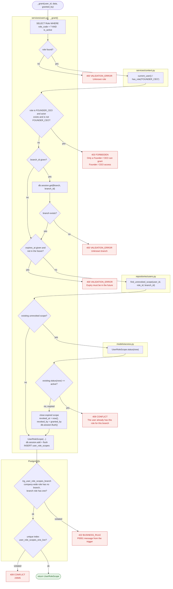
```mermaid
flowchart TD
    classDef err fill:#fdecea,stroke:#c62828,color:#b71c1c
    classDef done fill:#e8f5e9,stroke:#2e7d32,color:#1b5e20

    IN(["_grant(user_id, data, granted_by)"])

    subgraph sgSvc["services/users.py · _grant()"]
        G1["SELECT Role WHERE role_code = ? AND is_active"]
        G2{"role found?"}
        G3{"role is FOUNDER_CEO and actor<br/>exists and is not FOUNDER_CEO?"}
        G4{"branch_id given?"}
        G5["db.session.get(Branch, branch_id)"]
        G6{"branch exists?"}
        G7{"expires_at given and<br/>not in the future?"}
        G9{"existing unrevoked scope?"}
        G10{"existing.status(now) == active?"}
        G11["close expired scope<br/>revoked_at = now(), revoked_by = granted_by<br/>db.session.flush()"]
        G12["UserRoleScope(...)<br/>db.session.add + flush<br/>INSERT user_role_scopes"]
    end

    subgraph sgCtx["services/context.py"]
        CU["current_user() / has_role('FOUNDER_CEO')"]
    end

    subgraph sgRepo["repositories/users.py"]
        G8["find_unrevoked_scope(user_id, role_id, branch_id)"]
    end

    subgraph sgModel["models/access.py"]
        ST["UserRoleScope.status(now)"]
    end

    subgraph sgDb["PostgreSQL"]
        TRG{"trg_user_role_scopes_branch<br/>company-wide role has no branch,<br/>branch role has one?"}
        UQ{"unique index<br/>user_role_scopes_one_live?"}
    end

    E400R["400 VALIDATION_ERROR<br/>Unknown role"]:::err
    E403["403 FORBIDDEN<br/>Only a Founder / CEO can grant<br/>Founder / CEO access"]:::err
    E400B["400 VALIDATION_ERROR<br/>Unknown branch"]:::err
    E400E["400 VALIDATION_ERROR<br/>Expiry must be in the future"]:::err
    E409["409 CONFLICT<br/>The user already has this role for this branch"]:::err
    E422["422 BUSINESS_RULE<br/>P0001 message from the trigger"]:::err
    E409U["409 CONFLICT<br/>23505"]:::err
    OUT(["return UserRoleScope"]):::done

    IN --> G1 --> G2
    G2 -->|no| E400R
    G2 -->|yes| CU --> G3
    G3 -->|yes| E403
    G3 -->|no| G4
    G4 -->|yes| G5 --> G6
    G6 -->|no| E400B
    G6 -->|yes| G7
    G4 -->|no| G7
    G7 -->|yes| E400E
    G7 -->|no| G8 --> G9
    G9 -->|yes| ST --> G10
    G10 -->|yes| E409
    G10 -->|no, expired| G11 --> G12
    G9 -->|no| G12
    G12 --> TRG
    TRG -->|violated| E422
    TRG -->|ok| UQ
    UQ -->|violated| E409U
    UQ -->|ok| OUT
```

| # | Location | What |
|---|---|---|
| 1 | [repositories/users.py:52](../backend/repositories/users.py#L52) | `find_unrevoked_scope` — the (user, role, branch) slot, active or expired |
| 2 | [models/access.py:100](../backend/models/access.py#L100) | `UserRoleScope.status` — `revoked` / `expired` / `active` |
| 3 | [db/010_prototype_alignment.sql:84](../db/010_prototype_alignment.sql#L84) | `trg_user_role_scopes_branch` |
| 4 | [db/010_prototype_alignment.sql:65](../db/010_prototype_alignment.sql#L65) | `user_role_scopes_one_live` unique index |

---

### 5. Endpoints

<a id="health"></a>
#### 5.1 GET `/api/v1/health`

Public. Checks that the app is up and that it can reach the database.

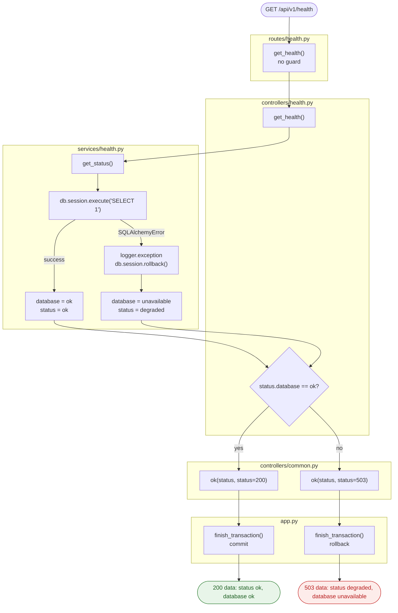
```mermaid
flowchart TD
    classDef err fill:#fdecea,stroke:#c62828,color:#b71c1c
    classDef done fill:#e8f5e9,stroke:#2e7d32,color:#1b5e20

    REQ(["GET /api/v1/health"])

    subgraph sgR["routes/health.py"]
        R1["get_health()<br/>no guard"]
    end
    subgraph sgC["controllers/health.py"]
        C1["get_health()"]
        C2{"status.database == ok?"}
    end
    subgraph sgS["services/health.py"]
        S1["get_status()"]
        S2["db.session.execute('SELECT 1')"]
        S3["logger.exception<br/>db.session.rollback()"]
        D1["database = ok<br/>status = ok"]
        D2["database = unavailable<br/>status = degraded"]
    end
    subgraph sgResp["controllers/common.py"]
        OK1["ok(status, status=200)"]
        OK2["ok(status, status=503)"]
    end
    subgraph sgTx["app.py"]
        FT1["finish_transaction()<br/>commit"]
        FT2["finish_transaction()<br/>rollback"]
    end

    RES1(["200 data: status ok, database ok"]):::done
    RES2(["503 data: status degraded, database unavailable"]):::err

    REQ --> R1 --> C1 --> S1 --> S2
    S2 -->|success| D1 --> C2
    S2 -->|SQLAlchemyError| S3 --> D2 --> C2
    C2 -->|yes| OK1 --> FT1 --> RES1
    C2 -->|no| OK2 --> FT2 --> RES2
```

| # | Location | Function |
|---|---|---|
| 1 | [routes/health.py:9](../backend/routes/health.py#L9) | `get_health` |
| 2 | [controllers/health.py:5](../backend/controllers/health.py#L5) | `get_health` |
| 3 | [services/health.py:12](../backend/services/health.py#L12) | `get_status` |
| 4 | [controllers/common.py:24](../backend/controllers/common.py#L24) | `ok` |

---

<a id="auth-login"></a>
#### 5.2 POST `/api/v1/auth/login`

Public. Body: `{email, password}`. Returns a token plus the same profile that `/auth/me` returns.

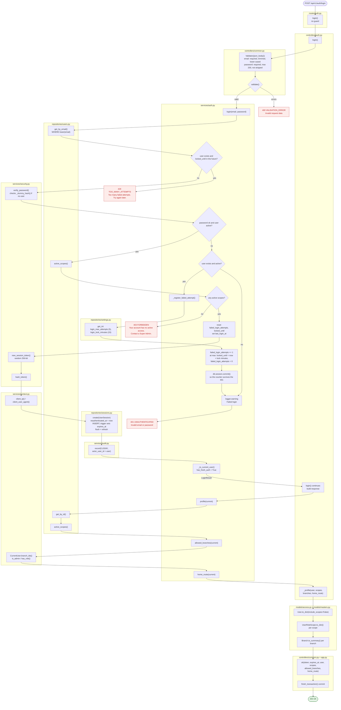
```mermaid
flowchart TD
    classDef err fill:#fdecea,stroke:#c62828,color:#b71c1c
    classDef done fill:#e8f5e9,stroke:#2e7d32,color:#1b5e20

    REQ(["POST /api/v1/auth/login"])

    subgraph sgR["routes/auth.py"]
        R1["login()<br/>no guard"]
    end
    subgraph sgC["controllers/auth.py"]
        C1["login()"]
        C2["login() continues<br/>build response"]
        C3["_profile(user, scopes,<br/>branches, home_route)"]
    end
    subgraph sgV["controllers/common.py"]
        V1["Validator(json_body())<br/>email: required, trimmed, lower-cased<br/>password: required, max 200, not stripped"]
        V2{"validate()"}
    end
    subgraph sgS["services/auth.py"]
        S1["login(email, password)"]
        S2{"user exists and<br/>locked_until in the future?"}
        S3{"password ok and user active?"}
        S3b{"user exists and active?"}
        S4["_register_failed_attempt()"]
        S4b["failed_login_attempts += 1<br/>at max: locked_until = now + lock minutes,<br/>failed_login_attempts = 0"]
        S4c["db.session.commit()<br/>so the counter survives the 401"]
        LOGW["logger.warning<br/>Failed login"]
        S5{"any active scopes?"}
        S6["reset failed_login_attempts, locked_until<br/>set last_login_at"]
        S7["_to_current_user()<br/>has_fresh_auth = True"]
        S8["profile(current)"]
        S9["allowed_branches(current)"]
        S10["home_route(current)"]
    end
    subgraph sgU["repositories/users.py"]
        U1["get_by_email()<br/>WHERE lower(email)"]
        U2["active_scopes()"]
        U3["get_by_id()"]
        U4["active_scopes()"]
    end
    subgraph sgSet["repositories/settings.py"]
        ST["get_int login_max_attempts (5),<br/>login_lock_minutes (15)"]
    end
    subgraph sgSec["services/security.py"]
        P1["verify_password()<br/>checks _dummy_hash() if no user"]
        P2["new_session_token()<br/>random 256-bit"]
        P3["hash_token()"]
    end
    subgraph sgCtx["services/context.py"]
        X1["client_ip() / client_user_agent()"]
        X2["CurrentUser.branch_ids()<br/>is_admin / has_role()"]
    end
    subgraph sgSess["repositories/sessions.py"]
        SS1["create(UserSession)<br/>reauthenticated_at = now<br/>INSERT, trigger sets expires_at<br/>flush + refresh"]
    end
    subgraph sgA["services/audit.py"]
        A1["record('LOGIN',<br/>actor_user_id = user)"]
    end
    subgraph sgM["models/access.py + models/masters.py"]
        D1["User.to_dict(include_scopes=False)"]
        D2["UserRoleScope.to_dict() per scope"]
        D3["Branch.to_summary() per branch"]
    end
    subgraph sgResp["controllers/common.py + app.py"]
        OK["ok(token, expires_at, user, scopes,<br/>allowed_branches, home_route)"]
        FT["finish_transaction() commit"]
    end

    E400["400 VALIDATION_ERROR<br/>Invalid request data"]:::err
    E429["429 TOO_MANY_ATTEMPTS<br/>Too many failed attempts. Try again later."]:::err
    E401["401 UNAUTHENTICATED<br/>Invalid email or password"]:::err
    E403["403 FORBIDDEN<br/>Your account has no active access.<br/>Contact a Super Admin."]:::err
    RES(["200 OK"]):::done

    REQ --> R1 --> C1 --> V1 --> V2
    V2 -->|errors| E400
    V2 -->|valid| S1 --> U1 --> S2
    S2 -->|yes| E429
    S2 -->|no| P1 --> S3
    S3 -->|no| S3b
    S3b -->|yes| S4 --> ST --> S4b --> S4c --> LOGW
    S3b -->|no| LOGW
    LOGW --> E401
    S3 -->|yes| U2 --> S5
    S5 -->|no| E403
    S5 -->|yes| S6 --> P2 --> P3 --> X1 --> SS1 --> A1 --> S7
    S7 -->|LoginResult| C2
    C2 --> S8 --> U3 --> U4 --> S9 --> X2 --> S10
    S10 --> C3 --> D1 --> D2 --> D3 --> OK --> FT --> RES
```

| # | Location | Function |
|---|---|---|
| 1 | [routes/auth.py:10](../backend/routes/auth.py#L10) | `login` |
| 2 | [controllers/auth.py:15](../backend/controllers/auth.py#L15) | `login` (Validator rules) |
| 3 | [services/auth.py:67](../backend/services/auth.py#L67) | `login` |
| 4 | [repositories/users.py:20](../backend/repositories/users.py#L20) | `get_by_email` |
| 5 | [services/security.py:19](../backend/services/security.py#L19) | `verify_password` (constant-time for unknown emails) |
| 6 | [services/auth.py:102](../backend/services/auth.py#L102) → [repositories/settings.py:15](../backend/repositories/settings.py#L15) | `_register_failed_attempt` → `get_int` |
| 7 | [repositories/users.py:31](../backend/repositories/users.py#L31) | `active_scopes` |
| 8 | [services/security.py:33](../backend/services/security.py#L33), [:38](../backend/services/security.py#L38) | `new_session_token`, `hash_token` |
| 9 | [repositories/sessions.py:8](../backend/repositories/sessions.py#L8) | `create` |
| 10 | [services/audit.py:17](../backend/services/audit.py#L17) | `record("LOGIN")`. The actor is passed explicitly because no user is in context yet |
| 11 | [services/auth.py:123](../backend/services/auth.py#L123), [:131](../backend/services/auth.py#L131), [:139](../backend/services/auth.py#L139) | `profile`, `allowed_branches`, `home_route` |
| 12 | [controllers/auth.py:6](../backend/controllers/auth.py#L6) | `_profile` → [User.to_dict](../backend/models/access.py#L61), [UserRoleScope.to_dict](../backend/models/access.py#L107), [Branch.to_summary](../backend/models/masters.py#L38) |

---

<a id="auth-logout"></a>
#### 5.3 POST `/api/v1/auth/logout`

Logged in (allowed during a forced password change). Revokes the current session.

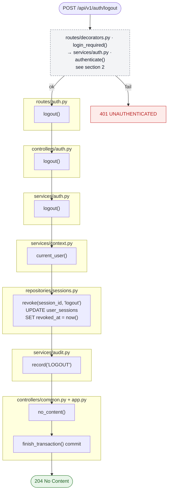
```mermaid
flowchart TD
    classDef err fill:#fdecea,stroke:#c62828,color:#b71c1c
    classDef done fill:#e8f5e9,stroke:#2e7d32,color:#1b5e20
    classDef shared fill:#f3f4f6,stroke:#6b7280,stroke-dasharray:4 3,color:#111827

    REQ(["POST /api/v1/auth/logout"])
    LR["routes/decorators.py · login_required()<br/>→ services/auth.py · authenticate()<br/>see section 2"]:::shared

    subgraph sgR["routes/auth.py"]
        R1["logout()"]
    end
    subgraph sgC["controllers/auth.py"]
        C1["logout()"]
    end
    subgraph sgS["services/auth.py"]
        S1["logout()"]
    end
    subgraph sgCtx["services/context.py"]
        X1["current_user()"]
    end
    subgraph sgSess["repositories/sessions.py"]
        SS1["revoke(session_id, 'logout')<br/>UPDATE user_sessions<br/>SET revoked_at = now()"]
    end
    subgraph sgA["services/audit.py"]
        A1["record('LOGOUT')"]
    end
    subgraph sgResp["controllers/common.py + app.py"]
        NC["no_content()"]
        FT["finish_transaction() commit"]
    end

    E401["401 UNAUTHENTICATED"]:::err
    RES(["204 No Content"]):::done

    REQ --> LR
    LR -->|fail| E401
    LR -->|ok| R1 --> C1 --> S1 --> X1 --> SS1 --> A1 --> NC --> FT --> RES
```

| # | Location | Function |
|---|---|---|
| 1 | [routes/auth.py:16](../backend/routes/auth.py#L16) | `logout` |
| 2 | [controllers/auth.py:26](../backend/controllers/auth.py#L26) | `logout` |
| 3 | [services/auth.py:115](../backend/services/auth.py#L115) | `logout` |
| 4 | [repositories/sessions.py:44](../backend/repositories/sessions.py#L44) | `revoke` |
| 5 | [services/audit.py:17](../backend/services/audit.py#L17) | `record` |

---

<a id="auth-me"></a>
#### 5.4 GET `/api/v1/auth/me`

Logged in (allowed during a forced password change). Returns the user, active scopes, allowed branches and landing route.

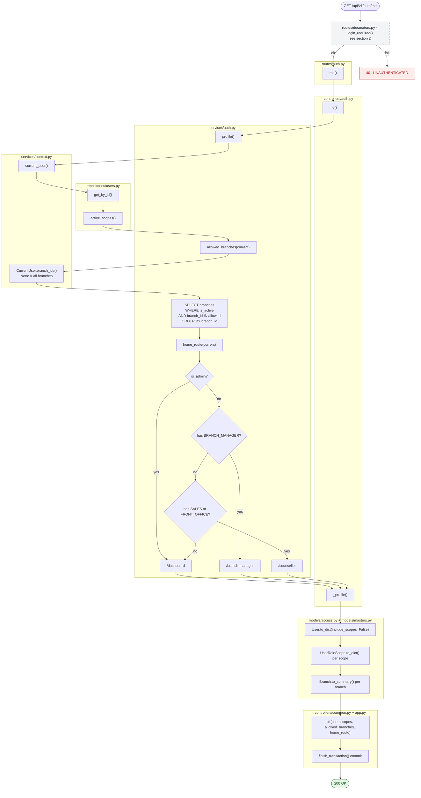
```mermaid
flowchart TD
    classDef err fill:#fdecea,stroke:#c62828,color:#b71c1c
    classDef done fill:#e8f5e9,stroke:#2e7d32,color:#1b5e20
    classDef shared fill:#f3f4f6,stroke:#6b7280,stroke-dasharray:4 3,color:#111827

    REQ(["GET /api/v1/auth/me"])
    LR["routes/decorators.py · login_required()<br/>see section 2"]:::shared

    subgraph sgR["routes/auth.py"]
        R1["me()"]
    end
    subgraph sgC["controllers/auth.py"]
        C1["me()"]
        C2["_profile()"]
    end
    subgraph sgS["services/auth.py"]
        S1["profile()"]
        S2["allowed_branches(current)"]
        S3["SELECT branches<br/>WHERE is_active<br/>AND branch_id IN allowed<br/>ORDER BY branch_id"]
        S4["home_route(current)"]
        H1{"is_admin?"}
        H2{"has BRANCH_MANAGER?"}
        H3{"has SALES or FRONT_OFFICE?"}
        HR1["/dashboard"]
        HR2["/branch-manager"]
        HR3["/counsellor"]
    end
    subgraph sgCtx["services/context.py"]
        X1["current_user()"]
        X2["CurrentUser.branch_ids()<br/>None = all branches"]
    end
    subgraph sgU["repositories/users.py"]
        U1["get_by_id()"]
        U2["active_scopes()"]
    end
    subgraph sgM["models/access.py + models/masters.py"]
        D1["User.to_dict(include_scopes=False)"]
        D2["UserRoleScope.to_dict() per scope"]
        D3["Branch.to_summary() per branch"]
    end
    subgraph sgResp["controllers/common.py + app.py"]
        OK["ok(user, scopes, allowed_branches, home_route)"]
        FT["finish_transaction() commit"]
    end

    E401["401 UNAUTHENTICATED"]:::err
    RES(["200 OK"]):::done

    REQ --> LR
    LR -->|fail| E401
    LR -->|ok| R1 --> C1 --> S1 --> X1 --> U1 --> U2 --> S2 --> X2 --> S3 --> S4 --> H1
    H1 -->|yes| HR1
    H1 -->|no| H2
    H2 -->|yes| HR2
    H2 -->|no| H3
    H3 -->|yes| HR3
    H3 -->|no| HR1
    HR1 & HR2 & HR3 --> C2 --> D1 --> D2 --> D3 --> OK --> FT --> RES
```

| # | Location | Function |
|---|---|---|
| 1 | [routes/auth.py:22](../backend/routes/auth.py#L22) | `me` |
| 2 | [controllers/auth.py:31](../backend/controllers/auth.py#L31) | `me` |
| 3 | [services/auth.py:123](../backend/services/auth.py#L123) | `profile` |
| 4 | [services/auth.py:131](../backend/services/auth.py#L131) → [services/context.py:57](../backend/services/context.py#L57) | `allowed_branches` → `branch_ids` |
| 5 | [services/auth.py:139](../backend/services/auth.py#L139) | `home_route` |
| 6 | [controllers/auth.py:6](../backend/controllers/auth.py#L6) | `_profile` |

---

<a id="auth-reauthenticate"></a>
#### 5.5 POST `/api/v1/auth/reauthenticate`

Logged in. Body: `{password}`. Refreshes `reauthenticated_at` so that `@fresh_auth` routes pass for the next `fresh_auth_minutes` (15). This endpoint is **not** in `PASSWORD_CHANGE_ALLOWED`, so a user with a temporary password gets 403.

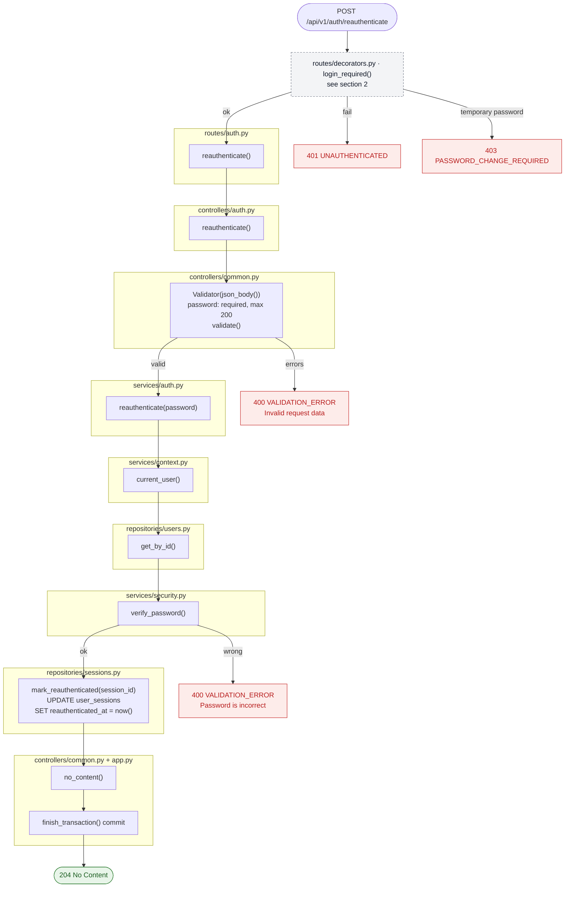
```mermaid
flowchart TD
    classDef err fill:#fdecea,stroke:#c62828,color:#b71c1c
    classDef done fill:#e8f5e9,stroke:#2e7d32,color:#1b5e20
    classDef shared fill:#f3f4f6,stroke:#6b7280,stroke-dasharray:4 3,color:#111827

    REQ(["POST /api/v1/auth/reauthenticate"])
    LR["routes/decorators.py · login_required()<br/>see section 2"]:::shared

    subgraph sgR["routes/auth.py"]
        R1["reauthenticate()"]
    end
    subgraph sgC["controllers/auth.py"]
        C1["reauthenticate()"]
    end
    subgraph sgV["controllers/common.py"]
        V1["Validator(json_body())<br/>password: required, max 200<br/>validate()"]
    end
    subgraph sgS["services/auth.py"]
        S1["reauthenticate(password)"]
    end
    subgraph sgCtx["services/context.py"]
        X1["current_user()"]
    end
    subgraph sgU["repositories/users.py"]
        U1["get_by_id()"]
    end
    subgraph sgSec["services/security.py"]
        P1["verify_password()"]
    end
    subgraph sgSess["repositories/sessions.py"]
        SS1["mark_reauthenticated(session_id)<br/>UPDATE user_sessions<br/>SET reauthenticated_at = now()"]
    end
    subgraph sgResp["controllers/common.py + app.py"]
        NC["no_content()"]
        FT["finish_transaction() commit"]
    end

    E401["401 UNAUTHENTICATED"]:::err
    E403["403 PASSWORD_CHANGE_REQUIRED"]:::err
    E400V["400 VALIDATION_ERROR<br/>Invalid request data"]:::err
    E400P["400 VALIDATION_ERROR<br/>Password is incorrect"]:::err
    RES(["204 No Content"]):::done

    REQ --> LR
    LR -->|fail| E401
    LR -->|temporary password| E403
    LR -->|ok| R1 --> C1 --> V1
    V1 -->|errors| E400V
    V1 -->|valid| S1 --> X1 --> U1 --> P1
    P1 -->|wrong| E400P
    P1 -->|ok| SS1 --> NC --> FT --> RES
```

| # | Location | Function |
|---|---|---|
| 1 | [routes/auth.py:28](../backend/routes/auth.py#L28) | `reauthenticate` |
| 2 | [controllers/auth.py:35](../backend/controllers/auth.py#L35) | `reauthenticate` (Validator rules) |
| 3 | [services/auth.py:152](../backend/services/auth.py#L152) | `reauthenticate` |
| 4 | [repositories/sessions.py:38](../backend/repositories/sessions.py#L38) | `mark_reauthenticated` |

---

<a id="auth-change-password"></a>
#### 5.6 POST `/api/v1/auth/change-password`

Logged in (allowed during a forced password change). Body: `{current_password, new_password}`. Signs out every other session.

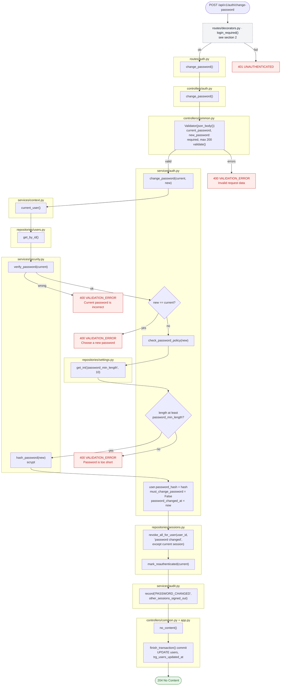
```mermaid
flowchart TD
    classDef err fill:#fdecea,stroke:#c62828,color:#b71c1c
    classDef done fill:#e8f5e9,stroke:#2e7d32,color:#1b5e20
    classDef shared fill:#f3f4f6,stroke:#6b7280,stroke-dasharray:4 3,color:#111827

    REQ(["POST /api/v1/auth/change-password"])
    LR["routes/decorators.py · login_required()<br/>see section 2"]:::shared

    subgraph sgR["routes/auth.py"]
        R1["change_password()"]
    end
    subgraph sgC["controllers/auth.py"]
        C1["change_password()"]
    end
    subgraph sgV["controllers/common.py"]
        V1["Validator(json_body())<br/>current_password, new_password:<br/>required, max 200<br/>validate()"]
    end
    subgraph sgS["services/auth.py"]
        S1["change_password(current, new)"]
        S2{"new == current?"}
        S3["check_password_policy(new)"]
        S4{"length at least<br/>password_min_length?"}
        S5["user.password_hash = hash<br/>must_change_password = False<br/>password_changed_at = now"]
    end
    subgraph sgCtx["services/context.py"]
        X1["current_user()"]
    end
    subgraph sgU["repositories/users.py"]
        U1["get_by_id()"]
    end
    subgraph sgSec["services/security.py"]
        P1["verify_password(current)"]
        P2["hash_password(new)<br/>scrypt"]
    end
    subgraph sgSet["repositories/settings.py"]
        ST["get_int('password_min_length', 10)"]
    end
    subgraph sgSess["repositories/sessions.py"]
        SS1["revoke_all_for_user(user_id,<br/>'password changed',<br/>except current session)"]
        SS2["mark_reauthenticated(current)"]
    end
    subgraph sgA["services/audit.py"]
        A1["record('PASSWORD_CHANGED',<br/>other_sessions_signed_out)"]
    end
    subgraph sgResp["controllers/common.py + app.py"]
        NC["no_content()"]
        FT["finish_transaction() commit<br/>UPDATE users, trg_users_updated_at"]
    end

    E401["401 UNAUTHENTICATED"]:::err
    E400V["400 VALIDATION_ERROR<br/>Invalid request data"]:::err
    E400C["400 VALIDATION_ERROR<br/>Current password is incorrect"]:::err
    E400S["400 VALIDATION_ERROR<br/>Choose a new password"]:::err
    E400L["400 VALIDATION_ERROR<br/>Password is too short"]:::err
    RES(["204 No Content"]):::done

    REQ --> LR
    LR -->|fail| E401
    LR -->|ok| R1 --> C1 --> V1
    V1 -->|errors| E400V
    V1 -->|valid| S1 --> X1 --> U1 --> P1
    P1 -->|wrong| E400C
    P1 -->|ok| S2
    S2 -->|yes| E400S
    S2 -->|no| S3 --> ST --> S4
    S4 -->|no| E400L
    S4 -->|yes| P2 --> S5 --> SS1 --> SS2 --> A1 --> NC --> FT --> RES
```

| # | Location | Function |
|---|---|---|
| 1 | [routes/auth.py:34](../backend/routes/auth.py#L34) | `change_password` |
| 2 | [controllers/auth.py:42](../backend/controllers/auth.py#L42) | `change_password` (Validator rules) |
| 3 | [services/auth.py:166](../backend/services/auth.py#L166) | `change_password` |
| 4 | [services/auth.py:160](../backend/services/auth.py#L160) | `check_password_policy` |
| 5 | [services/security.py:15](../backend/services/security.py#L15) | `hash_password` |
| 6 | [repositories/sessions.py:52](../backend/repositories/sessions.py#L52), [:38](../backend/repositories/sessions.py#L38) | `revoke_all_for_user`, `mark_reauthenticated` |
| 7 | [db/002_phase0_foundation.sql:102](../db/002_phase0_foundation.sql#L102) | `trg_users_updated_at` |

---

<a id="auth-sessions"></a>
#### 5.7 GET `/api/v1/auth/sessions`

Logged in. Lists the caller's own active sessions and marks the current one.

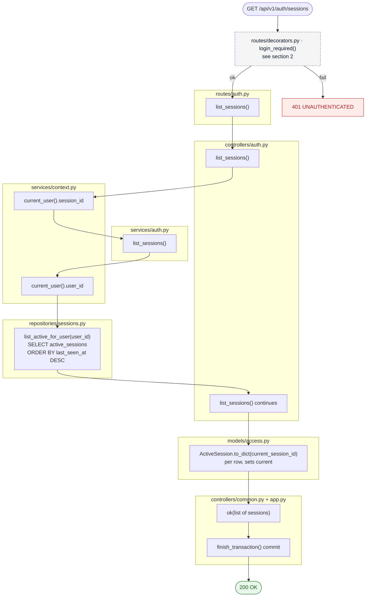
```mermaid
flowchart TD
    classDef err fill:#fdecea,stroke:#c62828,color:#b71c1c
    classDef done fill:#e8f5e9,stroke:#2e7d32,color:#1b5e20
    classDef shared fill:#f3f4f6,stroke:#6b7280,stroke-dasharray:4 3,color:#111827

    REQ(["GET /api/v1/auth/sessions"])
    LR["routes/decorators.py · login_required()<br/>see section 2"]:::shared

    subgraph sgR["routes/auth.py"]
        R1["list_sessions()"]
    end
    subgraph sgC["controllers/auth.py"]
        C1["list_sessions()"]
        C2["list_sessions() continues"]
    end
    subgraph sgS["services/auth.py"]
        S1["list_sessions()"]
    end
    subgraph sgCtx["services/context.py"]
        X2["current_user().session_id"]
        X1["current_user().user_id"]
    end
    subgraph sgSess["repositories/sessions.py"]
        SS1["list_active_for_user(user_id)<br/>SELECT active_sessions<br/>ORDER BY last_seen_at DESC"]
    end
    subgraph sgM["models/access.py"]
        D1["ActiveSession.to_dict(current_session_id)<br/>per row, sets current"]
    end
    subgraph sgResp["controllers/common.py + app.py"]
        OK["ok(list of sessions)"]
        FT["finish_transaction() commit"]
    end

    E401["401 UNAUTHENTICATED"]:::err
    RES(["200 OK"]):::done

    REQ --> LR
    LR -->|fail| E401
    LR -->|ok| R1 --> C1 --> X2 --> S1 --> X1 --> SS1 --> C2 --> D1 --> OK --> FT --> RES
```

| # | Location | Function |
|---|---|---|
| 1 | [routes/auth.py:40](../backend/routes/auth.py#L40) | `list_sessions` |
| 2 | [controllers/auth.py:52](../backend/controllers/auth.py#L52) | `list_sessions` |
| 3 | [services/auth.py:185](../backend/services/auth.py#L185) | `list_sessions` |
| 4 | [repositories/sessions.py:24](../backend/repositories/sessions.py#L24) | `list_active_for_user` |
| 5 | [models/access.py:158](../backend/models/access.py#L158) | `ActiveSession.to_dict` |

---

<a id="auth-revoke-session"></a>
#### 5.8 DELETE `/api/v1/auth/sessions/<session_id>`

Logged in. `session_id` is the hashed id returned by `GET /auth/sessions`. Only the caller's own sessions can be revoked.

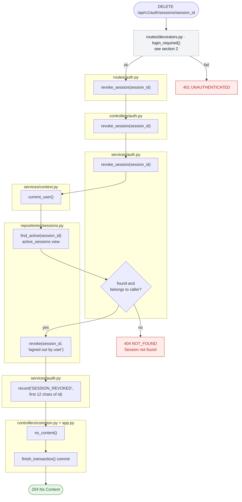
```mermaid
flowchart TD
    classDef err fill:#fdecea,stroke:#c62828,color:#b71c1c
    classDef done fill:#e8f5e9,stroke:#2e7d32,color:#1b5e20
    classDef shared fill:#f3f4f6,stroke:#6b7280,stroke-dasharray:4 3,color:#111827

    REQ(["DELETE /api/v1/auth/sessions/session_id"])
    LR["routes/decorators.py · login_required()<br/>see section 2"]:::shared

    subgraph sgR["routes/auth.py"]
        R1["revoke_session(session_id)"]
    end
    subgraph sgC["controllers/auth.py"]
        C1["revoke_session(session_id)"]
    end
    subgraph sgS["services/auth.py"]
        S1["revoke_session(session_id)"]
        S2{"found and<br/>belongs to caller?"}
    end
    subgraph sgCtx["services/context.py"]
        X1["current_user()"]
    end
    subgraph sgSess["repositories/sessions.py"]
        SS1["find_active(session_id)<br/>active_sessions view"]
        SS2["revoke(session_id,<br/>'signed out by user')"]
    end
    subgraph sgA["services/audit.py"]
        A1["record('SESSION_REVOKED',<br/>first 12 chars of id)"]
    end
    subgraph sgResp["controllers/common.py + app.py"]
        NC["no_content()"]
        FT["finish_transaction() commit"]
    end

    E401["401 UNAUTHENTICATED"]:::err
    E404["404 NOT_FOUND<br/>Session not found"]:::err
    RES(["204 No Content"]):::done

    REQ --> LR
    LR -->|fail| E401
    LR -->|ok| R1 --> C1 --> S1 --> X1 --> SS1 --> S2
    S2 -->|no| E404
    S2 -->|yes| SS2 --> A1 --> NC --> FT --> RES
```

| # | Location | Function |
|---|---|---|
| 1 | [routes/auth.py:46](../backend/routes/auth.py#L46) | `revoke_session` |
| 2 | [controllers/auth.py:57](../backend/controllers/auth.py#L57) | `revoke_session` |
| 3 | [services/auth.py:189](../backend/services/auth.py#L189) | `revoke_session` |
| 4 | [repositories/sessions.py:15](../backend/repositories/sessions.py#L15), [:44](../backend/repositories/sessions.py#L44) | `find_active`, `revoke` |

---

<a id="users-list"></a>
#### 5.9 GET `/api/v1/users`

Admin. Query parameters: `role`, `branch_id`, `is_active`, `q`, `page`, `per_page`.

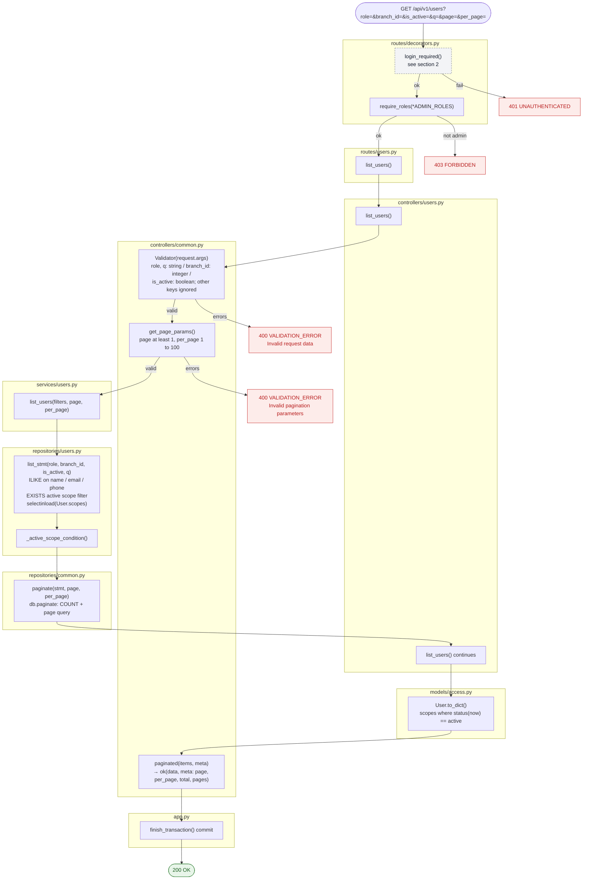
```mermaid
flowchart TD
    classDef err fill:#fdecea,stroke:#c62828,color:#b71c1c
    classDef done fill:#e8f5e9,stroke:#2e7d32,color:#1b5e20
    classDef shared fill:#f3f4f6,stroke:#6b7280,stroke-dasharray:4 3,color:#111827

    REQ(["GET /api/v1/users?role=&branch_id=&is_active=&q=&page=&per_page="])

    subgraph sgG["routes/decorators.py"]
        LR["login_required()<br/>see section 2"]:::shared
        RR["require_roles(*ADMIN_ROLES)"]
    end
    subgraph sgR["routes/users.py"]
        R1["list_users()"]
    end
    subgraph sgC["controllers/users.py"]
        C1["list_users()"]
        C2["list_users() continues"]
    end
    subgraph sgV["controllers/common.py"]
        V1["Validator(request.args)<br/>role, q: string / branch_id: integer /<br/>is_active: boolean; other keys ignored"]
        PG1["get_page_params()<br/>page at least 1, per_page 1 to 100"]
        OK["paginated(items, meta)<br/>→ ok(data, meta: page, per_page, total, pages)"]
    end
    subgraph sgS["services/users.py"]
        S1["list_users(filters, page, per_page)"]
    end
    subgraph sgU["repositories/users.py"]
        U1["list_stmt(role, branch_id, is_active, q)<br/>ILIKE on name / email / phone<br/>EXISTS active scope filter<br/>selectinload(User.scopes)"]
        U2["_active_scope_condition()"]
    end
    subgraph sgPg["repositories/common.py"]
        PG2["paginate(stmt, page, per_page)<br/>db.paginate: COUNT + page query"]
    end
    subgraph sgM["models/access.py"]
        D1["User.to_dict()<br/>scopes where status(now) == active"]
    end
    subgraph sgTx["app.py"]
        FT["finish_transaction() commit"]
    end

    E401["401 UNAUTHENTICATED"]:::err
    E403["403 FORBIDDEN"]:::err
    E400Q["400 VALIDATION_ERROR<br/>Invalid request data"]:::err
    E400P["400 VALIDATION_ERROR<br/>Invalid pagination parameters"]:::err
    RES(["200 OK"]):::done

    REQ --> LR
    LR -->|fail| E401
    LR -->|ok| RR
    RR -->|not admin| E403
    RR -->|ok| R1 --> C1 --> V1
    V1 -->|errors| E400Q
    V1 -->|valid| PG1
    PG1 -->|errors| E400P
    PG1 -->|valid| S1 --> U1 --> U2 --> PG2 --> C2 --> D1 --> OK --> FT --> RES
```

| # | Location | Function |
|---|---|---|
| 1 | [routes/users.py:14](../backend/routes/users.py#L14) | `list_users` |
| 2 | [controllers/users.py:14](../backend/controllers/users.py#L14) | `list_users` (Validator rules) |
| 3 | [controllers/common.py:307](../backend/controllers/common.py#L307) | `get_page_params` |
| 4 | [services/users.py:31](../backend/services/users.py#L31) | `list_users` |
| 5 | [repositories/users.py:86](../backend/repositories/users.py#L86) | `list_stmt` |
| 6 | [repositories/common.py:7](../backend/repositories/common.py#L7) | `paginate` |
| 7 | [models/access.py:61](../backend/models/access.py#L61) | `User.to_dict` |
| 8 | [controllers/common.py:39](../backend/controllers/common.py#L39) | `paginated` |

---

<a id="users-create"></a>
#### 5.10 POST `/api/v1/users`

Admin + fresh auth. Body: `{full_name, email, phone?, person_id?, is_recovery_account?, scopes: [{role_code, branch_id?, expires_at?}, ...]}`. Returns the user and a **one-time** temporary password.

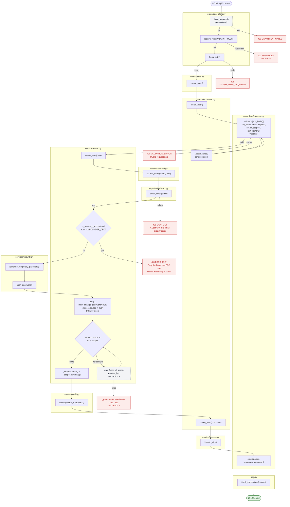
```mermaid
flowchart TD
    classDef err fill:#fdecea,stroke:#c62828,color:#b71c1c
    classDef done fill:#e8f5e9,stroke:#2e7d32,color:#1b5e20
    classDef shared fill:#f3f4f6,stroke:#6b7280,stroke-dasharray:4 3,color:#111827

    REQ(["POST /api/v1/users"])

    subgraph sgG["routes/decorators.py"]
        LR["login_required()<br/>see section 2"]:::shared
        RR["require_roles(*ADMIN_ROLES)"]
        FA["fresh_auth()"]
    end
    subgraph sgR["routes/users.py"]
        R1["create_user()"]
    end
    subgraph sgC["controllers/users.py"]
        C1["create_user()"]
        SR["_scope_rules()<br/>per scope item"]
        C2["create_user() continues"]
    end
    subgraph sgV["controllers/common.py"]
        V1["Validator(json_body())<br/>full_name, email required,<br/>list_of('scopes', min_items=1)<br/>validate()"]
        OK["created(user, temporary_password)"]
    end
    subgraph sgS["services/users.py"]
        S1["create_user(data)"]
        S2{"is_recovery_account and<br/>actor not FOUNDER_CEO?"}
        S3["User(..., must_change_password=True)<br/>db.session.add + flush<br/>INSERT users"]
        S4{"for each scope in data.scopes"}
        GR["_grant(user_id, scope, granted_by)<br/>see section 4"]:::shared
        S5["_snapshot(user) + _scope_summary()"]
    end
    subgraph sgCtx["services/context.py"]
        X1["current_user() / has_role()"]
    end
    subgraph sgU["repositories/users.py"]
        U1["email_taken(email)"]
    end
    subgraph sgSec["services/security.py"]
        P1["generate_temporary_password()"]
        P2["hash_password()"]
    end
    subgraph sgA["services/audit.py"]
        A1["record('USER_CREATED')"]
    end
    subgraph sgM["models/access.py"]
        D1["User.to_dict()"]
    end
    subgraph sgTx["app.py"]
        FT["finish_transaction() commit"]
    end

    E401["401 UNAUTHENTICATED"]:::err
    E403R["403 FORBIDDEN<br/>not admin"]:::err
    E401F["401 FRESH_AUTH_REQUIRED"]:::err
    E400["400 VALIDATION_ERROR<br/>Invalid request data"]:::err
    E409["409 CONFLICT<br/>A user with this email already exists"]:::err
    E403C["403 FORBIDDEN<br/>Only the Founder / CEO can<br/>create a recovery account"]:::err
    EG["_grant errors: 400 / 403 / 409 / 422<br/>see section 4"]:::err
    RES(["201 Created"]):::done

    REQ --> LR
    LR -->|fail| E401
    LR -->|ok| RR
    RR -->|not admin| E403R
    RR -->|ok| FA
    FA -->|stale| E401F
    FA -->|fresh| R1 --> C1 --> V1
    V1 --> SR --> V1
    V1 -->|errors| E400
    V1 -->|valid| S1 --> X1 --> U1
    U1 -->|taken| E409
    U1 -->|free| S2
    S2 -->|yes| E403C
    S2 -->|no| P1 --> P2 --> S3 --> S4
    S4 -->|next scope| GR --> S4
    GR -->|error| EG
    S4 -->|done| S5 --> A1 --> C2 --> D1 --> OK --> FT --> RES
```

| # | Location | Function |
|---|---|---|
| 1 | [routes/users.py:22](../backend/routes/users.py#L22) | `create_user` |
| 2 | [controllers/users.py:27](../backend/controllers/users.py#L27) | `create_user` (Validator rules; `_scope_rules`, [:8](../backend/controllers/users.py#L8)) |
| 3 | [services/users.py:43](../backend/services/users.py#L43) | `create_user` |
| 4 | [repositories/users.py:24](../backend/repositories/users.py#L24) | `email_taken` |
| 5 | [services/security.py:43](../backend/services/security.py#L43), [:15](../backend/services/security.py#L15) | `generate_temporary_password`, `hash_password` |
| 6 | [services/users.py:135](../backend/services/users.py#L135) | `_grant` (per scope) |
| 7 | [services/audit.py:17](../backend/services/audit.py#L17) | `record("USER_CREATED")` |
| 8 | [controllers/common.py:31](../backend/controllers/common.py#L31) | `created` |

---

<a id="users-get"></a>
#### 5.11 GET `/api/v1/users/<user_id>`

Admin. `<int:user_id>`: a non-integer id never reaches the view and returns a werkzeug 404.

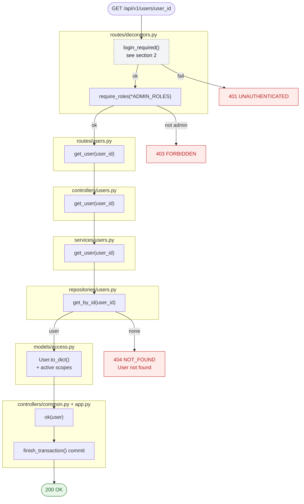
```mermaid
flowchart TD
    classDef err fill:#fdecea,stroke:#c62828,color:#b71c1c
    classDef done fill:#e8f5e9,stroke:#2e7d32,color:#1b5e20
    classDef shared fill:#f3f4f6,stroke:#6b7280,stroke-dasharray:4 3,color:#111827

    REQ(["GET /api/v1/users/user_id"])

    subgraph sgG["routes/decorators.py"]
        LR["login_required()<br/>see section 2"]:::shared
        RR["require_roles(*ADMIN_ROLES)"]
    end
    subgraph sgR["routes/users.py"]
        R1["get_user(user_id)"]
    end
    subgraph sgC["controllers/users.py"]
        C1["get_user(user_id)"]
    end
    subgraph sgS["services/users.py"]
        S1["get_user(user_id)"]
    end
    subgraph sgU["repositories/users.py"]
        U1["get_by_id(user_id)"]
    end
    subgraph sgM["models/access.py"]
        D1["User.to_dict()<br/>+ active scopes"]
    end
    subgraph sgResp["controllers/common.py + app.py"]
        OK["ok(user)"]
        FT["finish_transaction() commit"]
    end

    E401["401 UNAUTHENTICATED"]:::err
    E403["403 FORBIDDEN"]:::err
    E404["404 NOT_FOUND<br/>User not found"]:::err
    RES(["200 OK"]):::done

    REQ --> LR
    LR -->|fail| E401
    LR -->|ok| RR
    RR -->|not admin| E403
    RR -->|ok| R1 --> C1 --> S1 --> U1
    U1 -->|none| E404
    U1 -->|user| D1 --> OK --> FT --> RES
```

| # | Location | Function |
|---|---|---|
| 1 | [routes/users.py:29](../backend/routes/users.py#L29) | `get_user` |
| 2 | [controllers/users.py:42](../backend/controllers/users.py#L42) | `get_user` |
| 3 | [services/users.py:36](../backend/services/users.py#L36) | `get_user` |
| 4 | [repositories/users.py:16](../backend/repositories/users.py#L16) | `get_by_id` |

---

<a id="users-update"></a>
#### 5.12 PATCH `/api/v1/users/<user_id>`

Admin (no fresh auth). Body: any of `{full_name, email, phone, is_active}`, with at least one field. Deactivating a user signs out all of their sessions.

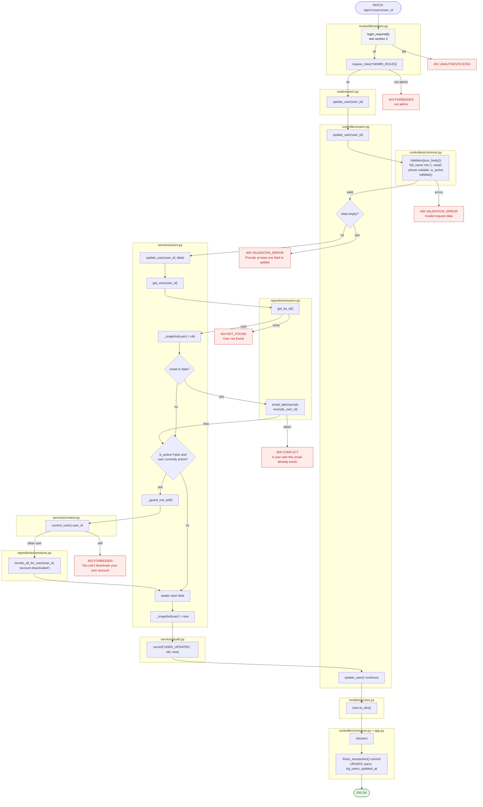
```mermaid
flowchart TD
    classDef err fill:#fdecea,stroke:#c62828,color:#b71c1c
    classDef done fill:#e8f5e9,stroke:#2e7d32,color:#1b5e20
    classDef shared fill:#f3f4f6,stroke:#6b7280,stroke-dasharray:4 3,color:#111827

    REQ(["PATCH /api/v1/users/user_id"])

    subgraph sgG["routes/decorators.py"]
        LR["login_required()<br/>see section 2"]:::shared
        RR["require_roles(*ADMIN_ROLES)"]
    end
    subgraph sgR["routes/users.py"]
        R1["update_user(user_id)"]
    end
    subgraph sgC["controllers/users.py"]
        C1["update_user(user_id)"]
        CE{"data empty?"}
        C2["update_user() continues"]
    end
    subgraph sgV["controllers/common.py"]
        V1["Validator(json_body())<br/>full_name min 1, email,<br/>phone nullable, is_active<br/>validate()"]
    end
    subgraph sgS["services/users.py"]
        S1["update_user(user_id, data)"]
        S2["get_user(user_id)"]
        S3["_snapshot(user) = old"]
        S4{"email in data?"}
        S5{"is_active False and<br/>user currently active?"}
        S6["_guard_not_self()"]
        S7["setattr each field"]
        S8["_snapshot(user) = new"]
    end
    subgraph sgU["repositories/users.py"]
        U1["get_by_id()"]
        U2["email_taken(email,<br/>exclude_user_id)"]
    end
    subgraph sgCtx["services/context.py"]
        X1["current_user().user_id"]
    end
    subgraph sgSess["repositories/sessions.py"]
        SS1["revoke_all_for_user(user_id,<br/>'account deactivated')"]
    end
    subgraph sgA["services/audit.py"]
        A1["record('USER_UPDATED', old, new)"]
    end
    subgraph sgM["models/access.py"]
        D1["User.to_dict()"]
    end
    subgraph sgResp["controllers/common.py + app.py"]
        OK["ok(user)"]
        FT["finish_transaction() commit<br/>UPDATE users, trg_users_updated_at"]
    end

    E401["401 UNAUTHENTICATED"]:::err
    E403["403 FORBIDDEN<br/>not admin"]:::err
    E400["400 VALIDATION_ERROR<br/>Invalid request data"]:::err
    E400E["400 VALIDATION_ERROR<br/>Provide at least one field to update"]:::err
    E404["404 NOT_FOUND<br/>User not found"]:::err
    E409["409 CONFLICT<br/>A user with this email already exists"]:::err
    E403S["403 FORBIDDEN<br/>You can't deactivate your own account"]:::err
    RES(["200 OK"]):::done

    REQ --> LR
    LR -->|fail| E401
    LR -->|ok| RR
    RR -->|not admin| E403
    RR -->|ok| R1 --> C1 --> V1
    V1 -->|errors| E400
    V1 -->|valid| CE
    CE -->|yes| E400E
    CE -->|no| S1 --> S2 --> U1
    U1 -->|none| E404
    U1 -->|user| S3 --> S4
    S4 -->|yes| U2
    U2 -->|taken| E409
    U2 -->|free| S5
    S4 -->|no| S5
    S5 -->|yes| S6 --> X1
    X1 -->|self| E403S
    X1 -->|other user| SS1 --> S7
    S5 -->|no| S7
    S7 --> S8 --> A1 --> C2 --> D1 --> OK --> FT --> RES
```

| # | Location | Function |
|---|---|---|
| 1 | [routes/users.py:36](../backend/routes/users.py#L36) | `update_user` |
| 2 | [controllers/users.py:46](../backend/controllers/users.py#L46) | `update_user` (Validator rules + empty check) |
| 3 | [services/users.py:70](../backend/services/users.py#L70) | `update_user` |
| 4 | [services/users.py:24](../backend/services/users.py#L24) | `_guard_not_self` |
| 5 | [repositories/sessions.py:52](../backend/repositories/sessions.py#L52) | `revoke_all_for_user` |

---

<a id="users-reset-password"></a>
#### 5.13 POST `/api/v1/users/<user_id>/reset-password`

Admin + fresh auth. Issues a new temporary password, unlocks the account and signs out every session for that user.

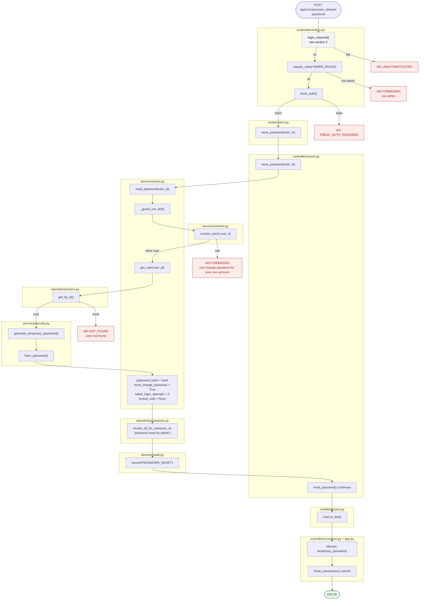
```mermaid
flowchart TD
    classDef err fill:#fdecea,stroke:#c62828,color:#b71c1c
    classDef done fill:#e8f5e9,stroke:#2e7d32,color:#1b5e20
    classDef shared fill:#f3f4f6,stroke:#6b7280,stroke-dasharray:4 3,color:#111827

    REQ(["POST /api/v1/users/user_id/reset-password"])

    subgraph sgG["routes/decorators.py"]
        LR["login_required()<br/>see section 2"]:::shared
        RR["require_roles(*ADMIN_ROLES)"]
        FA["fresh_auth()"]
    end
    subgraph sgR["routes/users.py"]
        R1["reset_password(user_id)"]
    end
    subgraph sgC["controllers/users.py"]
        C1["reset_password(user_id)"]
        C2["reset_password() continues"]
    end
    subgraph sgS["services/users.py"]
        S1["reset_password(user_id)"]
        S2["_guard_not_self()"]
        S3["get_user(user_id)"]
        S4["password_hash = hash<br/>must_change_password = True<br/>failed_login_attempts = 0<br/>locked_until = None"]
    end
    subgraph sgCtx["services/context.py"]
        X1["current_user().user_id"]
    end
    subgraph sgU["repositories/users.py"]
        U1["get_by_id()"]
    end
    subgraph sgSec["services/security.py"]
        P1["generate_temporary_password()"]
        P2["hash_password()"]
    end
    subgraph sgSess["repositories/sessions.py"]
        SS1["revoke_all_for_user(user_id,<br/>'password reset by admin')"]
    end
    subgraph sgA["services/audit.py"]
        A1["record('PASSWORD_RESET')"]
    end
    subgraph sgM["models/access.py"]
        D1["User.to_dict()"]
    end
    subgraph sgResp["controllers/common.py + app.py"]
        OK["ok(user, temporary_password)"]
        FT["finish_transaction() commit"]
    end

    E401["401 UNAUTHENTICATED"]:::err
    E403R["403 FORBIDDEN<br/>not admin"]:::err
    E401F["401 FRESH_AUTH_REQUIRED"]:::err
    E403S["403 FORBIDDEN<br/>Use change password for your own account"]:::err
    E404["404 NOT_FOUND<br/>User not found"]:::err
    RES(["200 OK"]):::done

    REQ --> LR
    LR -->|fail| E401
    LR -->|ok| RR
    RR -->|not admin| E403R
    RR -->|ok| FA
    FA -->|stale| E401F
    FA -->|fresh| R1 --> C1 --> S1 --> S2 --> X1
    X1 -->|self| E403S
    X1 -->|other user| S3 --> U1
    U1 -->|none| E404
    U1 -->|user| P1 --> P2 --> S4 --> SS1 --> A1 --> C2 --> D1 --> OK --> FT --> RES
```

| # | Location | Function |
|---|---|---|
| 1 | [routes/users.py:44](../backend/routes/users.py#L44) | `reset_password` |
| 2 | [controllers/users.py:59](../backend/controllers/users.py#L59) | `reset_password` |
| 3 | [services/users.py:89](../backend/services/users.py#L89) | `reset_password` |
| 4 | [repositories/sessions.py:52](../backend/repositories/sessions.py#L52) | `revoke_all_for_user` |

---

<a id="users-scopes-list"></a>
#### 5.14 GET `/api/v1/users/<user_id>/scopes`

Admin. Returns every scope, including expired and revoked ones, each with a computed `status`.

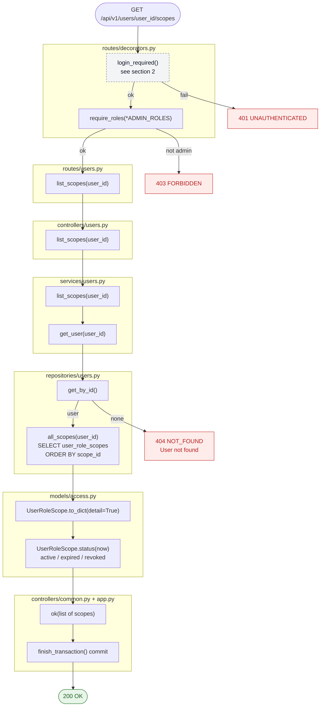
```mermaid
flowchart TD
    classDef err fill:#fdecea,stroke:#c62828,color:#b71c1c
    classDef done fill:#e8f5e9,stroke:#2e7d32,color:#1b5e20
    classDef shared fill:#f3f4f6,stroke:#6b7280,stroke-dasharray:4 3,color:#111827

    REQ(["GET /api/v1/users/user_id/scopes"])

    subgraph sgG["routes/decorators.py"]
        LR["login_required()<br/>see section 2"]:::shared
        RR["require_roles(*ADMIN_ROLES)"]
    end
    subgraph sgR["routes/users.py"]
        R1["list_scopes(user_id)"]
    end
    subgraph sgC["controllers/users.py"]
        C1["list_scopes(user_id)"]
    end
    subgraph sgS["services/users.py"]
        S1["list_scopes(user_id)"]
        S2["get_user(user_id)"]
    end
    subgraph sgU["repositories/users.py"]
        U1["get_by_id()"]
        U2["all_scopes(user_id)<br/>SELECT user_role_scopes<br/>ORDER BY scope_id"]
    end
    subgraph sgM["models/access.py"]
        D1["UserRoleScope.to_dict(detail=True)"]
        M1["UserRoleScope.status(now)<br/>active / expired / revoked"]
    end
    subgraph sgResp["controllers/common.py + app.py"]
        OK["ok(list of scopes)"]
        FT["finish_transaction() commit"]
    end

    E401["401 UNAUTHENTICATED"]:::err
    E403["403 FORBIDDEN"]:::err
    E404["404 NOT_FOUND<br/>User not found"]:::err
    RES(["200 OK"]):::done

    REQ --> LR
    LR -->|fail| E401
    LR -->|ok| RR
    RR -->|not admin| E403
    RR -->|ok| R1 --> C1 --> S1 --> S2 --> U1
    U1 -->|none| E404
    U1 -->|user| U2 --> D1 --> M1 --> OK --> FT --> RES
```

| # | Location | Function |
|---|---|---|
| 1 | [routes/users.py:51](../backend/routes/users.py#L51) | `list_scopes` |
| 2 | [controllers/users.py:64](../backend/controllers/users.py#L64) | `list_scopes` |
| 3 | [services/users.py:106](../backend/services/users.py#L106) | `list_scopes` |
| 4 | [repositories/users.py:41](../backend/repositories/users.py#L41) | `all_scopes` |
| 5 | [models/access.py:107](../backend/models/access.py#L107) | `UserRoleScope.to_dict` |

---

<a id="users-scopes-grant"></a>
#### 5.15 POST `/api/v1/users/<user_id>/scopes`

Admin + fresh auth. Body: `{role_code, branch_id?, expires_at?}`.

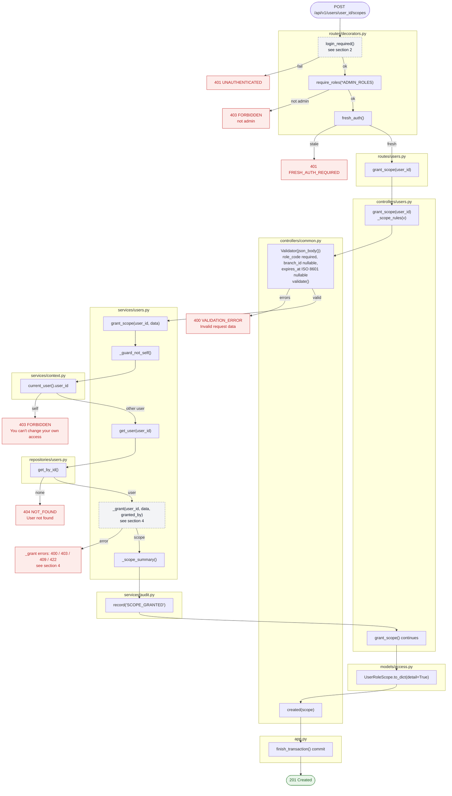
```mermaid
flowchart TD
    classDef err fill:#fdecea,stroke:#c62828,color:#b71c1c
    classDef done fill:#e8f5e9,stroke:#2e7d32,color:#1b5e20
    classDef shared fill:#f3f4f6,stroke:#6b7280,stroke-dasharray:4 3,color:#111827

    REQ(["POST /api/v1/users/user_id/scopes"])

    subgraph sgG["routes/decorators.py"]
        LR["login_required()<br/>see section 2"]:::shared
        RR["require_roles(*ADMIN_ROLES)"]
        FA["fresh_auth()"]
    end
    subgraph sgR["routes/users.py"]
        R1["grant_scope(user_id)"]
    end
    subgraph sgC["controllers/users.py"]
        C1["grant_scope(user_id)<br/>_scope_rules(v)"]
        C2["grant_scope() continues"]
    end
    subgraph sgV["controllers/common.py"]
        V1["Validator(json_body())<br/>role_code required, branch_id nullable,<br/>expires_at ISO 8601 nullable<br/>validate()"]
        OK["created(scope)"]
    end
    subgraph sgS["services/users.py"]
        S1["grant_scope(user_id, data)"]
        S2["_guard_not_self()"]
        S3["get_user(user_id)"]
        GR["_grant(user_id, data, granted_by)<br/>see section 4"]:::shared
        S4["_scope_summary()"]
    end
    subgraph sgCtx["services/context.py"]
        X1["current_user().user_id"]
    end
    subgraph sgU["repositories/users.py"]
        U1["get_by_id()"]
    end
    subgraph sgA["services/audit.py"]
        A1["record('SCOPE_GRANTED')"]
    end
    subgraph sgM["models/access.py"]
        D1["UserRoleScope.to_dict(detail=True)"]
    end
    subgraph sgTx["app.py"]
        FT["finish_transaction() commit"]
    end

    E401["401 UNAUTHENTICATED"]:::err
    E403R["403 FORBIDDEN<br/>not admin"]:::err
    E401F["401 FRESH_AUTH_REQUIRED"]:::err
    E400["400 VALIDATION_ERROR<br/>Invalid request data"]:::err
    E403S["403 FORBIDDEN<br/>You can't change your own access"]:::err
    E404["404 NOT_FOUND<br/>User not found"]:::err
    EG["_grant errors: 400 / 403 / 409 / 422<br/>see section 4"]:::err
    RES(["201 Created"]):::done

    REQ --> LR
    LR -->|fail| E401
    LR -->|ok| RR
    RR -->|not admin| E403R
    RR -->|ok| FA
    FA -->|stale| E401F
    FA -->|fresh| R1 --> C1 --> V1
    V1 -->|errors| E400
    V1 -->|valid| S1 --> S2 --> X1
    X1 -->|self| E403S
    X1 -->|other user| S3 --> U1
    U1 -->|none| E404
    U1 -->|user| GR
    GR -->|error| EG
    GR -->|scope| S4 --> A1 --> C2 --> D1 --> OK --> FT --> RES
```

| # | Location | Function |
|---|---|---|
| 1 | [routes/users.py:59](../backend/routes/users.py#L59) | `grant_scope` |
| 2 | [controllers/users.py:68](../backend/controllers/users.py#L68) | `grant_scope` (`_scope_rules`, [:8](../backend/controllers/users.py#L8)) |
| 3 | [services/users.py:111](../backend/services/users.py#L111) | `grant_scope` |
| 4 | [services/users.py:135](../backend/services/users.py#L135) | `_grant` |

---

<a id="users-scopes-revoke"></a>
#### 5.16 DELETE `/api/v1/users/<user_id>/scopes/<scope_id>`

Admin + fresh auth. This is a soft revoke: it sets `revoked_at` and never deletes the row. It returns **200 with the revoked scope**, not 204.

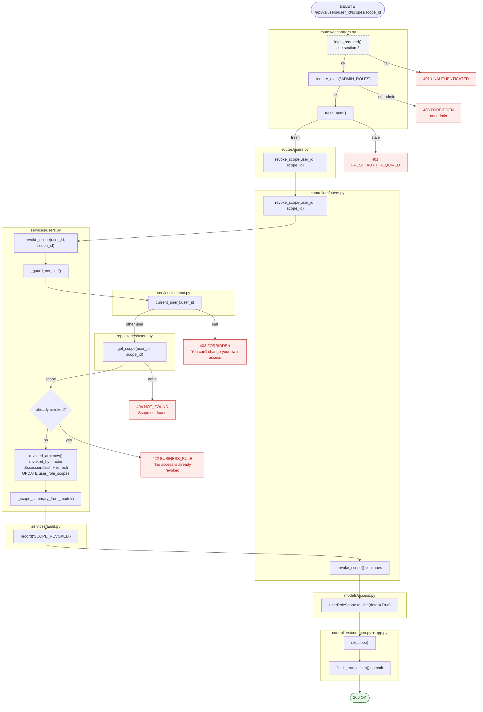
```mermaid
flowchart TD
    classDef err fill:#fdecea,stroke:#c62828,color:#b71c1c
    classDef done fill:#e8f5e9,stroke:#2e7d32,color:#1b5e20
    classDef shared fill:#f3f4f6,stroke:#6b7280,stroke-dasharray:4 3,color:#111827

    REQ(["DELETE /api/v1/users/user_id/scopes/scope_id"])

    subgraph sgG["routes/decorators.py"]
        LR["login_required()<br/>see section 2"]:::shared
        RR["require_roles(*ADMIN_ROLES)"]
        FA["fresh_auth()"]
    end
    subgraph sgR["routes/users.py"]
        R1["revoke_scope(user_id, scope_id)"]
    end
    subgraph sgC["controllers/users.py"]
        C1["revoke_scope(user_id, scope_id)"]
        C2["revoke_scope() continues"]
    end
    subgraph sgS["services/users.py"]
        S1["revoke_scope(user_id, scope_id)"]
        S2["_guard_not_self()"]
        S3{"already revoked?"}
        S4["revoked_at = now()<br/>revoked_by = actor<br/>db.session.flush + refresh<br/>UPDATE user_role_scopes"]
        S5["_scope_summary_from_model()"]
    end
    subgraph sgCtx["services/context.py"]
        X1["current_user().user_id"]
    end
    subgraph sgU["repositories/users.py"]
        U1["get_scope(user_id, scope_id)"]
    end
    subgraph sgA["services/audit.py"]
        A1["record('SCOPE_REVOKED')"]
    end
    subgraph sgM["models/access.py"]
        D1["UserRoleScope.to_dict(detail=True)"]
    end
    subgraph sgResp["controllers/common.py + app.py"]
        OK["ok(scope)"]
        FT["finish_transaction() commit"]
    end

    E401["401 UNAUTHENTICATED"]:::err
    E403R["403 FORBIDDEN<br/>not admin"]:::err
    E401F["401 FRESH_AUTH_REQUIRED"]:::err
    E403S["403 FORBIDDEN<br/>You can't change your own access"]:::err
    E404["404 NOT_FOUND<br/>Scope not found"]:::err
    E422["422 BUSINESS_RULE<br/>This access is already revoked"]:::err
    RES(["200 OK"]):::done

    REQ --> LR
    LR -->|fail| E401
    LR -->|ok| RR
    RR -->|not admin| E403R
    RR -->|ok| FA
    FA -->|stale| E401F
    FA -->|fresh| R1 --> C1 --> S1 --> S2 --> X1
    X1 -->|self| E403S
    X1 -->|other user| U1
    U1 -->|none| E404
    U1 -->|scope| S3
    S3 -->|yes| E422
    S3 -->|no| S4 --> S5 --> A1 --> C2 --> D1 --> OK --> FT --> RES
```

| # | Location | Function |
|---|---|---|
| 1 | [routes/users.py:67](../backend/routes/users.py#L67) | `revoke_scope` |
| 2 | [controllers/users.py:74](../backend/controllers/users.py#L74) | `revoke_scope` |
| 3 | [services/users.py:119](../backend/services/users.py#L119) | `revoke_scope` |
| 4 | [repositories/users.py:46](../backend/repositories/users.py#L46) | `get_scope` |

---

<a id="roles"></a>
#### 5.17 GET `/api/v1/roles`

Logged in. Active roles, for dropdowns.

```mermaid
flowchart TD
    classDef err fill:#fdecea,stroke:#c62828,color:#b71c1c
    classDef done fill:#e8f5e9,stroke:#2e7d32,color:#1b5e20
    classDef shared fill:#f3f4f6,stroke:#6b7280,stroke-dasharray:4 3,color:#111827

    REQ(["GET /api/v1/roles"])
    LR["routes/decorators.py · login_required()<br/>see section 2"]:::shared

    subgraph sgR["routes/reference.py"]
        R1["list_roles()"]
    end
    subgraph sgC["controllers/reference.py"]
        C1["list_roles()"]
    end
    subgraph sgS["services/reference.py"]
        S1["list_roles()<br/>SELECT roles WHERE is_active<br/>ORDER BY role_id"]
    end
    subgraph sgM["models/access.py"]
        D1["Role.to_dict() per role"]
    end
    subgraph sgResp["controllers/common.py + app.py"]
        OK["ok(list of roles)"]
        FT["finish_transaction() commit"]
    end

    E401["401 UNAUTHENTICATED"]:::err
    E403["403 PASSWORD_CHANGE_REQUIRED"]:::err
    RES(["200 OK"]):::done

    REQ --> LR
    LR -->|fail| E401
    LR -->|temporary password| E403
    LR -->|ok| R1 --> C1 --> S1 --> D1 --> OK --> FT --> RES
```

| # | Location | Function |
|---|---|---|
| 1 | [routes/reference.py:11](../backend/routes/reference.py#L11) | `list_roles` |
| 2 | [controllers/reference.py:7](../backend/controllers/reference.py#L7) | `list_roles` |
| 3 | [services/reference.py:11](../backend/services/reference.py#L11) | `list_roles` |
| 4 | [models/access.py:24](../backend/models/access.py#L24) | `Role.to_dict` |

---

<a id="branches"></a>
#### 5.18 GET `/api/v1/branches`

Logged in. Lives in the masters blueprint. Returns **all** active branches, with no filter by the caller's scopes. The caller's own branches come from `allowed_branches` in `/auth/me`.

```mermaid
flowchart TD
    classDef err fill:#fdecea,stroke:#c62828,color:#b71c1c
    classDef done fill:#e8f5e9,stroke:#2e7d32,color:#1b5e20
    classDef shared fill:#f3f4f6,stroke:#6b7280,stroke-dasharray:4 3,color:#111827

    REQ(["GET /api/v1/branches"])
    LR["routes/decorators.py · login_required()<br/>see section 2"]:::shared

    subgraph sgR["routes/masters.py"]
        R1["list_branches()"]
    end
    subgraph sgC["controllers/masters.py"]
        C1["list_branches()"]
    end
    subgraph sgS["services/branches.py"]
        S1["list_branches()<br/>SELECT branches WHERE is_active<br/>ORDER BY branch_id"]
    end
    subgraph sgM["models/masters.py"]
        D1["Branch.to_dict() per branch"]
    end
    subgraph sgResp["controllers/common.py + app.py"]
        OK["ok(list of branches)"]
        FT["finish_transaction() commit"]
    end

    E401["401 UNAUTHENTICATED"]:::err
    E403["403 PASSWORD_CHANGE_REQUIRED"]:::err
    RES(["200 OK"]):::done

    REQ --> LR
    LR -->|fail| E401
    LR -->|temporary password| E403
    LR -->|ok| R1 --> C1 --> S1 --> D1 --> OK --> FT --> RES
```

| # | Location | Function |
|---|---|---|
| 1 | [routes/masters.py:44](../backend/routes/masters.py#L44) | `list_branches` |
| 2 | [controllers/masters.py:55](../backend/controllers/masters.py#L55) | `list_branches` |
| 3 | [services/branches.py:12](../backend/services/branches.py#L12) | `list_branches` |
| 4 | [models/masters.py:25](../backend/models/masters.py#L25) | `Branch.to_dict` |

---

<a id="branches-get"></a>
#### 5.19 GET `/api/v1/branches/<branch_id>`

Logged in (no role check and no branch-scope check in the code). Returns one branch, active or not.

```mermaid
flowchart TD
    classDef err fill:#fdecea,stroke:#c62828,color:#b71c1c
    classDef done fill:#e8f5e9,stroke:#2e7d32,color:#1b5e20
    classDef shared fill:#f3f4f6,stroke:#6b7280,stroke-dasharray:4 3,color:#111827

    REQ(["GET /api/v1/branches/branch_id"])
    LR["routes/decorators.py · login_required()<br/>see section 2"]:::shared

    subgraph sgR["routes/masters.py"]
        R1["get_branch(branch_id)"]
    end
    subgraph sgC["controllers/masters.py"]
        C1["get_branch(branch_id)"]
    end
    subgraph sgS["services/branches.py"]
        S1["get_branch(branch_id)<br/>db.session.get(Branch, branch_id)"]
    end
    subgraph sgM["models/masters.py"]
        D1["Branch.to_dict()"]
    end
    subgraph sgResp["controllers/common.py + app.py"]
        OK["ok(branch)"]
        FT["finish_transaction() commit"]
    end

    E401["401 UNAUTHENTICATED"]:::err
    E403["403 PASSWORD_CHANGE_REQUIRED"]:::err
    E404["404 NOT_FOUND<br/>Branch not found"]:::err
    RES(["200 OK"]):::done

    REQ --> LR
    LR -->|fail| E401
    LR -->|temporary password| E403
    LR -->|ok| R1 --> C1 --> S1
    S1 -->|none| E404
    S1 -->|branch| D1 --> OK --> FT --> RES
```

| # | Location | Function |
|---|---|---|
| 1 | [routes/masters.py:50](../backend/routes/masters.py#L50) | `get_branch` |
| 2 | [controllers/masters.py:59](../backend/controllers/masters.py#L59) | `get_branch` |
| 3 | [services/branches.py:16](../backend/services/branches.py#L16) | `get_branch` |

---

<a id="branches-update"></a>
#### 5.20 PATCH `/api/v1/branches/<branch_id>`

Admin (no fresh auth). Body: any of `{branch_name, city, address, phone, email}`, with at least one field. Contact details only; `branch_code` and `receipt_prefix` can't be changed here.

```mermaid
flowchart TD
    classDef err fill:#fdecea,stroke:#c62828,color:#b71c1c
    classDef done fill:#e8f5e9,stroke:#2e7d32,color:#1b5e20
    classDef shared fill:#f3f4f6,stroke:#6b7280,stroke-dasharray:4 3,color:#111827

    REQ(["PATCH /api/v1/branches/branch_id"])

    subgraph sgG["routes/decorators.py"]
        LR["login_required()<br/>see section 2"]:::shared
        RR["require_roles(*ADMIN_ROLES)"]
    end
    subgraph sgR["routes/masters.py"]
        R1["update_branch(branch_id)"]
    end
    subgraph sgC["controllers/masters.py"]
        C1["update_branch(branch_id)"]
        CE["_require_changes(data)"]
    end
    subgraph sgV["controllers/common.py"]
        V1["Validator(json_body())<br/>branch_name, city: min 1, max 100<br/>address, phone, email: nullable<br/>validate()"]
    end
    subgraph sgS["services/branches.py"]
        S1["update_branch(branch_id, data)"]
        S2["get_branch(branch_id)"]
        S3["old = branch.to_dict()<br/>setattr each field<br/>db.session.flush()"]
    end
    subgraph sgA["services/audit.py"]
        A1["record('BRANCH_UPDATED',<br/>old, new, branch_id)"]
    end
    subgraph sgM["models/masters.py"]
        D1["Branch.to_dict()"]
    end
    subgraph sgResp["controllers/common.py + app.py"]
        OK["ok(branch)"]
        FT["finish_transaction() commit"]
    end

    E401["401 UNAUTHENTICATED"]:::err
    E403["403 FORBIDDEN<br/>not admin"]:::err
    E400["400 VALIDATION_ERROR<br/>Invalid request data"]:::err
    E400E["400 VALIDATION_ERROR<br/>Provide at least one field to update"]:::err
    E404["404 NOT_FOUND<br/>Branch not found"]:::err
    EDB["DB error at flush<br/>mapped as in section 3"]:::err
    RES(["200 OK"]):::done

    REQ --> LR
    LR -->|fail| E401
    LR -->|ok| RR
    RR -->|not admin| E403
    RR -->|ok| R1 --> C1 --> V1
    V1 -->|errors| E400
    V1 -->|valid| CE
    CE -->|empty| E400E
    CE -->|data| S1 --> S2
    S2 -->|none| E404
    S2 -->|branch| S3
    S3 -->|constraint fails| EDB
    S3 -->|ok| A1 --> D1 --> OK --> FT --> RES
```

| # | Location | Function |
|---|---|---|
| 1 | [routes/masters.py:57](../backend/routes/masters.py#L57) | `update_branch` |
| 2 | [controllers/masters.py:63](../backend/controllers/masters.py#L63) | `update_branch` (Validator rules; `_require_changes`, [:13](../backend/controllers/masters.py#L13)) |
| 3 | [services/branches.py:23](../backend/services/branches.py#L23) | `update_branch` |
| 4 | [services/audit.py:17](../backend/services/audit.py#L17) | `record("BRANCH_UPDATED")` |

---

<a id="staff"></a>
#### 5.21 GET `/api/v1/staff`

Logged in. Query parameters: `branch_id` (optional, whole number 1 or more) and `role` (optional; repeatable and / or comma-separated, e.g. `?role=SALES,FRONT_OFFICE`, upper-cased). Staff directory for owner / trainer / task-owner pickers: active users with active scopes at the caller's branches plus company-wide scopes, one entry per user with every matching role.

```mermaid
flowchart TD
    classDef err fill:#fdecea,stroke:#c62828,color:#b71c1c
    classDef done fill:#e8f5e9,stroke:#2e7d32,color:#1b5e20
    classDef shared fill:#f3f4f6,stroke:#6b7280,stroke-dasharray:4 3,color:#111827

    REQ(["GET /api/v1/staff?branch_id=&role="])
    LR["routes/decorators.py · login_required()<br/>see section 2"]:::shared

    subgraph sgR["routes/reference.py"]
        R1["list_staff()"]
    end
    subgraph sgC["controllers/reference.py"]
        C1["list_staff()"]
        C2["roles = request.args.getlist('role')<br/>split on commas, strip, upper<br/>empty list → None"]
    end
    subgraph sgV["controllers/common.py"]
        V1["Validator(branch_id only)<br/>integer, min_value 1<br/>validate()"]
        OK["ok(list of staff)"]
    end
    subgraph sgS["services/reference.py"]
        S1["list_staff(branch_id, role_codes)"]
        S2{"branch_id given?"}
        S3{"allowed is not None and<br/>branch_id not in allowed?"}
        S4["allowed = {branch_id}"]
        S5["group scopes by user_id<br/>user_id, full_name,<br/>roles: role_code, role_name,<br/>branch_id, branch_code"]
    end
    subgraph sgCtx["services/context.py"]
        X1["current_user()"]
        X2["CurrentUser.branch_ids()<br/>None = all branches"]
    end
    subgraph sgU["repositories/users.py"]
        U1["staff_scopes(role_codes, allowed)<br/>active scopes of active users<br/>role_code IN roles (if given)<br/>branch_id IN allowed OR NULL (if not None)<br/>ORDER BY full_name, user_id, scope_id"]
        U2["_active_scope_condition()"]
    end
    subgraph sgTx["app.py"]
        FT["finish_transaction() commit"]
    end

    E401["401 UNAUTHENTICATED"]:::err
    E403["403 PASSWORD_CHANGE_REQUIRED"]:::err
    E400["400 VALIDATION_ERROR<br/>Invalid request data"]:::err
    E404["404 NOT_FOUND<br/>Branch not found"]:::err
    RES(["200 OK"]):::done

    REQ --> LR
    LR -->|fail| E401
    LR -->|temporary password| E403
    LR -->|ok| R1 --> C1 --> V1
    V1 -->|errors| E400
    V1 -->|valid| C2 --> S1 --> X1 --> X2 --> S2
    S2 -->|yes| S3
    S3 -->|yes| E404
    S3 -->|no| S4 --> U1
    S2 -->|no| U1
    U1 --> U2 --> S5 --> OK --> FT --> RES
```

| # | Location | Function |
|---|---|---|
| 1 | [routes/reference.py:17](../backend/routes/reference.py#L17) | `list_staff` |
| 2 | [controllers/reference.py:11](../backend/controllers/reference.py#L11) | `list_staff` (Validator rule + `role` parsing) |
| 3 | [services/reference.py:15](../backend/services/reference.py#L15) | `list_staff` |
| 4 | [services/context.py:57](../backend/services/context.py#L57) | `CurrentUser.branch_ids` |
| 5 | [repositories/users.py:104](../backend/repositories/users.py#L104) | `staff_scopes` |
