# Nipuna CRM — Product Guide

What the system does, who uses it and what each role can see, do and approve.

| Part | Covers |
|---|---|
| [Part A — The product](#part-a--the-product) | What the product does and how it behaves, in plain language |
| [Part B — Roles and permissions](#part-b--roles-and-permissions) | Every role's screens, actions, approvals, fresh-auth actions and settings |

Related docs: [DATABASE.md](DATABASE.md) (schema and rules), [API.md](API.md) (backend and endpoints), [DEVELOPMENT.md · Part A (local development)](DEVELOPMENT.md#part-a--local-development) (setup, frontend, deployment, project status).

---

## Part A — The product

*What the system does and how it behaves, in plain language. For management, operations and anyone who needs to understand the product without the technical detail.*

---

### 1. What Nipuna CRM is

Nipuna CRM is the single system Nipuna Technologies uses to run its training business end to end — from the moment someone enquires about a course, through counselling, demo classes, fees and payments, admission and classes, to collecting dues, handling refunds and helping students find jobs.

It replaces spreadsheets, notebooks and WhatsApp threads with one shared record per learner, so that:

- **Nothing falls through the cracks** — every enquiry has an owner and a next follow-up, and the system raises tasks and alerts when something is waiting too long.
- **Money is trustworthy** — only payments that Accounts has verified count as collected, and no payment can be edited or deleted.
- **Discounts and exceptions are controlled** — anything outside normal pricing needs the right person's approval, and every decision is recorded.
- **Each branch runs its own operation** — Guntur and Vijayawada staff see only their own branch; management sees both.
- **Leaders see the real picture** — dashboards and reports are built from the same live records staff work in.

### 2. Who uses it

Everyone signs in with their own account. What they see and can do depends on their role and their branch.

| Role | What they do in the CRM | Sees |
|---|---|---|
| **Founder / CEO** | Oversees the business; final approver for large discounts, fee changes, refunds and payment corrections; approves targets | Both branches |
| **Super Admin** | Same approvals as Founder; manages users, access, settings and configuration | Both branches |
| **Branch Manager** | Runs a branch: assigns leads, approves discounts within their limit, watches team work, collections and targets | Own branch |
| **Sales (Counsellor)** | Owns leads: calls, counsels, books demos, negotiates fees, issues invoices, records payments | Own branch |
| **Front Office** | Walk-ins and phone enquiries; same lead work as counsellors | Own branch |
| **Accounts** | Verifies payments, manages collections and refund payouts, applies approved fee changes | Own branch |
| **Academic Coordinator** | Batches, curricula, allocating admitted students to batches, certificates | Own branch |
| **Trainer** | Runs demo classes and records how they went; sees their batches | Own branch |
| **Placement Team** | Employers, job openings, student placement profiles and applications | Own branch |
| **HR** | Staff-side access to student and task information | Own branch |

**Where each person lands after signing in:** counsellors and front office open their *Counsellor Workspace* (today's queue), branch managers open the *Branch Manager* view, everyone else opens the *Dashboard*.

**Branch separation:** a Guntur counsellor cannot see or open a Vijayawada lead, student or payment — the system treats it as if it doesn't exist. Founder / CEO and Super Admin can switch between *All branches*, Guntur and Vijayawada.

### 3. The learner journey at a glance

```
Enquiry ─► Lead ─► Qualify (6 checks) ─► Convert to deal ─► Counselling ─► Demo ─► Fee discussion
                                                                                        │
             Accepted delivery plan (per course) ─► Invoice (one or more courses) ◄─────┘
                                                        │
              Payment claim (pending) ─► Verification ─► Receipt ─► Admission per course (₹1,000 verified)
                                                                          │
            Alumni ◄─ Placement ◄─ Classes (batch) ◄──────────────────────┘
                     Collections (remaining instalments) · Refunds if needed
```

Every lead moves through these **pipeline stages**:

1. **New Enquiry** — just captured
2. **Counselling** — the counsellor is talking to them
3. **Demo Scheduled** — a demo class is booked
4. **Demo Attended** — they attended; follow-up on fees is due
5. **Fee Discussion / Payment Awaited** — price agreed or being negotiated
6. **Payment Pending Verification** — a payment has been recorded; Accounts must confirm it
7. **Admitted** — admission created (final stage)
8. **Lost - closed** — they decided not to join (always with a reason)

Many stage moves happen automatically: converting a qualified lead puts it at *Counselling*, booking a demo moves it to *Demo Scheduled*, recording a payment moves it to *Payment Pending Verification*, and the admission (created when the payment is verified) moves it to *Admitted*.

**Qualify, then convert.** A new lead is reviewed against **six qualification checks** — genuine intent, reachable contact, intended course(s) understood, branch and delivery mode discussed, exact next action agreed, and possible identity match reviewed (similar persons are checked by hand, never merged automatically). Each tick records who reviewed it and when. **Mark Qualified** needs all six and never changes the stage. Only then does **Convert to deal** open: the counsellor picks the course or courses (the lead's own course plus any others), the branch, the owner and the expected close date. The same person is reused; a course they already have open is returned, not duplicated. Conversion creates no admission, receipt or LMS access. Demos and fee discussions happen on deals, so they wait for conversion.

**Leads and the pipeline.** A lead stays an **Active lead** only while it is a *New Enquiry*, and the Leads screen shows these by default. Once converted, the lead becomes **Inactive** and the **person** moves onto the **Pipeline**:

- There is one pipeline **card** per person per branch. All of that person's open courses (deals) at the branch sit on the card and **share its stage**.
- Moving the card moves every course on it, and moving any one course moves the card.
- A new enquiry from someone who already has an open card stays in Leads until it is qualified and converted; it then joins the card.
- Admitting or losing one course closes only that course. The card stays on the board for the rest, and leaves it when its last course is admitted or lost.
- If one course is admitted while the card is at *Payment Pending Verification*, the rest of the card goes back to *Fee Discussion / Payment Awaited*.
- A lead lost straight from *New Enquiry* never gets a card.
- A closed card never reopens. A later enquiry (or a reactivated lost lead) starts a new one.

### 4. How each part works

#### 4.1 Capturing enquiries and leads

- A lead can be entered by staff (phone, walk-in, WhatsApp), come from the website or ads, or be **imported from a CSV file** (for example college data or outreach lists).
- For every lead the system records **where it came from** (source such as Google Ads, Referral, Walk-in), **how they contacted us** (channel) and **how it was entered**, so marketing performance can be measured.
- One person can enquire about several courses. The system keeps **one record per person** and a separate lead per course, so a returning learner's history stays together ("Add another course").
- **Duplicates are never merged automatically.** If a phone number already exists, the new record is flagged *Duplicate Review* for a person to check.
- CSV imports are checked row by row before anything is saved (valid phone and email, real course, correct branch); invalid rows are skipped and duplicates held for review.
- A lead created by a counsellor belongs to that counsellor. A lead without an owner creates a task for the branch manager to assign it; managers can **bulk-assign** several leads at once. Ownership changes are recorded.

#### 4.2 Counselling and follow-ups

- The **Counsellor Workspace** shows each counsellor their own queue in tabs: New, Untouched, Due Today, Overdue, Hot, Demos, Fee Discussion, Payment Pending, Cold / Reactivation and Future Joining.
- **Lead 360** is the full picture of one lead: contact details, stage, timeline of every call, message, note and stage change, demos, fee discussions, tasks and AI insights. Once the lead is in the pipeline, it also shows the person's card (shared stage, owner, other courses).
- The **Deal pipeline** shows the open opportunities, their value (the approved fee, else the standard fee) and the number admitted, then **seven stage counts** — Counselling, Demo scheduled, Demo attended, Fee discussion, Payment review, Admitted and Closed lost (the last two all-time for the branch). Clicking a count filters the board or list; "Show all stages" clears it. The board has columns *Counselling · Demo · Fee discussion · Payment review*; each card shows the person, courses, value, delivery-plan status, owner and expected close. Drag a card, or use "Move to…", between the manual stages; *Payment review* is set by a recorded payment. **Mark lost…** closes every course on the card with one reason. The card's settings button changes the owner (branch managers), the next follow-up and the expected close.
- **Next actions** below the board list one step per deal for the selected branch, most urgent first: review payment evidence, complete the scheduled demo, confirm the delivery plan, prepare the invoice, follow up the balance — each with a **Review deal** link.
- On **Lead 360** the phone number sits beside **Call**, **WhatsApp** (green), **Email** and **Convert to deal**; the qualification checklist is on the right until the lead is converted, then the deal's **delivery plan** and **commercial and invoice** panels take its place.
- **Persons** lists everyone who has enquired or studied at your branches. Search by name, part of the mobile number, email or person ID (it filters as you type; the header search box opens it too). **Person 360** shows the profile, the person's pipeline cards (one per branch), every lead and course with its status, and their admissions.
- After each conversation the counsellor **logs a follow-up** (purpose, the learner's response, notes) and must set the **next follow-up time**. Overdue follow-ups are highlighted and counted on dashboards.
- A lead can be **marked lost** only with a reason (fee too high, joined competitor, timing, etc.), optionally a competitor name and a date to reconnect. Lost leads can be **reactivated** later.
- **Saved views** let staff keep their favourite filters (e.g. "Hot fee discussions").

#### 4.3 Demo classes

- Counsellors book demos from Lead 360: date and time, in-person or online, standard (up to 45 minutes) or practical (up to 60 minutes), and the trainer.
- The system schedules **reminders** — a booking confirmation, a reminder 24 hours before and 1 hour before (student and trainer). Rescheduling or cancelling updates the reminders automatically, and both need a reason.
- After the class, the **trainer or counsellor records the outcome**: attended or no-show, student and trainer feedback, a rating, recommended course and the next step. A commercial follow-up is then due within 2 working hours.
- A learner gets up to two demos; a **third demo needs approval** from the Academic Coordinator or Branch Manager.

#### 4.4 Fees, offers and discounts

- Every course has a **standard fee** in the Course Master (the same at both branches). Combos ("3+1 career combos") have their own package price.
- The counsellor opens a **fee discussion** and builds a **fee version**: standard fee, any active **offer**, any **extra concession**, the resulting final amount and a **payment plan**. Each change creates a new version (v1, v2, …) — earlier versions are kept, never overwritten. A version is valid for 7 days.
- The **payment schedule** is agreed when the invoice is created (see 4.5), not on the fee version.
- **Extra concessions need approval** through a **special closing request**:
  - Branch Managers can approve up to their limit (the lower of 5% or ₹1,000 by default); Founder / CEO and Super Admin have no limit.
  - The target is a decision within **5 working minutes**; the manager is alerted and, if it waits too long, it escalates to the Founder / CEO.
  - Going below **70% of the standard fee** (the advisory floor) needs Founder / CEO or Super Admin **plus a second, independent approver**.
  - Nobody can approve their own request. The approver can approve, counteroffer or reject (with a reason).
- **Offers** (Offer Master) are set up by admins with dates, branches and courses they apply to, and can include a **complimentary course** (for example a free add-on when the final fee is above a threshold). Changing an active offer creates a new version so past fees stay explainable.
- **Each offer can be used only once per person.** Once a learner has been admitted with an offer (as a discount or a complimentary course), that offer no longer appears for them on any later course, and the system refuses it if someone tries — it names the admission where it was used. A different offer can still apply. If the admission that used the offer is cancelled, the offer becomes available to that learner again.
- **An offer gives one complimentary course per admission.** If an offer lists several free courses, the learner picks one. The free course also can't be one the learner already has (paid or free); the system refuses it and names the admission they already hold. Cancelling a wrongly granted free course frees the choice again.
- **Delivery plan (per course).** Each deal has its own delivery plan (`DP-00001`): service branch, classroom / online / hybrid, *Confirmed Seat* or *Future Plan* (with a planned start date), capacity review (checked or waiting) and a tick that the **student's acceptance was captured**. The counsellor, branch manager or academic coordinator confirms it; an accepted plan is fixed (it can be reopened until the course is invoiced). Batch allocation stays a separate step.

#### 4.5 Invoices

- **Create invoice** opens from a deal (Lead 360 or the fee discussion). It shows the **issuing branch and its address**, the learner, and every course deal of that learner at that branch. Only courses with an **approved fee** and an **accepted delivery plan**, not already invoiced and not lost, can be ticked — so one invoice can bill **one course or several compatible courses together** (for example `INV-GNT-2627-0001` with lines `…-L1`, `…-L2`). Each course's approved fee becomes its line amount.
- **Payment schedule:** 1, 2 or 3 instalments with any dates from today and any amounts (quick fills: Full, 50/50, 50/25/25), adding up to the invoice total. The learner can pay any amount at any time up to the balance; verified money covers the oldest instalment first. The dates drive reminders and alerts (see 4.11).
- After creating, the invoice opens and each included course shows **View invoice**. No admission is created by invoicing.
- The issuing branch's name, address, phone and email are **copied onto the invoice** when it is issued: later branch edits, or a viewer switching the branch filter, never change it. **Guntur** invoices use the violet template and **Vijayawada** the teal one.
- The invoice page shows the branch document itself — issuer, bill-to, course lines, payment terms, totals, verified paid, balance due, instalment cards and verified receipts — with **Print / Save PDF** (it prints on its own, A4). On a phone the tables become stacked cards. Tax / GSTIN and bank details are left off until approved values are provided.
- Invoices cannot be edited. An unpaid invoice can be cancelled (its courses can then be invoiced again); after admission, only an approved fee change can revise a course's amount (see 4.8).

#### 4.6 Payments and verification

- **Record payment** (Payments & receipts, which opens with the invoice already selected from the invoice page) splits the money across the invoice's **courses** ("Allocate now" per course — no course can be paid beyond what is left on it) and takes one or several **tenders** (mode, amount, reference). Modes: cash, UPI / bank transfer, payment link / card, or cheque as an exception. A photo or PDF of the proof can be attached.
- Each tender is a separate **payment claim** with a **transaction number** (`TXN-GNT-00001`). A claim is *Pending Verification*: it has **no receipt number**, does **not** count as paid and never looks like a receipt. Accounts is alerted immediately and has a 30-minute target before it escalates to the Branch Manager.
- Accounts **verifies** after two confirmations — the evidence was reviewed, and (for cash) an independent cash check — or marks it **Failed** with a reason. Only then is the **receipt number** issued (`GNT-R-2627-00001`, per branch and financial year). This happens once and cannot be undone. Example: an invoice of ₹22,000 with a ₹5,000 claim pending shows ₹0 paid and ₹22,000 balance; after verification it has one receipt, ₹5,000 paid and ₹17,000 balance — on the invoice, the invoice list, collections and reports alike.
- **Payments can never be edited or deleted.** Mistakes are fixed with a **correction**: Accounts requests it with a reason, a *different* person (Founder / CEO or Super Admin) approves it, and the system adds a reversal entry linked to the original. The full history stays visible.
- Cheques are accepted only as an exception approved by a manager other than the person collecting.
- Money received without an invoice is kept as an **advance** and allocated later.

#### 4.7 Admission

Admissions are **per course** and are created **automatically when a payment is verified**: every course on the invoice whose verified money reaches the **₹1,000 admission token** (or its whole amount, if smaller) and whose delivery plan is accepted gets its admission — once, reusing the same person / student for every course. Admins can change the token amount in Settings (`admission_token_amount`).

The *New Admission* screen is an **eligibility review**: invoiced courses not admitted yet, what each still needs (₹ verified so far vs the token, the delivery plan) and a manual **Create admission** if an automatic one was refused (the branch manager also gets a task). Complimentary courses are still added by hand from the paid admission. The admission gets a code (e.g. `NIT-GNT-2026-000001`), takes its service branch, mode, seat type and start date from the delivery plan, moves that course to *Admitted* and hands the student over to academics. LMS access is a separate step afterwards. The date the token was reached is what counts as a **"new paid admission"** in reports and targets.

#### 4.8 After admission: changes, transfers, cancellation

- **Fee changes after admission** (for example switching course) are requested by staff, approved by the Founder / CEO or Super Admin (who may approve their own request) and applied by Accounts, or by the Founder / CEO or Super Admin. The invoice and instalments are recalculated. A fee can't be reduced below what has already been paid — that needs a refund case.
- A student can be **transferred** to be served by the other branch; the original branch stays on record.
- **Cancelling** an admission always needs a reason and is done by a manager or admin.

#### 4.9 Batches and classes

- Academic Coordinators create **batches** per course and branch: schedule, trainer, room or online link, capacity and start date. Each course has a published **curriculum version** (e.g. v2026.1).
- Admitted students wait in the **allocation queue**. Before allocating, the system checks the batch has space, is at the student's branch, and the student is mapped to the right curriculum — and says exactly what blocks it and who can fix it.
- Deadlines: confirmed-seat students should be allocated within 1 working day and before the first class; future-plan students 48 hours before start. The coordinator is alerted 24 hours before a batch starts if anyone is still unallocated.
- The **first attended class** (not demos) is recorded as the joining date; the student's status moves from *Awaiting Batch Allocation* to *Scheduled* to *In Progress*.
- On completion, **certificates** are issued with their own numbers; a revoked certificate needs a reason.

#### 4.10 Student 360

One screen per student with everything in tabs: personal details, all enquiries and admissions, finance (invoices, payments, dues), academic progress and certificates, **documents** (identity proof, photo, address proof, education certificate — uploaded, then verified or rejected by someone other than the uploader), support cases, placement, the full timeline and the audit history.

#### 4.11 Collections

- The **Collections** screen lists every instalment that is due today, overdue or upcoming, with ageing bands (1–3, 4–7, 8–15, 16–30, 31–60, 61–90, 91+ days).
- **Reminder and escalation schedule** for each instalment: 3 days before, on the due date, 3 days after; on day 4 it goes to the owner, day 7 to the branch manager, then weekly until day 30.
- **Due in 2 days:** every day the owner, Accounts and the Branch Manager get a notification for each unpaid instalment due within the next 2 days (setting `installment_due_soon_days`).
- **Long payment gap:** when a payment is verified and the next unpaid instalment is due **more than 30 days** after it (setting `payment_gap_alert_days`), the owner, Accounts, the Branch Manager, the Founder / CEO and Super Admin are notified.
- The dashboard's **Long-gap plans** card counts those plans (and their outstanding amount); clicking it lists the persons, longest gap first.
- Staff record **promises to pay** (amount and date) and mark them kept or broken; broken promises escalate.
- Students with a payment still waiting for verification are put on **contact hold** so they aren't chased for money they've already paid.

#### 4.12 Refunds and support

- A **refund case** follows fixed steps, each recorded separately: registration (reason, receipts involved, evidence) → assessment → **decision by Founder / CEO or Super Admin** → **payout by Accounts, Founder / CEO or Super Admin** (an admin may pay out a refund they decided) → reconciliation → completed.
- Targets: a decision within 7 working days, payout within 18 working days of approval. A refund can never exceed what was actually verified as paid.
- **Support cases** (LMS problems, academic questions, payment queries, certificates, complaints) are logged, tracked and resolved with notes.

#### 4.13 Placement and alumni

- The Placement Team keeps **employers** and **job openings**, and a **placement profile** per student (readiness, skills, CV, preferences).
- A student can be put forward for a job only with their **explicit consent** and only for an open job.
- Applications move through: Applied → Shortlisted → Interview Scheduled → Interview Attended → Selected → Offer Received → Offer Accepted → Joined. An interview no-show is noted as an event, not an automatic rejection.
- Nipuna offers **career assistance, not guaranteed placement** — the product wording reflects this.
- Students become **alumni** after an authorised course completion and get **6 months of support** by default (extendable by Founder / CEO or Super Admin).

### 5. Keeping work moving

#### Tasks
Everyone has a **Tasks** list (*My Tasks*, and *Team Tasks* for managers). Many tasks are created automatically — assign a new lead, verify a payment, follow up after a demo, chase an instalment — and staff can add their own. A task's **original deadline never changes**; moving it needs a reason and both dates stay visible. Blocking or cancelling a task also needs a reason.

#### Notifications and escalations
The bell icon shows **notifications**. For action-required items the system tracks separately whether they were delivered, read, acknowledged and completed. If nobody acts in time, it **escalates** automatically:

| Event | Who is alerted | Warning | Escalates to |
|---|---|---|---|
| Discount approval (special closing) waiting | Branch Manager | 4 min | Founder / CEO at 5 min |
| Payment waiting for verification | Accounts | 25 min | Branch Manager at 30 min |

Thresholds are adjustable by admins.

#### Communications inbox
All messages and calls are logged in one **inbox** with queues: Awaiting Reply, Match Review (a message from a number the system recognises, waiting to be linked to the right person — never linked automatically), Failed (can be retried), Missed Calls and Manual Activity. Inbound messages show a response deadline and whether it's within time, at risk or breached.

#### Working time
Response targets count **staffed working time** — branch opening hours, excluding off days and holidays — so a message at 6:55 pm isn't "late" by 9:05 am the next day. Branch hours and holidays are set by admins (currently Monday–Saturday, 9 am–7 pm).

### 6. Management visibility

- **Dashboard** — for Founder / Admin: company totals and a branch comparison; for Branch Managers: genuine enquiries, follow-ups at risk, demos (scheduled / attended / no-show), paid admissions, verified collections, dues, staff coverage, the lead funnel, approval queues and progress against target.
- **Reports** — management summary, lead funnel, performance by course, source and staff, and response-time (SLA) compliance; filterable by period, course, staff and source, exportable to CSV, and schedulable for regular delivery.
- **Target Master** — monthly targets for verified collections and paid admissions, per branch and for the company. Targets are drafted, then **approved by the Founder / CEO**; a new approved version replaces the old one while keeping history. Achievement is tracked live.
- **What counts:** collections = **verified** payments minus corrections, by payment date and collecting branch. Pending payments are never counted.

### 7. AI assistance (advisory only)

- **Next best action** — suggests which leads a counsellor should contact next and why.
- **Lead brief** — a short pre-call summary, why the lead is considered hot, and a suggested WhatsApp message in **English or Telugu**.
- **Ask Nipuna** — managers ask questions in plain language ("How are collections this month?") and get an answer with the facts, sources, period and what data is missing.
- AI **never changes records or sends messages by itself**; a person always decides. Every answer can be rated (helpful / incorrect / not useful / missing context) to improve it.
- Today the answers come from built-in rules on live data; connecting a full AI model is planned.

### 8. Safeguards the system always enforces

| Safeguard | What it means in practice |
|---|---|
| Branch separation | Staff only see and act on their own branch's records |
| Verified money only | Only Accounts-verified payments count as collected or unlock admission |
| No editing money | Payments and invoices can't be edited or deleted; corrections are separate, approved entries |
| Two-person rule | Nobody approves their own discount, correction or document (a Founder / CEO or Super Admin may approve their own fee change and pay out a refund they decided) |
| Reasons required | Lost leads, cancellations, rejections, deadline changes, reversals and refunds all need a written reason |
| Full audit trail | Sensitive actions (approvals, money, fee changes, access changes, settings) record who did what, when, and the before / after values |
| Secure sign-in | Sessions end after 30 minutes idle or 12 hours at most; 5 wrong passwords lock the account for 15 minutes; new or reset accounts must set their own password; sensitive admin actions ask for the password again |
| Controlled access | Admins grant each person a role per branch, optionally temporary with an expiry date; revoking takes effect immediately |

### 9. Administration

Founder / CEO and Super Admin have an **Admin / Settings** area to: manage users and their access; maintain courses, payment plans, offers and targets; set branch hours and holidays; edit dropdown lists (sources, lost reasons, etc.); set discount limits; tune notification thresholds; track integration status and incidents; see active sessions; approve sensitive deletions; and browse the audit log.

### 10. What's not live yet

| Area | Today | Planned |
|---|---|---|
| WhatsApp, email, telephony | Messages and calls are logged by staff; due reminders become tasks | Automatic sending through connected channels |
| LMS | Status recorded by hand | Automatic account creation and sync |
| Bank / payment gateway (HDFC) | Payments recorded and verified manually | Automatic matching |
| AI | Rule-based suggestions on live data | A full AI model |
| Some dashboard tiles and report sections from the prototype | Not shown | Added as the data becomes available |

Open product decisions are listed in [DEVELOPMENT.md · Part E (backlog)](DEVELOPMENT.md#part-e--backlog).

### 11. Glossary

| Term | Meaning |
|---|---|
| **Lead** | One person's interest in one course, tracked until admission or lost. *Active* while at New Enquiry; *Inactive* once in the pipeline or closed |
| **Person** | The individual learner; one person can have several leads and admissions |
| **Pipeline card** | One person at one branch in the pipeline; their open courses there share the card's stage |
| **Stage** | Where a lead (and its card) is in the pipeline (see section 3) |
| **Demo** | A trial class before joining |
| **Fee version** | One priced proposal in a fee discussion; changes create a new version |
| **Offer** | A pre-approved campaign discount or benefit set up in the Offer Master |
| **Extra concession** | A discount beyond the offer, which needs approval |
| **Special closing request** | The approval request for an extra concession |
| **Floor** | 70% of the standard fee; going below needs top-level plus independent approval |
| **Invoice** | The bill issued from an approved fee version, with its instalment schedule |
| **Verified payment** | A payment Accounts has confirmed — the only kind that counts |
| **Reversal / correction** | An approved entry that cancels a verified payment; the original stays on record |
| **Paid admission** | An admission with a verified payment, counted on its first verified payment date |
| **Collecting branch** | The branch where money was received (used for collection totals) |
| **Service branch** | The branch where the student is taught (can change with a transfer) |
| **Confirmed Seat / Future Plan** | Joining the next batch now vs. reserving for a later start date |
| **Contact hold** | Pause on chasing a student whose payment is waiting for verification |
| **Staffed time** | Branch working hours, used for all response deadlines |
| **Alumni** | A student who has completed a course; supported for 6 months by default |

---

## Part B — Roles and permissions

*What each role sees, what it can do, what it approves, and every setting that shapes that behaviour. Built from the live permission checks: `frontend/src/auth/access.ts` (screens), `backend/routes/*.py` (API guards), `backend/services/context.py` (role groups) and the seeded settings in the dev database.*

The server is the only real enforcement. The UI hides screens the server would refuse, but every action is re-checked by the API, and many rules (money, stages, approvals) are also enforced by the database itself.

---

### 1. The roles

| Code | Role | Branch scope | One-line job |
|---|---|---|---|
| `FOUNDER_CEO` | Founder / CEO | All branches | Final approver: big discounts, refunds, corrections, fee changes, targets; can also do everything Accounts does |
| `SUPER_ADMIN` | Super Admin | All branches | Same approvals as Founder; runs users, settings and configuration; can also do everything Accounts does |
| `BRANCH_MANAGER` | Branch Manager | Own branch | Runs the branch: assigns leads, approves small discounts, cancels / transfers admissions |
| `SALES` | Sales (Counsellor) | Own branch | Owns leads end to end until admission |
| `FRONT_OFFICE` | Front Office | Own branch | Walk-ins and phone enquiries; same lead work as counsellors |
| `ACCOUNTS` | Accounts | Own branch | Verifies payments, runs collections, pays out refunds, applies fee changes |
| `ACADEMIC_COORDINATOR` | Academic Coordinator | Own branch | Curricula, batches, allocation, completion, certificates |
| `TRAINER` | Trainer | Own branch | Runs demos and classes, records outcomes and joining dates |
| `PLACEMENT` | Placement Team | Own branch | Employers, jobs, placement profiles, applications |
| `HR` | HR | Own branch | Staff-side read access to students and tasks |
| `STUDENT` | Student | — | Reserved for a future student portal; no staff screens |

#### Role groups used by the code

The API guards are written against these groups, so a rule like "Lead roles" below means exactly this list.

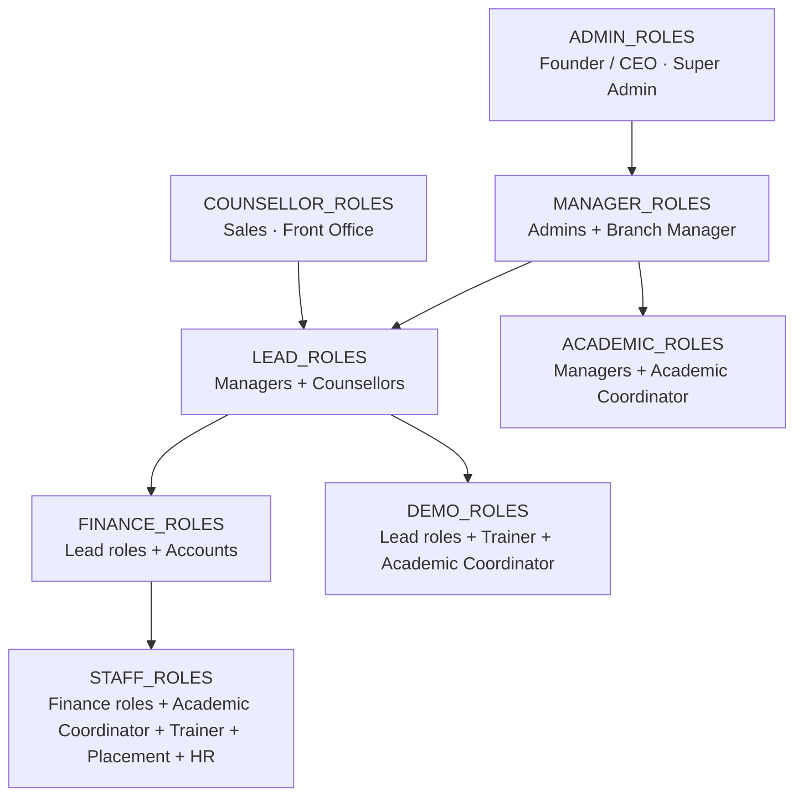

#### Branch scoping

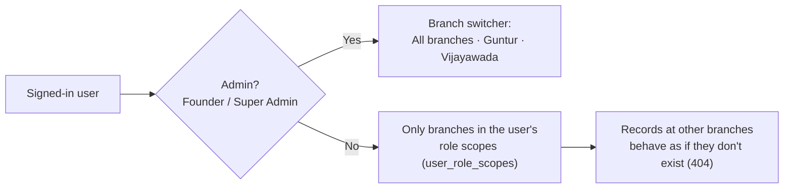

- A user can hold several **role + branch scopes** (e.g. Sales at Guntur and Trainer at Vijayawada). Each scope applies only at its own branch — scopes never combine into a stronger role.
- Scopes can carry an `expires_at` for temporary access.
- Person search (the duplicate check) deliberately works across branches so a second-branch enquiry is found.

---

### 2. Where each role lands after login

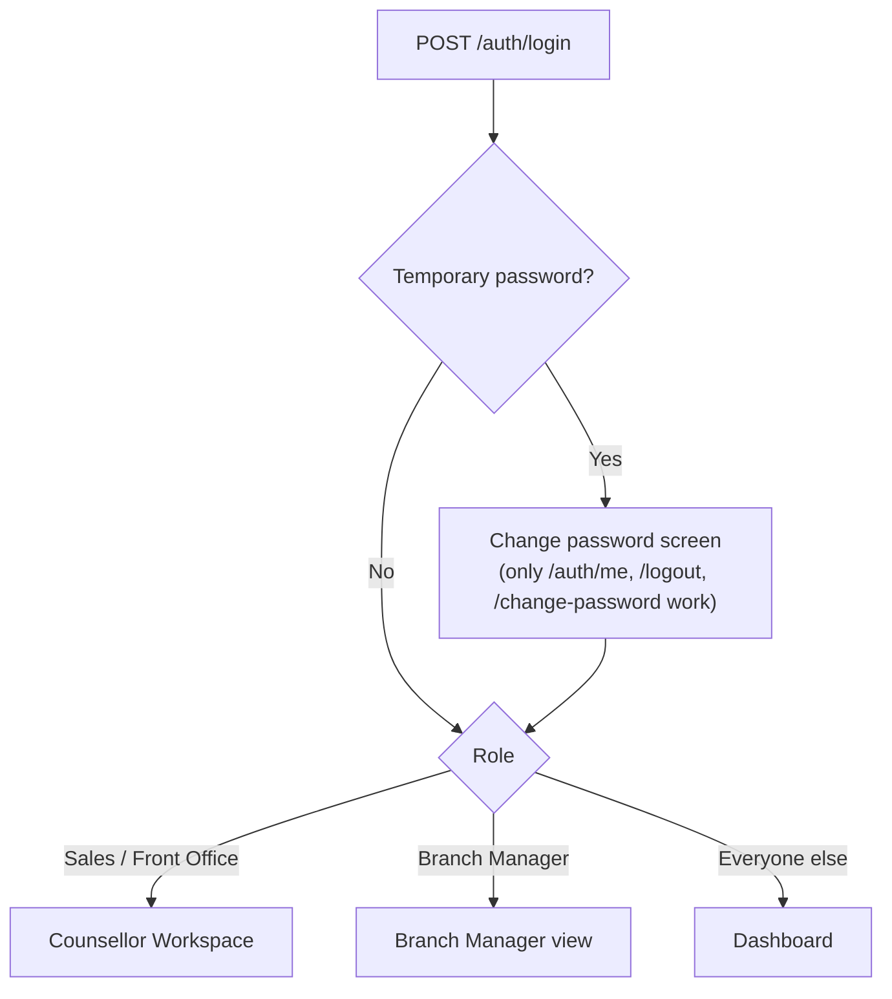

---

### 3. Screen access matrix

✅ = screen visible. Admin = Founder / CEO and Super Admin (identical for screens).

| Screen | Admin | BM | Sales / FO | Accounts | Acad. Coord. | Trainer | Placement | HR |
|---|---|---|---|---|---|---|---|---|
| Dashboard (Overview) | ✅ | ✅ | ✅ | ✅ | ✅ | ✅ | ✅ | ✅ |
| My work (V4) | ✅ | ✅ | ✅ | ✅ | ✅ | ✅ | ✅ | ✅ |
| LMS access (V4, read-only) | ✅ | ✅ | ✅ | ✅ | ✅ | ✅ | ✅ | ✅ |
| Workflow guide (V4) | ✅ | ✅ | ✅ | ✅ | ✅ | ✅ | ✅ | ✅ |
| Persons · Person 360 | ✅ | ✅ | ✅ | | | | | |
| Leads · Lead 360 | ✅ | ✅ | ✅ | | | | | |
| Deal pipeline | ✅ | ✅ | ✅ | | | | | |
| Demos | ✅ | ✅ | ✅ | | ✅ | ✅ | | |
| Admissions | ✅ | ✅ | ✅ | ✅ | ✅ | ✅ | ✅ | ✅ |
| Batches | ✅ | ✅ | | | ✅ | ✅ | | |
| Students · Student 360 | ✅ | ✅ | ✅ | ✅ | ✅ | ✅ | ✅ | ✅ |
| Payments | ✅ | ✅ | ✅ | ✅ | | | | |
| Invoices | ✅ | ✅ | ✅ | ✅ | | | | |
| Collections | ✅ | ✅ | ✅ | ✅ | | | | |
| Refunds | ✅ | ✅ | | ✅ | | | | |
| Tasks | ✅ | ✅ | ✅ | ✅ | ✅ | ✅ | ✅ | ✅ |
| Communications | ✅ | ✅ | ✅ | | | | | |
| Reports | ✅ | ✅ | | ✅ | | | | |
| Placement & Alumni | ✅ | ✅ | | | ✅ | | ✅ | |
| AI Copilot | ✅ | ✅ | ✅ | | | | | |
| Course Master | ✅ | ✅ | ✅ | ✅ | ✅ | ✅ | ✅ | ✅ |
| **More →** Counsellor Workspace | ✅ | ✅ | ✅ | | | | | |
| **More →** Branch Manager | ✅ | ✅ | | | | | | |
| **More →** Discount Approvals | ✅ | ✅ | | | | | | |
| **More →** Offer Master | ✅ | ✅ (view) | | | | | | |
| **More →** Target Master | ✅ | ✅ (view) | | ✅ (view) | | | | |
| **More →** Notifications | ✅ | ✅ | ✅ | ✅ | ✅ | ✅ | ✅ | ✅ |
| **More →** Ask Nipuna | ✅ | ✅ | | | | | | |
| **More →** Admin / Settings | ✅ | | | | | | | |

---

### 4. Role by role

#### 4.1 Sales (Counsellor) and Front Office

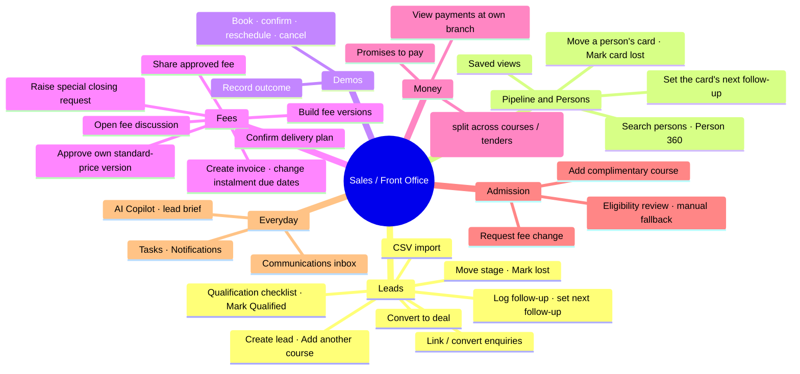

**Rules that apply to them**
- A counsellor who creates a lead **owns** it. Stage, follow-up, lost and edit need the owner (or a manager); while a lead is unassigned, any counsellor at the branch can work it.
- The same rule applies to a pipeline card: its owner (or a manager) moves it, marks it lost and sets its follow-up. Only a branch manager or admin changes the card's owner.
- Demos, fee discussions and stage moves need a **converted** lead: tick all six qualification checks, Mark Qualified, then Convert to deal (courses, branch, owner, expected close). Conversion reuses the person and never duplicates an open course.
- They **cannot** assign / bulk-assign / reactivate leads, approve discounts, verify payments, cancel admissions or touch settings.
- Front Office can also log follow-ups and record payments, same as Sales.

**Their core flow**

```mermaid
flowchart LR
    A["Create lead"] --> Q["Qualification<br/>(6 checks)"]
    Q --> K["Convert to deal"]
    K --> C["Book demo"]
    C --> D["Record outcome"]
    D --> E["Fee discussion<br/>+ fee version"]
    E -->|"extra concession"| F["Special closing request"]
    F -->|"approved"| G
    E -->|"no concession"| G["Approved fee"]
    G --> P["Confirm delivery plan"]
    P --> H["Create invoice<br/>(1+ courses, 1–3 instalments)"]
    H --> I["Record payment claim"]
    I -.->|"Accounts verifies → receipt"| J["Admission per course<br/>(automatic at ₹1,000)"]
```

#### 4.2 Branch Manager

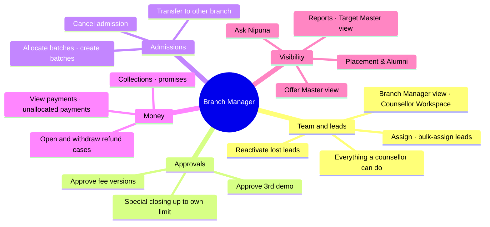

**Limits**
- Discount approval limit: **lower of 5% or ₹1,000** of the standard fee (setting: *Concession limits*). Anything above goes to Founder / CEO or Super Admin.
- **Cannot** verify payments, decide refunds, approve fee changes after admission, map curricula, create or activate offers, or open Admin / Settings.
- Gets a task for every **unassigned lead** (due in 60 staffed minutes) and is the escalation target for **payments waiting > 30 min**.

#### 4.3 Accounts

```mermaid
mindmap
  root(("Accounts"))
    Payments
      Record payment claim
      Verify (evidence reviewed · cash check) or fail with reason
      Allocate advance to invoice courses
      Request correction
    Invoices
      Create invoice
      Cancel invoice
      Change instalment due date
    Collections
      Dues · ageing bands
      Promises to pay
    Refunds
      Open refund case
      Payout
      Reconcile
    Fee changes
      Apply approved fee change
    Visibility
      Reports · Target Master view
```

**Rules**
- Verification is **once and final** (Verified or Failed). Target: **30 minutes**, warning at 25, then escalates to the Branch Manager.
- Verifying needs two confirmations: **evidence reviewed** and, for cash, an **independent cash check**. The receipt number is issued only then; a pending claim has only its transaction number (`TXN-…`).
- Only verified payments count as collected or unlock admission — each course is admitted automatically on the verification that brings ₹1,000 (the token) onto it. Accounts may also create an admission from the eligibility review if an automatic one was refused.
- They get the "instalment due in 2 days" and "long payment gap" notifications for their branch, and can open the dashboard's Long-gap plans list.
- Accounts **pays out** refunds but never decides them; the decider can never be the one who pays out.

#### 4.4 Academic Coordinator

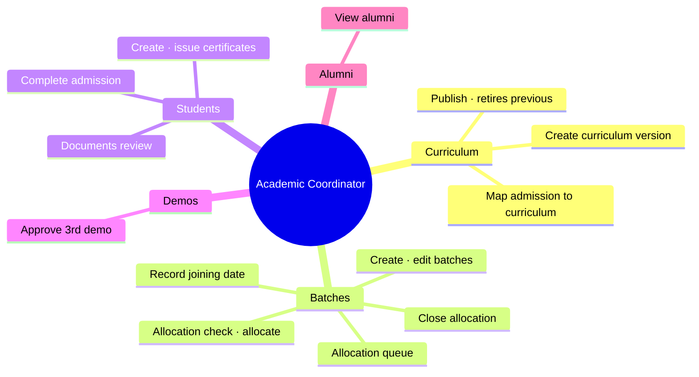

**Rules**
- Curriculum mapping is limited to Academic Coordinators **at the student's service branch**, plus admins. Branch Managers can allocate batches but **cannot map curricula**.
- Allocation deadlines: Confirmed Seat within **1 working day** and before the first class; Future Plan **48 hours** before start; alert **24 hours** before a batch starts if anyone is unallocated.

#### 4.5 Trainer

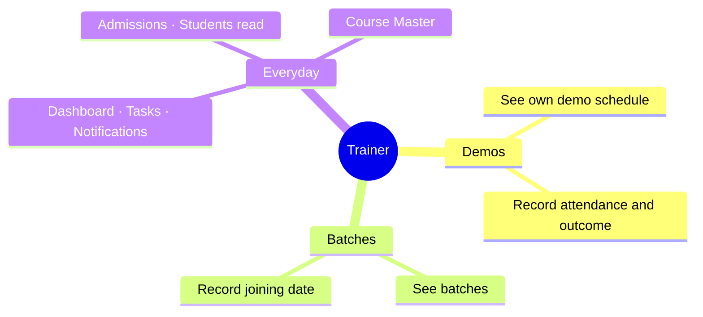

Outcome can be recorded only **after the demo's start time** and only while the demo is Scheduled or Confirmed.

#### 4.6 Placement Team

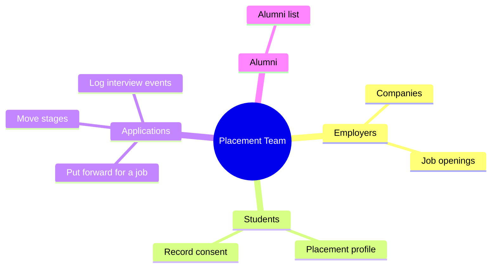

A student can be put forward **only with explicit consent** and only for an **open** job. Branch Managers and admins share these screens.

#### 4.7 HR

Read-side staff access: Dashboard, Admissions, Students (Student 360, documents, support cases), Tasks, Course Master, Notifications. No leads, money or academics actions.

#### 4.8 Founder / CEO and Super Admin

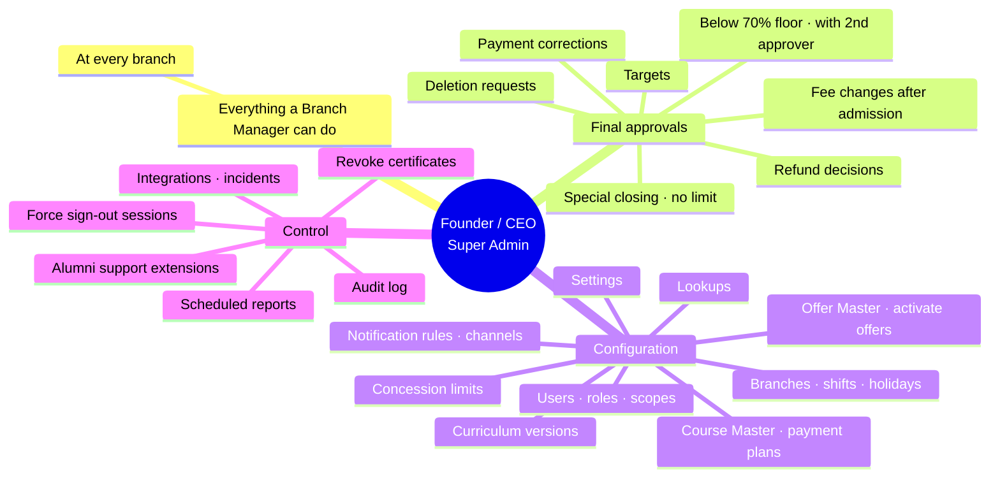

Founder / CEO and Super Admin have the same permissions, with one difference: **only a Founder / CEO can grant Founder / CEO access** or create a recovery account. Admins cannot change their own access, deactivate or reset themselves.

---

### 5. Approvals and the two-person rule

Nobody approves their own request. This is enforced for discounts, payment corrections, documents, deletion requests. **Exceptions for Founder / CEO and Super Admin:** they may approve a fee change they requested themselves (db 023) and pay out a refund they decided (db 025).

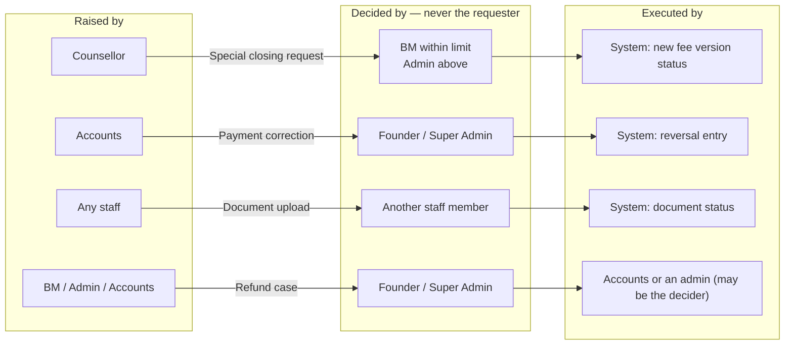

#### 5.1 Special closing (extra concession)

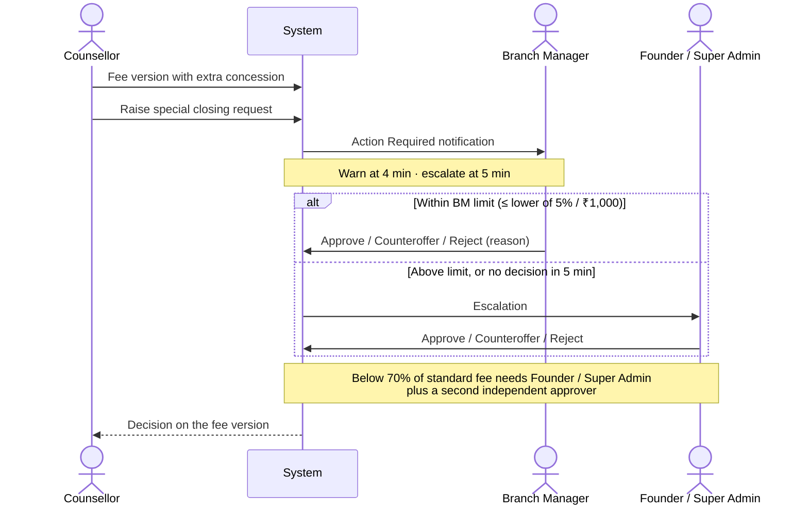

#### 5.2 Payment verification and correction

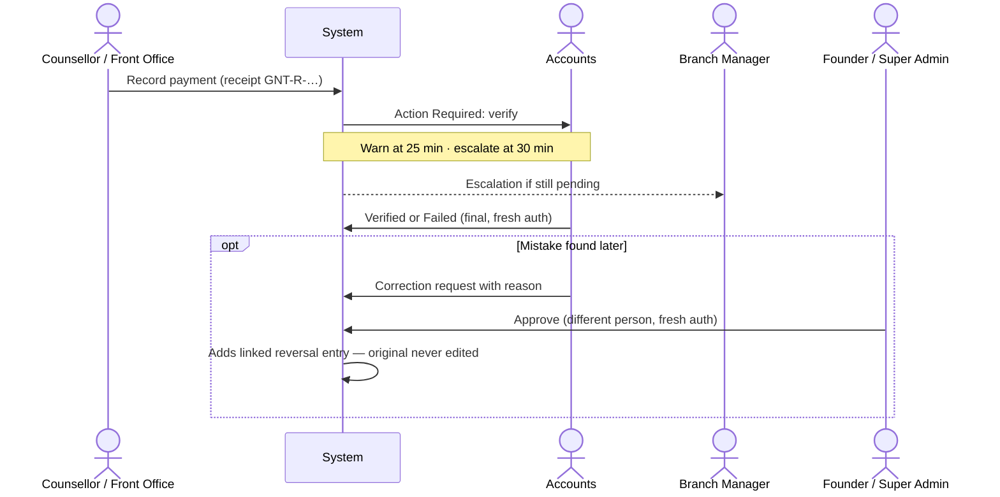

#### 5.3 Fee change after admission

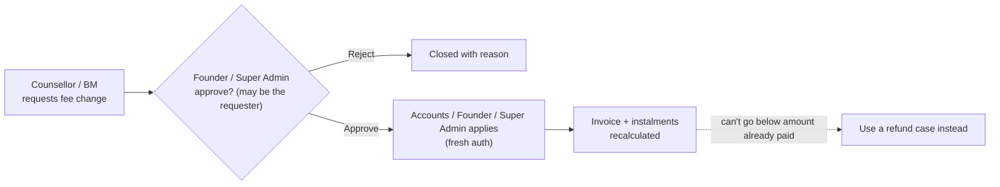

#### 5.4 Refund case

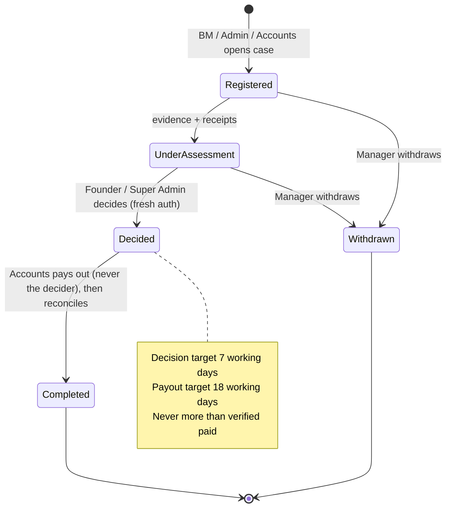

#### 5.5 Other approvals

| What | Requested by | Approved by | Notes |
|---|---|---|---|
| 3rd demo (after 2 attended) | Counsellor | Academic Coordinator or BM | Setting `demo_max_attended` = 2 |
| Fee version | Counsellor | **Counsellor or BM** if no extra concession and at / above floor (offers count as pre-approved); otherwise only via an approved special closing request | Must be Approved before accept plan / invoice |
| Offer activation | Admin | Admin (fresh auth) | Needs approver + dates; activating deactivates the other active version of the same code. The creator can activate their own offer today |
| Target version | Admin drafts | Admin (fresh auth) | Approved version supersedes the overlapping one |
| Deletion request | Admin | A *different* Admin (fresh auth), then execute | |
| Document | Any staff uploads | A different staff member reviews | Verify / reject with reason |
| Certificate revoke | — | Admin (fresh auth) | Reason required |
| Alumni support extension | — | Admin (fresh auth) | Default 6 months |

---

### 6. Fresh authentication

Sensitive actions ask for the password again if the last login is older than **15 minutes** (`fresh_auth_minutes`).

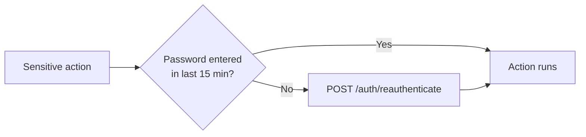

Actions that need it:

| Area | Actions |
|---|---|
| Users | Create user · reset password · add / remove scopes · force sign-out a session |
| Configuration | Settings · concession limits · offer activate / deactivate |
| Money | Approve special closing · verify / fail payment · approve correction · approve / apply fee change · decide refund |
| Academics | Revoke certificate · alumni support extension |
| Management | Approve targets · approve / execute deletion requests |

---

### 7. Every setting, and who controls it

All configuration lives in **More → Admin / Settings** (Founder / CEO and Super Admin only), except Course Master, Offer Master, Target Master and Curriculum, which have their own screens.

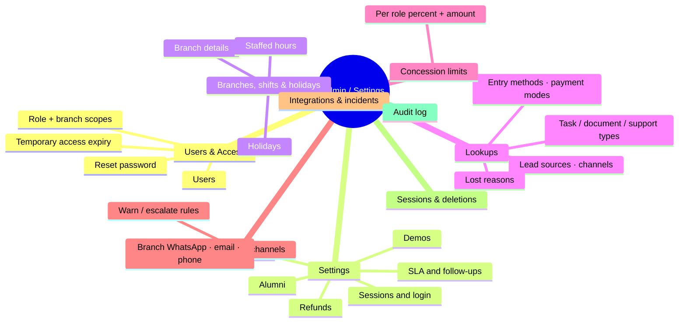

#### 7.1 System settings (`app_settings`, Admin / Settings → Settings)

| Setting | Current value | What it controls | Roles affected |
|---|---|---|---|
| `session_idle_minutes` | 30 | Sign-out after inactivity | Everyone |
| `session_max_hours` | 12 | Maximum session length | Everyone |
| `login_max_attempts` | 5 | Failed logins before lock | Everyone |
| `login_lock_minutes` | 15 | How long a lock lasts | Everyone |
| `password_min_length` | 10 | Minimum password length | Everyone |
| `fresh_auth_minutes` | 15 | Window for sensitive actions (§6) | Admins, Accounts, BM |
| `sla_at_risk_minutes` | 30 | When an item turns *At Risk* before its deadline | Counsellors, BM, Accounts |
| `commercial_follow_up_staffed_minutes` | 120 | Fee follow-up due after an attended / no-show demo | Counsellors, Trainer |
| `demo_max_attended` | 2 | Attended demos before approval is needed | Counsellors, Acad. Coord., BM |
| `refund_decision_target_working_days` | 7 | Refund decision target | Admins |
| `refund_payout_target_working_days` | 18 | Payout target after approval | Accounts |
| `alumni_support_months` | 6 | Support after course completion | Placement, Admins |
| `report_cutoff_time` | 20:00 | Daily report cutoff (IST) | Managers, Accounts |
| `business_timezone` | Asia/Kolkata | Staffed-time and report periods | Everyone |
| `admission_token_amount` | 1000 | Verified payments (₹) needed on the invoice before the admission can be created | Counsellors, Accounts |
| `installment_due_soon_days` | 2 | "Due soon" alert to the owner, Accounts and BM this many days before an instalment | Counsellors, Accounts, BM |
| `payment_gap_alert_days` | 30 | Alert (owner, Accounts, BM, admins) and dashboard "Long-gap plans" when the next instalment is due this long after a verified payment | Counsellors, Accounts, BM, Admins |

#### 7.2 Concession limits (Admin / Settings → Concession limits)

Extra concession a role may approve on its own: the **lower** of percent and amount; both blank = unlimited.

| Role | Max % | Max ₹ | Effect |
|---|---|---|---|
| Branch Manager | 5% | ₹1,000 | Above this, the request goes to an admin |
| Founder / CEO | — | — | Unlimited |
| Super Admin | — | — | Unlimited |

Separate hard rule (not a setting): below **70% of the standard fee** needs Founder / Super Admin **plus a second independent approver**.

#### 7.3 Notification and escalation rules (Admin / Settings → Notifications & channels)

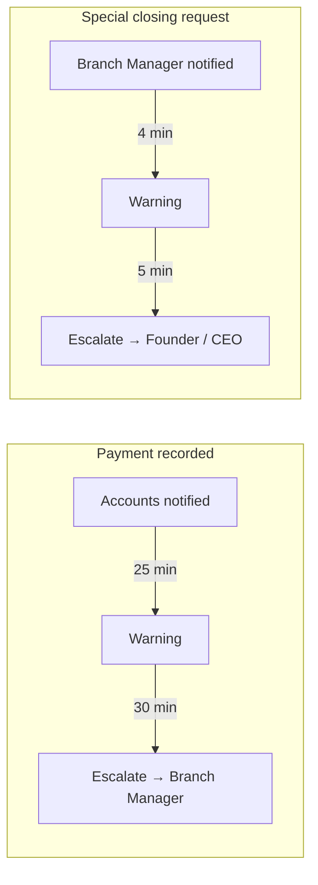

| Rule | Event | Recipient | Warn | Escalate | Escalate to |
|---|---|---|---|---|---|
| `PAYMENT_PENDING_VERIFICATION` | payment.recorded | Accounts | 25 min | 30 min | Branch Manager |
| `SCR_PENDING` | scr.created | Branch Manager | 4 min | 5 min | Founder / CEO |

Minutes are **staffed minutes** — they only run during branch hours (§7.4). Branch channels (WhatsApp numbers, email senders, phone lines) are configured per branch on the same tab; nothing is sent externally until integrations are live.

#### 7.4 Branches, shifts and holidays

- **Staffed hours:** currently Monday–Saturday, 09:00–19:00 at both branches. Every SLA, escalation and "working day" uses these.
- **Holidays** are excluded from staffed time.
- Branch details (name, code, prefix) feed the codes on receipts and invoices (`GNT-R-…`, `INV-GNT-…`).

#### 7.5 Lookups

Dropdown values used across the CRM: lead sources, contact channels, entry methods, payment modes, lost reasons, task types, document types, support case types. Admins add, rename and **deactivate** values; values are never deleted and codes never change, so old records stay readable.

#### 7.6 Masters outside Admin / Settings

| Master | Screen | Edit | View |
|---|---|---|---|
| Courses, fees, branch availability, combo components | Course Master | Admins | All staff |
| Payment plans (Full · 2 instalments · 3 instalments) | Admin API | Admins | Lead roles |
| Offers (discount / complimentary course, scope, dates) | More → Offer Master | Admins | Admins, BM |
| Targets (collections, paid admissions per branch) | More → Target Master | Admins draft + approve | Admins, BM, Accounts |
| Curriculum versions | Batches → Curriculum | Acad. Coord., Admins | Managers, Acad. Coord., Trainer |

Rules that apply to all masters: an **active offer can't be edited** (make a new version); a **payment plan in use can't be changed** (make a new plan); **publishing a curriculum retires the previous version**.

---

### 8. Full action permission reference

Grouped by module. "Owner" = the lead's assigned counsellor. All of these are also branch-scoped unless the actor is an admin.

| Module | Action | Allowed roles |
|---|---|---|
| **Leads** | Create lead / person / enquiry, CSV import | Sales, Front Office, BM, Admins |
| | Edit, move stage, set follow-up, mark lost | Owner, BM, Admins (any branch counsellor while unassigned) |
| | Qualification checks, Mark Qualified, Convert to deal | Owner, BM, Admins (any branch counsellor while unassigned) |
| | Log follow-up | Owner, Front Office, BM, Admins |
| | Assign, bulk assign, reactivate | BM, Admins |
| | Log activity, saved views | All lead roles |
| **Pipeline** | Move a card, mark it lost, set its follow-up | Card owner, BM, Admins (any branch counsellor while unassigned) |
| | Change a card's owner | BM, Admins |
| | Set a card's expected close | Card owner, BM, Admins |
| **Persons** | List / search persons, Person 360 | All lead roles (own branches) |
| **Demos** | Book, edit, confirm, reschedule, cancel | Sales, Front Office, BM, Admins |
| | Record outcome | Trainer, Sales, Front Office, BM, Admins |
| | Approve 3rd demo | Academic Coordinator, BM |
| **Fees** | Open discussion | Counsellors, BM |
| | New version, share, raise special closing | Counsellors |
| **Delivery plan** | Save, accept, reopen (until invoiced) | Deal owner, counsellors, BM, Academic Coordinator, Admins |
| | Approve standard-price version (no extra concession) | Counsellors, BM, Admins |
| | Decide special closing (approves the version too) | BM (within limit), Admins |
| **Invoices** | Create (one or more compatible courses) | Counsellors, Accounts, BM |
| | Change instalment due date | Counsellors, Accounts |
| | Cancel (unpaid only) | Accounts, BM, Admins |
| **Payments** | Record | Sales, Front Office, Accounts |
| | Verify (with evidence / cash checks) / fail | Accounts, Admins |
| | Allocate advance | Accounts |
| | Request correction | Accounts, Admins |
| | Approve correction | Founder / CEO, Super Admin |
| **Admissions** | Created automatically on verification; manual fallback from the eligibility review | Sales, Front Office, BM, Accounts |
| | Complimentary course | Counsellors, BM |
| | Cancel, transfer | BM |
| | Request fee change | Counsellors, BM |
| | Approve / reject fee change | Admins |
| | Apply fee change | Accounts, Admins |
| **Academics** | Create / edit batch, allocation queue, allocate | Academic Coordinator, BM |
| | Close allocation, complete admission | Academic Coordinator |
| | Joining date | Academic Coordinator, Trainer |
| | Create / publish curriculum, map curriculum | Academic Coordinator, Admins |
| | Create / issue certificate | Academic Coordinator, Admins |
| | Revoke certificate | Admins |
| **Students** | View Student 360, upload / review documents, support cases | All staff |
| **Collections** | Dues, ageing, promises to pay | Lead roles + Accounts |
| **Refunds** | Open, view, edit | BM, Admins, Accounts |
| | Decide | Admins |
| | Payout, reconcile | Accounts, Admins |
| | Withdraw | BM, Admins |
| **Tasks** | All task actions | All staff |
| **Communications** | Inbox, log, reply, retry, match | Lead roles |
| | Branch channels, notification rules | Admins |
| **Notifications** | Read / acknowledge / complete own | Everyone |
| **Placement** | Companies, jobs, profiles, consent, applications | Placement, BM, Admins |
| | Alumni list | Placement, BM, Admins, Academic Coordinator |
| | Support extension | Admins |
| **Reports** | Management, funnel, performance, SLA, export | BM, Admins, Accounts |
| | Scheduled reports | Admins |
| | Targets view / achievement | BM, Admins, Accounts |
| | Create / approve targets | Admins |
| **Dashboard** | Dashboard | All staff (role-aware content) |
| | Counsellor summary | Counsellors, BM, Admins |
| **AI** | Copilot, lead brief, next best action | Lead roles |
| | Ask Nipuna, management brief | BM, Admins |
| **Admin** | Users, scopes, settings, lookups, branches, holidays, concession limits, courses, payment plans, offers, integrations, incidents, audit log, sessions, deletion requests | Founder / CEO, Super Admin |

---

### 9. Known gaps

Things that behave differently from what the rules above might suggest. Tracked here until they are decided in [DEVELOPMENT.md · Part E (backlog)](DEVELOPMENT.md#part-e--backlog).

- **Offer self-activation:** the admin who creates an offer can also activate it; the two-person rule doesn't cover offers.
- **Curriculum mapping at branches without an Academic Coordinator:** Branch Managers can allocate batches but can't map curricula, so only an admin can clear *Mapping Pending*.
- **Complimentary course list can include the main course:** an offer can list the student's own course as complimentary.
- **Counsellors adding a complimentary course** type the numeric offer ID, because they can't list offers.
- **Manual stage moves:** a deal can be moved to *Demo Attended* by hand without an attended demo; only backward moves after *Payment Pending Verification* are blocked.
- **Deal owner at conversion:** converting onto a person's existing card keeps that card's owner; the owner picked in the dialog applies to a new card only.
- **Verifier independence for cash:** the "independent cash check" is a tick recorded on the payment; the system doesn't yet require the verifier to be a different person from the collector.
